```{r, include = FALSE}
knitr::opts_chunk$set(collapse = TRUE, comment = "#>")
```

Population-genomic outputs are summaries of a particular sample, marker set, filtering policy, population definition, and model. They are not direct measurements of demographic history or causation. Interpretation should begin with execution and validation evidence, not with the most visually striking figure.

## Read results in this order

1. Confirm exact sample identity and metadata alignment.
2. Review sample and variant QC, missingness, allele-frequency filters, and LD pruning.
3. Confirm module capability, execution state, and validation state.
4. Inspect numerical source tables before figures.
5. Compare related analyses and investigate disagreement.
6. State assumptions, uncertainty, exclusions, and alternative explanations.

## Execution and evidence states

| State | Meaning | Interpretation rule |
|---|---|---|
| `success` | The module completed | Interpret only after its validation record passes |
| `skipped` or unavailable | Required metadata, software, or inputs were absent | Report the reason; do not infer a negative biological result |
| `blocked` | A prerequisite failed or did not complete | Interpret neither the blocked module nor missing downstream artifacts |
| `failed` | The module encountered an error or invalid output | Resolve the cause and rerun before scientific use |
| `timed_out` | The configured elapsed-time budget was exceeded | Treat as incomplete, not as evidence for absence |
| diagnostic-only | A comparison is informative but not release-gating | Do not describe it as certified equivalence |
| insufficient evidence | Required datasets, repetitions, approvals, or comparisons are missing | Do not convert the state into pass or fail |

## Quality control and filtering

Sample and variant QC determine the data on which every downstream result depends.

Review missingness, heterozygosity, minor-allele frequency, retained sample counts, retained variant counts, chromosome representation, and the exact LD-pruned SNP list. Large changes after one threshold deserve explanation. A sample with unusual heterozygosity may reflect biology, contamination, ploidy mismatch, mapping error, or sample mixture; the statistic alone does not identify the cause.

Filtering can change ordinations, distances, diversity, and differentiation. Report thresholds and sensitivity analyses when conclusions depend on a narrow filtering choice.

```{r maf-figure, echo=FALSE, out.width="90%"}
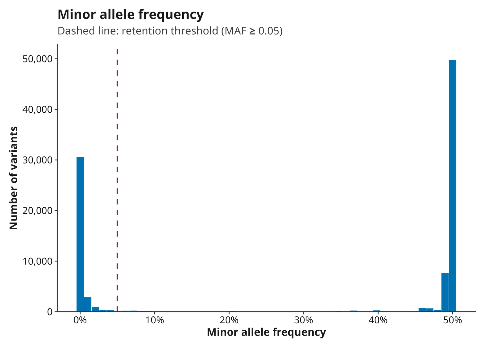
```

The quickstart example (see `vignette("quickstart")`) starts from 98,922 biallelic SNPs (21,418 on chromosome 22, 16,999 on chromosome X, 60,505 on chromosome Y -- real, male-only 1000 Genomes data; the 83 female samples correctly show no calls there at all, not a data-quality problem); MAF filtering retains 63,585 of these combined. By default (`qc.autosome_only`) only the 1,969 chromosome 22 SNPs continue into LD pruning, which reduces them to 357 -- the marker set used by PCA, IBS, kinship, DAPC, the ancestry backends, ROH, FST, genome scans, diversity, and AMOVA. Sex chromosomes are excluded from these by default because they are not uniformly diploid (or, for chromosome Y, present at all) across samples; mixing them in measurably corrupted results on this exact dataset before these exclusions were added: kinship for a known real duplicate pair collapsed from 0.4525 to essentially zero, and separately every female sample was silently dropped from the entire pipeline (chromosome Y's near-total absence in females inflated their overall missingness past the sample-QC threshold). The remaining 1,148 QC-passing chromosome X SNPs and 60,468 QC-passing chromosome Y SNPs are reserved for the sex-check module below. Real numbers from a real 160-sample, 8-population run, not a toy fixture.

## PCA

Principal components summarize directions of variance in the analyzed genotype matrix. Separation can reflect population structure, family relationships, batch effects, uneven missingness, marker ascertainment, inversions, or geographic clines.

Interpret the eigenvalues and source coordinates together. Do not assign discrete populations solely from visual clusters. Examine whether patterns persist after removing close relatives, high-LD regions, or problematic samples. Axis signs are arbitrary; only relative geometry is meaningful.

`31_PCA_loadings.tsv`, plus a genomic Manhattan-style figure and a rank-ordered figure, report each SNP's signed correlation with every retained component. Ranking is by magnitude, not raw value, since a large negative loading is just as informative as a large positive one. A high-magnitude loading marks a marker associated with an axis; it is not evidence that the marker is causal without independent, functional follow-up.

```{r pca-figure, echo=FALSE, out.width="90%"}
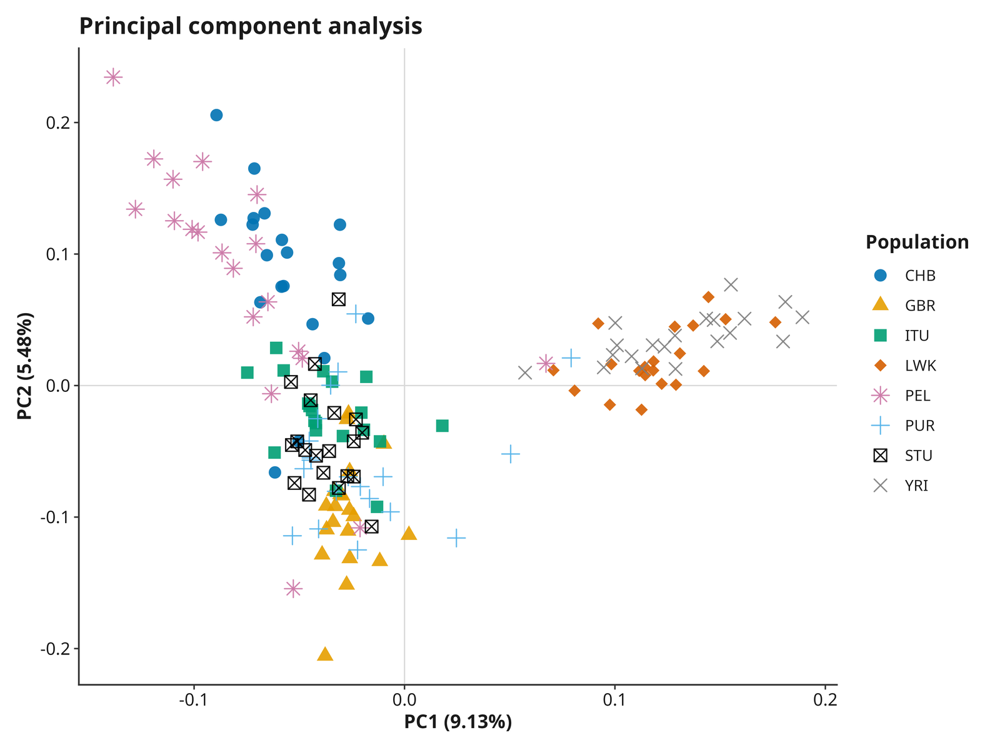
```

```{r pca-loadings-manhattan-figure, echo=FALSE, out.width="90%"}
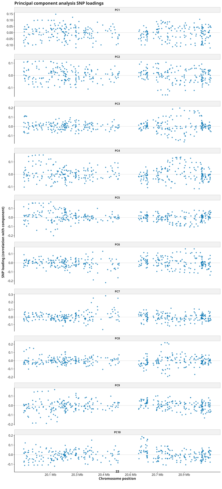
```

```{r pca-loadings-ranked-figure, echo=FALSE, out.width="90%"}
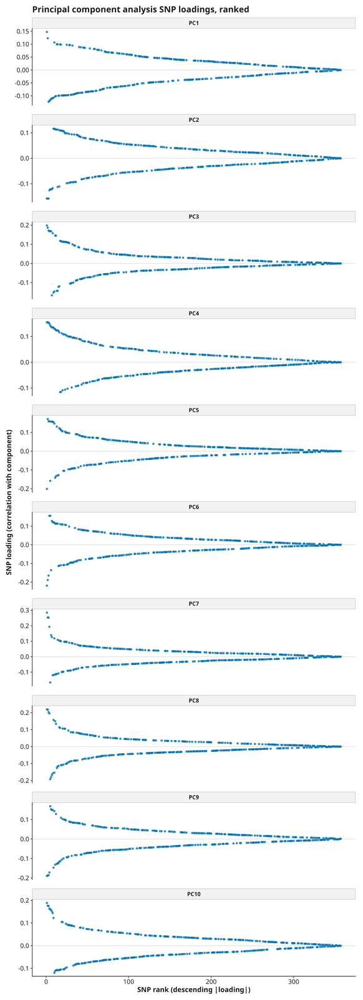
```

The 8 populations in the quickstart example separate largely by continental origin along PC1/PC2, as expected for real, geographically diverse human samples.

The report also draws one additional PC1/PC2 panel per other metadata column that qualifies for colouring: enough samples per distinct value (`analyses.pca_metadata_color_min_group`, default 3) and not too many distinct values (`analyses.pca_metadata_color_max_levels`, default 12). `population` itself, continuous coordinates (`latitude`/`longitude`), and identifier-like columns are excluded automatically. In the quickstart metadata, `sex` qualifies:

```{r pca-by-sex-figure, echo=FALSE, out.width="90%"}
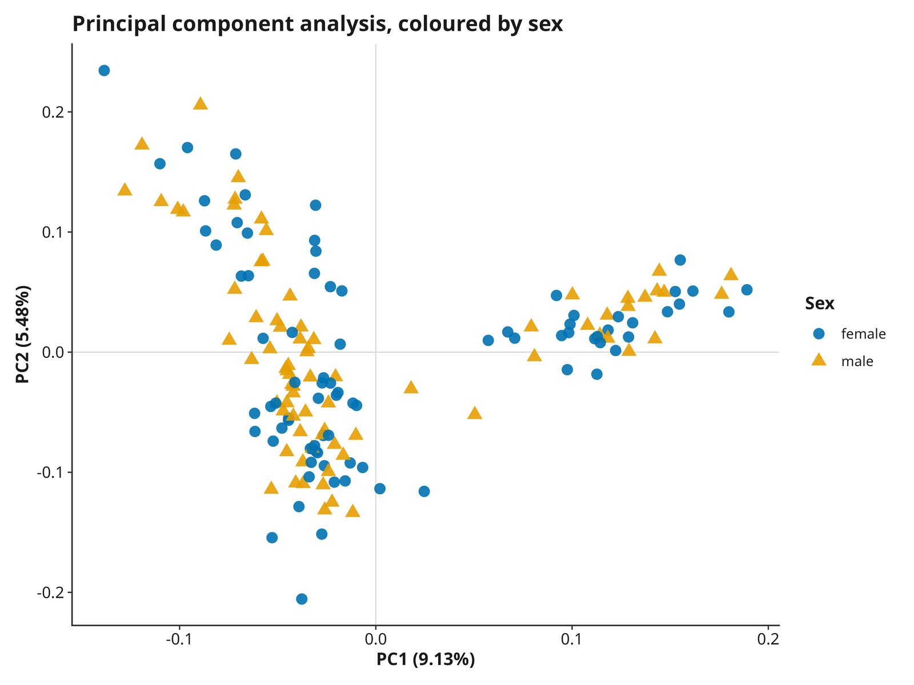
```

Sex shows no separation here (ANOVA on this exact PCA fit: p = 0.24 on PC1, p = 0.62 on PC2) -- itself the expected, useful result for an autosomal analysis: population structure, not sex, drives this PCA. A per-metadata-column panel that *does* show separation on your own data would be a genuine signal worth investigating (a batch effect, a confound, or real biology), not something to assume is noise.

## IBS and MDS

Identity-by-state (IBS, `SNPRelate::snpgdsIBS()`) is a simpler, symmetric similarity measure than kinship below: the fraction of alleles shared between every pair of samples, with no explicit relatedness model behind it. Multidimensional scaling (classical `stats::cmdscale()` on the 1 - IBS distance matrix, Zheng et al. 2012) projects that pairwise matrix into low-dimensional coordinates for visualization -- the same purpose as PCA above, but built from a similarity matrix rather than the raw genotype matrix directly, so treat it as a complementary view, not a substitute.

Confirm sample order and matrix symmetry before trusting either the heatmap or the MDS coordinates. Interpret low-dimensional MDS only after checking how much variance each axis actually explains: `cmdscale()` can produce negative eigenvalues for a non-Euclidean distance like IBS (goodness-of-fit is computed from the positive eigenvalues only), and a low percentage means the 2D plot is compressing away real structure, not that little structure exists. Close pairs in either view may reflect relatives or duplicates rather than population-level structure -- the Kinship section below is the right tool to tell those apart, not IBS/MDS alone.

```{r ibs-figure, echo=FALSE, out.width="90%"}
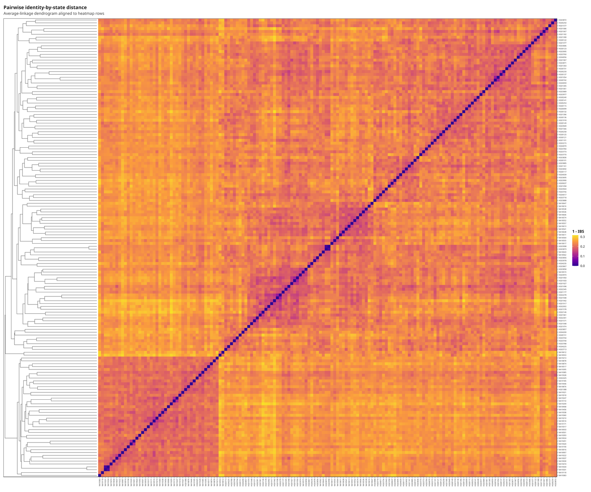
```

```{r ibs-mds-figure, echo=FALSE, out.width="90%"}
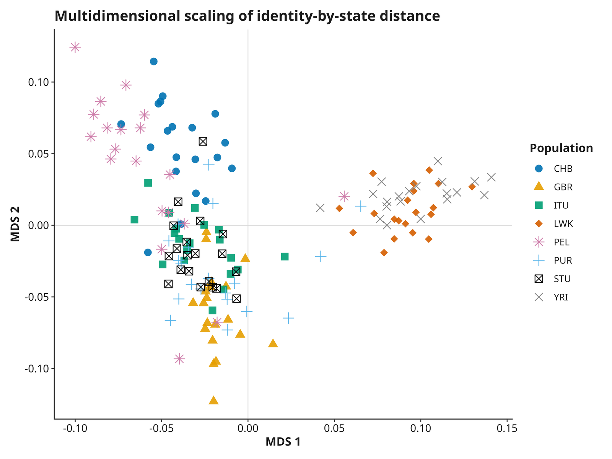
```

On the quickstart example, MDS1 and MDS2 explain 11.97% and 6.99% of the positive-eigenvalue variation respectively (65 of the 160 eigenvalues are negative -- an expected property of IBS-based distances, not an error). Modest but real: MDS1 alone already separates the two African populations (LWK, YRI) from the rest (ANOVA on MDS1 by population, p = 5.5e-64), the same continental pattern PCA recovers above, now from a completely different starting matrix (pairwise allele-sharing rather than PCA's genotype covariance structure) -- an independent confirmation, not a re-derivation of the same PCA result. The single highest pairwise IBS similarity in the whole dataset (0.979) is `HG03873`/`HG03998` -- the same pair the next section flags as a kinship "duplicate/MZ twin" call that turns out, on corroborating sex-check evidence, not actually to be one; worth keeping in mind while reading that section.

The same IBS distance matrix also builds a neighbour-joining tree (Saitou and Nei 1987), a third view of the same pairwise relationships alongside the heatmap and MDS above -- useful for reading off which *specific* samples group together, not just how much variance separates them. Bootstrap support (Felsenstein 1985; `analyses.tree_bootstrap`, on by default, 100 replicates) is shown at each internal node: loci are resampled with replacement, the tree rebuilt from each resampled set, and the percentage of replicates agreeing with each split in the original tree reported -- interpret it exactly like PCA's percent-variance-explained: a measure of how much confidence *this specific dataset* supports *this specific split*, not a universal truth about the populations involved.

```{r ibs-tree-figure, echo=FALSE, out.width="90%"}
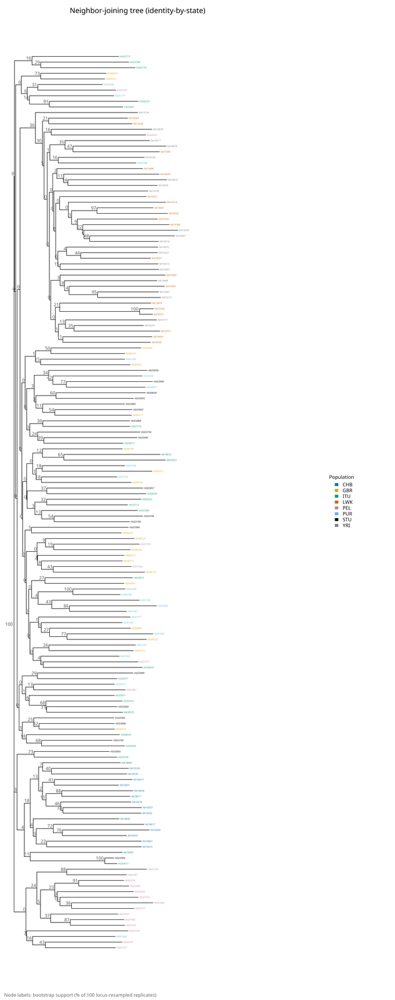
```

On the quickstart example (357 LD-pruned SNPs), most internal nodes show low bootstrap support (median 13%; 44% of nodes below 10%) -- an honest, expected consequence of resolving fine-scale, individual-level relationships from a modest, LD-pruned marker panel, not a defect in the tree or the bootstrap procedure. The one split that matters most, though, is rock solid: the deepest split in the tree -- separating the African (LWK, YRI) samples from everyone else, the same continental signal MDS and PCA both already found -- has 100% bootstrap support. Read this tree for its well-supported deep structure, not for fine-scale terminal groupings, which this marker panel genuinely cannot resolve with confidence; a whole-genome VCF would show substantially higher support throughout.

### Maximum-likelihood tree (optional)

`analyses.ml_tree` (off by default; needs the optional `phangorn` package) builds a genuine maximum-likelihood alternative to the NJ tree above: GTR substitution rates, gamma-distributed among-site rate variation, and Lewis (2001) ascertainment-bias correction, jointly optimized together with the topology. The correction matters specifically because this is SNP-only data -- a VCF records no invariant sites at all, and an uncorrected substitution model implicitly (and wrongly) assumes some were observed and simply happened not to vary. Applies only to this individual-level tree: ML substitution models describe per-sample sequence evolution, and there is no standard, defensible way to apply them to the population-level tree below, which is built from allele-*frequency* distances, not per-sample sequences. Genotypes are encoded as IUPAC nucleotide codes (homozygous calls become the plain reference/alternate base, heterozygous calls become the standard ambiguity code) so the existing biallelic ref/alt alleles double as a sequence alignment; bootstrap support (100 replicates by default, same Felsenstein 1985 procedure and interpretation as the NJ tree above) is shown at each node the same way.

```{r ml-tree-figure, echo=FALSE, out.width="90%"}
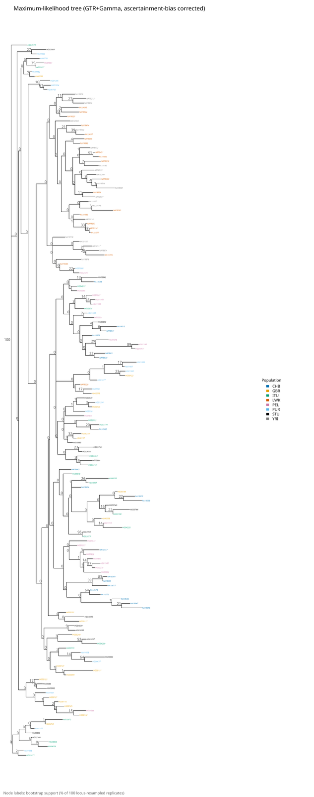
```

On the quickstart example, ML bootstrap support is even sparser than the NJ tree's own (median 1%; 68% of nodes below 10%) -- expected, not a regression: a proper likelihood-based method with an explicit substitution model is honestly more conservative than a simple distance method about what a modest, 357-SNP marker panel can actually resolve. Reassuringly, the one split both methods recover with full confidence is the *same* split: the tree's root, separating the African (LWK, YRI) samples from everyone else, at 100% bootstrap support in both the NJ and ML trees -- the same continental signal already found by PCA, MDS, and FST, now independently confirmed a fourth way, by a genuinely different statistical framework (explicit likelihood under a substitution model, not a distance transformation). As with the NJ tree, read this for its well-supported deep structure; a whole-genome VCF's much larger marker panel would resolve substantially more of the tree with confidence.

## Kinship

Kinship (`SNPRelate::snpgdsIBDKING()`, KING-robust, Manichaikul et al. 2010) answers a different question than IBS/MDS above: not "how similar are these samples overall" but "are these two individuals related, and how closely." KING-robust is specifically chosen for robustness to population stratification, unlike naive relatedness estimators that assume a single homogeneous population -- a real requirement here, since this package explicitly supports analyzing structured populations.

The estimator needs realistic marker density to behave sensibly; a handful of SNPs produces values with no biological meaning, confirmed concretely during this feature's implementation against both an undersized fixture and real chromosome-scale data. `relationship_degree` uses the standard KING thresholds and is a screening classification, not a pedigree diagnosis -- a flagged pair warrants follow-up (sample duplication, family structure in the study design, or a labeling error), not an automatic conclusion. Kinship is bounded above at 0.5 (a self/duplicate pair) but is *not* bounded below at -0.5 for arbitrarily divergent pairs; very negative values are expected, not an error, when comparing highly differentiated populations. Detected close relatives can bias the FST, diversity, and structure analyses computed from the same sample set -- consider whether to exclude or account for them before interpreting those results.

```{r kinship-figures, echo=FALSE, out.width="90%"}
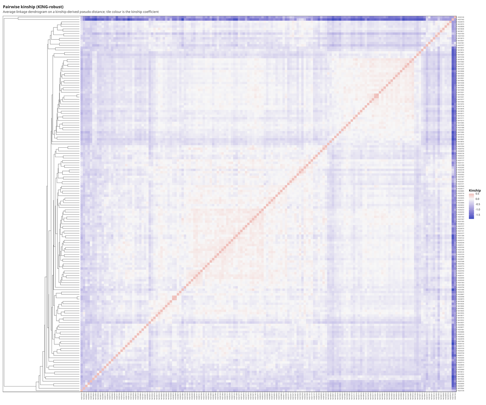
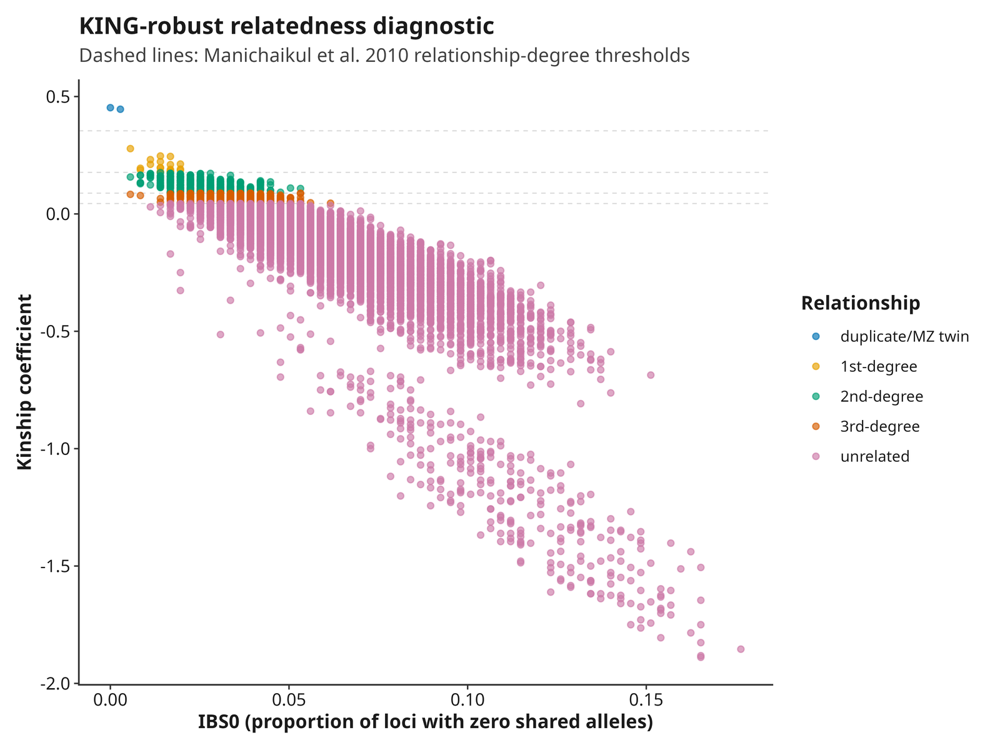
```

The quickstart dataset deliberately includes a known real duplicate/MZ-twin pair, `NA19331`/`NA19334` (kinship 0.4459, both LWK, correctly classified `duplicate/MZ twin`), confirmed consistent on chromosome X too: both are genuinely male (real hemizygous chromosome X genotypes, not just a metadata label), matching each other with no contradicting evidence.

`HG03873`/`HG03998` (kinship 0.4525, also classified `duplicate/MZ twin`) is a more interesting cautionary example, not a second confirmed duplicate: their real chromosome X genotypes show `HG03873` is genuinely female and `HG03998` is genuinely male (not just a metadata discrepancy between two population labels, ITU and STU) -- and MZ twins share genetic sex by definition, so despite the high chr22-only kinship, this pair cannot actually be the same individual or identical twins. The autosomal kinship signal is real (not a computation error), but a single small autosomal window is not sufficient evidence for "duplicate" on its own; the sex-check module below is exactly the kind of corroborating, independent evidence needed before accepting a kinship-based duplicate call as biological fact. Treat a single flagged pair as a lead to investigate, not a conclusion -- this is a real example of why.

## Sex check

Genetic sex inference from two complementary, independent signals -- X-chromosome heterozygosity and Y-chromosome genotype call rate -- flags samples whose metadata-reported `sex` disagrees with what their genotypes imply, PLINK's `--check-sex` convention extended the way real sex-check pipelines actually use it. X-chromosome heterozygosity (Visscher et al. 2010's F-statistic, via `SNPRelate::snpgdsIndInb(method = "mom.visscher")`, already used elsewhere in this package) separates hemizygous males (excess homozygosity, F close to 1) from diploid females (F close to 0); default thresholds (male F > 0.8, female F < 0.2) are PLINK's own documented defaults, verified on a hand-built synthetic fixture before shipping: simulated males gave F in [0.84, 1.13], simulated females in [-0.06, 0.10]. Y-chromosome call rate (`SNPRelate::snpgdsSampMissRate()`, already an SNPRelate dependency) is a second, much cleaner signal: males have a Y chromosome to call genotypes from, females do not. Verified against real 1000 Genomes data before shipping: females showed exactly 0.0 call rate, males 0.995-1.0 -- an almost perfectly binary separation, well clear of the default thresholds (male > 0.5, female < 0.1).

When both signals are available and agree, that is a high-confidence call. When they are both available but confidently disagree, the combined call is `discordant` -- real, informative evidence of a data problem, not averaged away. Either signal alone is used when only one chromosome is present. Pseudoautosomal (PAR) regions on X are not excluded by default, since their boundaries are genome-build-specific and this package accepts VCFs from any build or organism; PAR SNPs dilute, not reverse, the X-based separation.

This module needs only genotypes (no metadata required, though a `sex` column enables the mismatch comparison) and is on by default (`analyses.sex_check`). It skips transparently -- no table, no figure -- only when *both* chromosomes have too few QC-passing SNPs; either signal alone is used when only one chromosome is present, exactly like Mantel/isolation-by-distance skipping without coordinates.

```{r sex-check-figure, echo=FALSE, out.width="90%"}
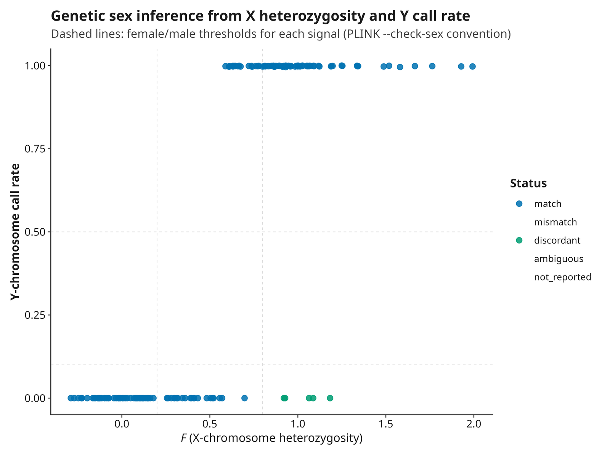
```

The quickstart example gives 1,148 QC-passing chromosome X SNPs and 60,468 QC-passing chromosome Y SNPs (both deliberately excluded from every other module above, per the Quality control section). Of 160 samples, 155 classify as a confident `match` and 5 as `discordant` -- zero `ambiguous`, zero `mismatch`. Combining the two signals resolved every one of the 40 samples that were `ambiguous` on chromosome X alone (X's F-statistic, from a single bounded 1Mb region, is a noisier signal than Y's near-binary call rate) into a confident call. The 5 `discordant` samples are genuinely informative: all 5 have real chromosome Y call rate of exactly 0 (confidently female) while chromosome X gives a spurious `male` reading (F just above the 0.8 threshold) -- a real example of chromosome X's small-region noise producing a wrong call that chromosome Y's cleaner signal catches, exactly the value of using both signals together rather than trusting either alone. All 5 samples' metadata-reported sex is `female`, agreeing with the chromosome Y evidence. A follow-up check against genome-wide (not just this bounded region) chromosome X data for these same 160 samples independently confirmed this: zero genuine mismatches remained at that scale, and these same 5 samples resolved to `female`.

## Runs of homozygosity

Runs of homozygosity (`bcftools roh`, an HMM-based method, Narasimhan et al. 2016) identify long stretches where a sample's genotype calls are consistently homozygous -- a standard per-sample autozygosity/inbreeding signal, distinct from both diversity's population-level FIS below and kinship's pairwise relatedness above.

Allele frequencies are self-estimated from the analyzed samples (there is no mechanism to attach an external reference-panel frequency), so informative site count -- and therefore sensitivity -- drops with smaller cohorts, confirmed concretely during this feature's implementation. `FROH` (total run length divided by the analyzed genomic footprint) is scaled to the footprint actually covered by the analyzed variants, **not the whole genome** -- a single-region VCF and a whole-genome VCF give very different `FROH` for the same underlying biology, so never compare `FROH` values across analyses that covered different genomic spans.

```{r roh-figure, echo=FALSE, out.width="90%"}
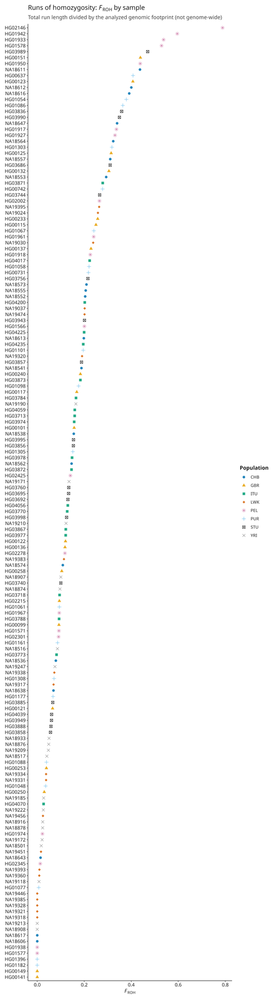
```

Each run is also classified into a length class (Ceballos et al. 2018): short (background LD), intermediate (distant common ancestors via genetic drift), and long (recent close inbreeding), with the two boundaries configurable (`analyses.roh_length_class_short_max_bp`/`roh_length_class_long_min_bp`, defaulting to 500 kb and 2 Mb -- this package's own convention chosen within Ceballos et al.'s published ranges, not a universal standard). `FROH` is reported per class as well as in total, on `38_ROH_sample_summary.tsv` and the figure below.

```{r roh-length-class-figure, echo=FALSE, out.width="90%"}
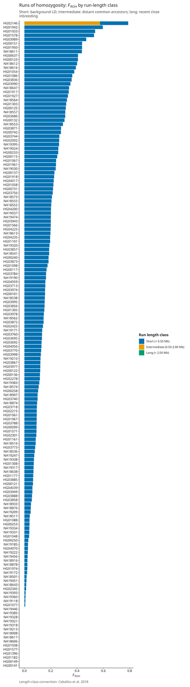
```

**Watch the analyzed genomic footprint against the long-class threshold.** In the quickstart example, all 8 populations show zero "long" runs -- not because recent close inbreeding is genuinely absent, but because the quickstart's analyzed chr22 region spans under 1 Mb end to end, smaller than the 2 Mb long-class threshold, so no single run can ever be classified "long" there regardless of true biology. This is a property of the demo's narrow genomic scope, not a general limitation -- a whole-genome VCF is not subject to this ceiling.

## Diversity

Allelic richness, heterozygosity, nucleotide diversity, and related summaries are sensitive to sample size, missing data, marker ascertainment, and the genomic regions retained after filtering.

Compare populations only when estimators and sampling effort are appropriate. A lower estimate is not automatically evidence of a bottleneck, inbreeding, or reduced fitness. Those explanations require additional analyses and study-design support.

`hwe_pvalue` (per-population Wigginton et al. 2005 exact test) and `private_allele` are reporting-only and never filter a SNP. A significant HWE deviation has many non-error causes -- null alleles, genotyping artifacts, selection, non-random mating, or substructure within the labeled group -- and small samples have limited power to detect real deviations, so treat both the raw and FDR-adjusted significant-loci counts as descriptive. A private allele is evidence only that it was observed in one retained population and nowhere else in the sampled set; it is not, by itself, evidence of adaptive significance.

```{r diversity-figure, echo=FALSE, out.width="90%"}
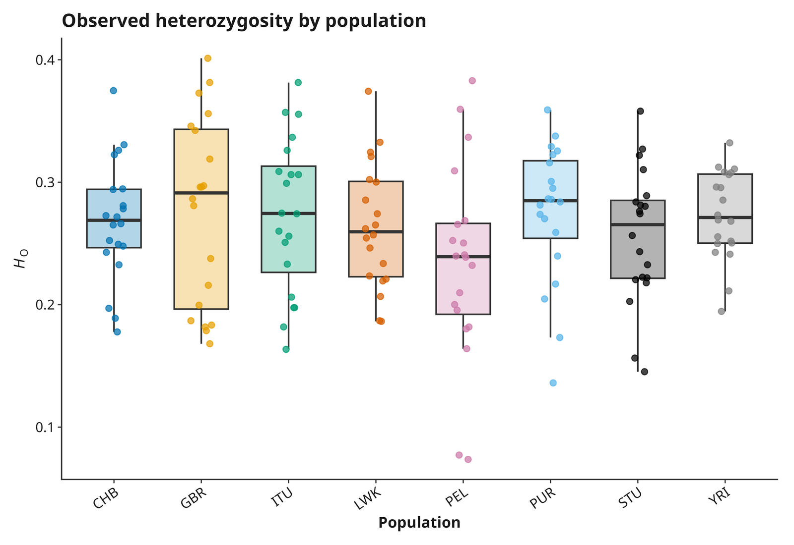
```

`allelic_richness` (rarefied via `hierfstat::allelic.richness()`, an optional dependency that skips transparently with a logged warning if not installed) is a per-population, sample-size-corrected count of alleles per locus -- unlike raw heterozygosity, it is comparable across populations with unequal sample sizes, since it rarefies every population down to the same allele count before counting. For biallelic SNPs it ranges from 1 (monomorphic within the population) to 2 (both alleles present).

```{r allelic-richness-figure, echo=FALSE, out.width="90%"}
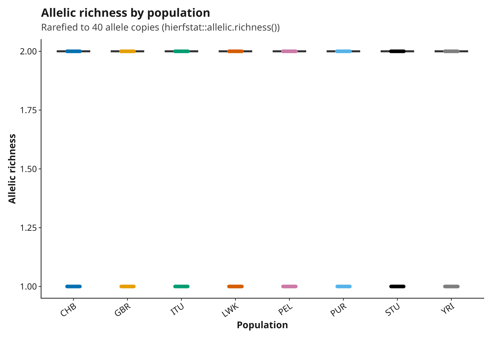
```

The quickstart example's 8 populations are all exactly 20 samples, so richness is rarefied to 40 allele copies and unsurprisingly narrow (1.82 to 1.94 across populations) -- this metric earns its keep on real datasets with unbalanced population sizes, where it can diverge from raw heterozygosity in ways worth investigating.

`effective_alleles` (Kimura and Crow 1964, Ae = 1 / (1 - unbiased expected heterozygosity)) complements allelic richness; `mean_effective_alleles` averages the per-locus values (not the same as computing Ae from the mean heterozygosity). Unlike rarefied allelic richness, Ae is not bounded above at 2 for biallelic markers -- it is a bias-corrected continuous estimator, and small samples can legitimately push it above 2 or to infinity (`Inf`, not a fabricated value, the same convention as Nm and Ne(LD)). On the quickstart example, `mean_effective_alleles` ranges from 1.44 to 1.51 across the 8 populations.

## Site frequency spectrum and bottleneck screen

`48_site_frequency_spectrum.tsv` bins each population's segregating loci by folded minor allele frequency. `49_bottleneck_mode_shift.tsv` applies the mode-shift test (Luikart and Cornuet 1998): under mutation-drift equilibrium the lowest frequency class should hold the most loci; a mode shifted to a higher class is a possible recent-bottleneck signature. This is a qualitative screen, not a p-value or a confirmed bottleneck, and (unlike the classic heterozygosity-excess test) makes no assumption about the locus mutation model.

```{r bottleneck-figure, echo=FALSE, out.width="90%"}
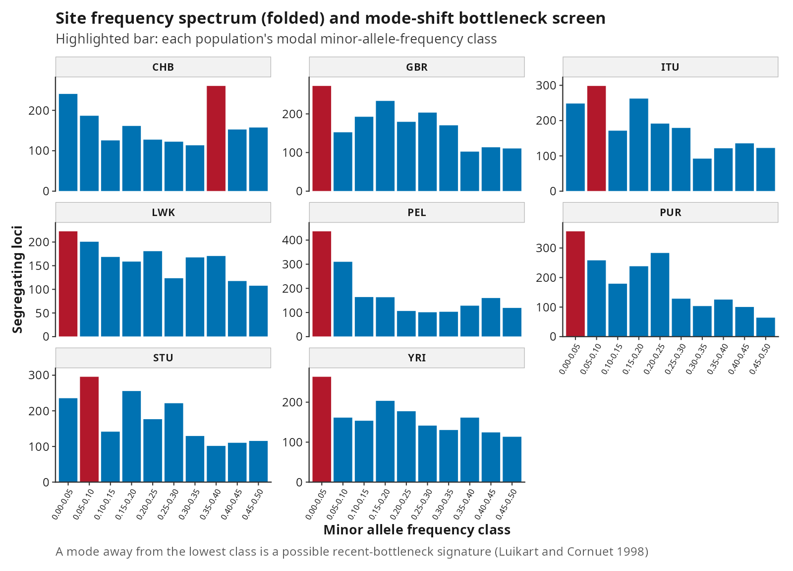
```

Read this with the same caution as any MAF-filtered analysis: with the default `qc.maf = 0.05` filter, all 8 quickstart populations show `mode_shifted = TRUE`, but re-running with `qc.maf = 0` on the same data shows only 3 of 8 (ITU, STU, YRI) are genuinely mode-shifted -- the other 5 correctly show the expected unshifted, lowest-class mode once the filter is removed. The default MAF filter removes population-rare variants before this test runs, which alone can produce a spurious mode-shift signal (the same caveat already documented for Tajima's D). This is not evidence that all 8 populations experienced a recent bottleneck.

## FST

FST summarizes relative allele-frequency differentiation under a specified estimator. It is not a direct measure of migration rate, divergence time, or reproductive isolation.

Report the estimator, marker set, population definitions, sample sizes, confidence intervals or resampling procedure, and whether pairwise estimates are stable. Negative estimates can arise from sampling variation and should be handled according to the documented estimator policy rather than silently transformed.

```{r fst-figure, echo=FALSE, out.width="90%"}
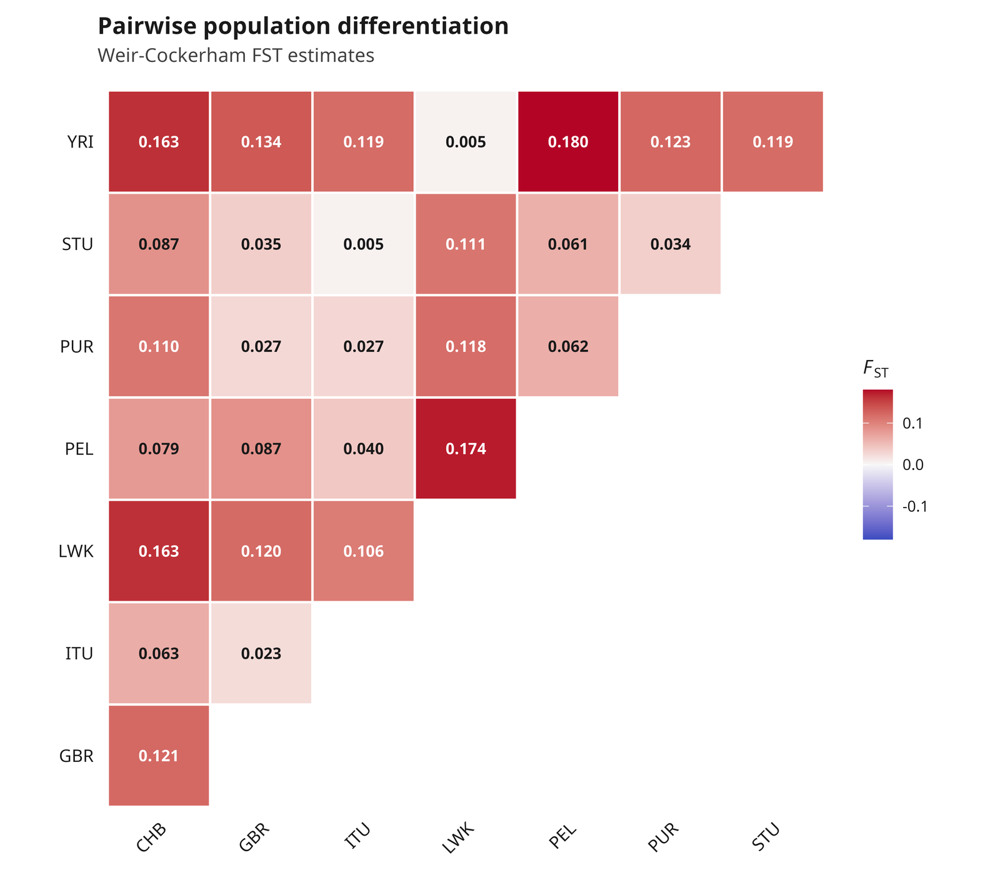
```

The global FST estimate for the quickstart example is 0.0915, consistent with real, moderate differentiation across 8 geographically diverse populations at this marker density.

Every FST estimate is accompanied by Wright's (1931) island-model gene-flow estimate, Nm = (1 - FST) / (4 * FST), on `17_global_FST.tsv` (`global_nm`) and `18_pairwise_FST.tsv` (`nm`) -- a direct, monotonic transform of the same FST value, not shown as a separate figure. On the quickstart example, global Nm = 2.48; the pairwise minimum (ITU-STU, FST = 0.0052) gives Nm = 48.3 and the pairwise maximum (PEL-YRI, FST = 0.180) gives Nm = 1.14.

The same tables also carry Jost's (2008) D (`global_jost_d`, `jost_d` on `18_pairwise_FST.tsv`, and `19b_pairwise_jost_d_matrix.tsv`) -- a different differentiation measure, not a transform of FST. FST's denominator is bounded by within-population heterozygosity, so a highly polymorphic marker set can never show a high FST even under strong true differentiation; Jost's D avoids that constraint. On the quickstart example, global Jost's D = 0.0387 versus global FST = 0.0915 (expected -- Jost's D is typically smaller than FST). Pairwise D correlates strongly with FST (r = 0.998) but reverses the order of the two closest, near-tied population pairs (ITU-STU vs. LWK-YRI) -- the two measures agree overall without being interchangeable in fine detail.

The same tables also carry Nei's (1987) Dxy, absolute nucleotide divergence (`global_dxy`, `dxy` on `18_pairwise_FST.tsv`, and `19c_pairwise_dxy_matrix.tsv`) -- a third differentiation measure, and the one genuinely unnormalized member of the group. FST, Nm, and Jost's D are all scaled by within-population diversity, so identical low values can mask two different demographic histories: recent divergence with ongoing gene flow (low Dxy) versus an older split that still shares a lot of ancestral polymorphism (high Dxy), a distinction FST alone cannot make (Cruickshank and Hahn 2014). On the quickstart example, global Dxy = 0.3056; pairwise Dxy correlates positively with FST (r = 0.90) but noticeably less tightly than Jost's D does (r = 0.998) -- expected, since Dxy is not scaled by within-population heterozygosity. Read honestly: in this dataset the two lowest-FST pairs (ITU-STU and LWK-YRI) are also the two lowest-Dxy pairs, so no FST/Dxy decoupling shows up here, consistent with these 8 populations sharing a broadly similar, relatively recent divergence history rather than the more variable species-level divergence times where FST/Dxy decoupling is most often reported.

Global and pairwise FST both describe the whole dataset or a pair of populations; neither directly answers "how distinct is this one population from the panel as a whole." Population-specific FST / beta (Weir and Goudet 2017), via `hierfstat::betas()` (the reference implementation), fills that gap: a per-population value using a common ("global") kinship reference rather than a pairwise one, on `51_population_specific_fst.tsv`.

```{r population-specific-fst-figure, echo=FALSE, out.width="90%"}
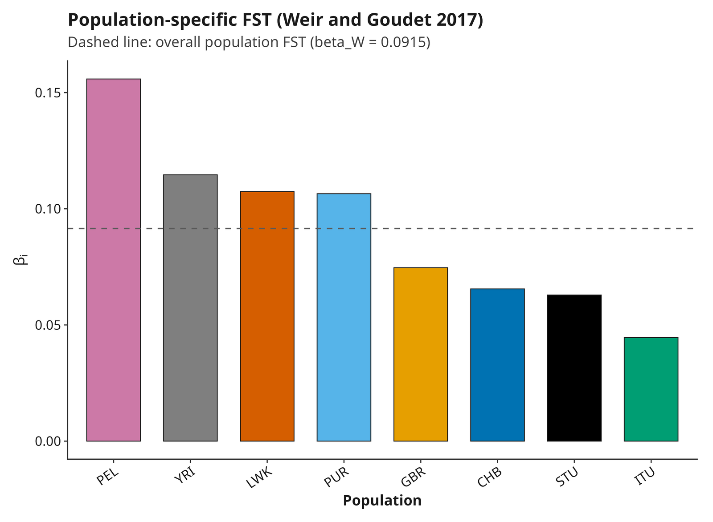
```

On the quickstart example, the overall weighted mean (`global_beta_fst`) is 0.0915 -- agreeing with `global_fst` to 9 significant figures, an expected internal-consistency check rather than a coincidence. Per-population beta ranges from ITU (0.0446, least distinct from the rest of the panel) to PEL (0.1558, most distinct); PEL standing out as the most differentiated population matches this package's own Nei's-distance and population-assignment results elsewhere in this report, an independent third confirmation of the same real population-structure pattern.

## Population genetic distance and tree

`46_population_genetic_distance.tsv` is Nei's (1972) standard genetic distance between populations, computed from allele frequencies -- a different deliverable from kinship/the individual tree above: those describe relationships among **samples**, this describes relationships among **populations**. A neighbour-joining tree built from this distance matrix is written to `trees/population_Nei_neighbor_joining.nwk` and rendered as a figure whenever at least three populations are present, with the same locus-resampling bootstrap support (Felsenstein 1985; see the individual IBS tree above for what the percentages mean) shown at each internal node.

```{r population-tree-figure, echo=FALSE, out.width="90%"}
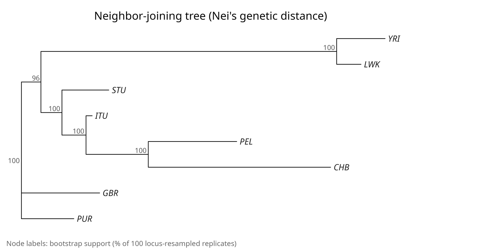
```

On the quickstart example, LWK-YRI (Luhya, Kenya and Yoruba, Nigeria, both African) is the single closest pair (D=0.0112), while the largest distances are all African-vs-non-African population pairs (up to D=0.091) -- the expected continental-population-structure pattern, a real result from real chr22 data. Unlike the individual-level tree above, support here is uniformly high (96-100% at every internal node): population-level allele-frequency distances average over many individuals per population, making the resulting topology far more robust to which specific loci were sampled than any single individual-level split can be.

## Population assignment test

`47_population_assignment.tsv` is a frequency-based self-assignment test (Paetkau et al. 1995, 2004): for each sample, the leave-one-out likelihood (Rannala and Mountain 1997) of its genotype is computed under every population's allele frequencies, and the sample is assigned to whichever population maximizes that likelihood. A sample whose assigned population differs from its recorded metadata label (`mismatch = TRUE`) is a candidate migrant or a metadata error. Uses the same LD-pruned marker set as kinship/PCA/IBS, since the per-locus likelihoods are multiplied together assuming independence across loci.

```{r assignment-figure, echo=FALSE, out.width="90%"}
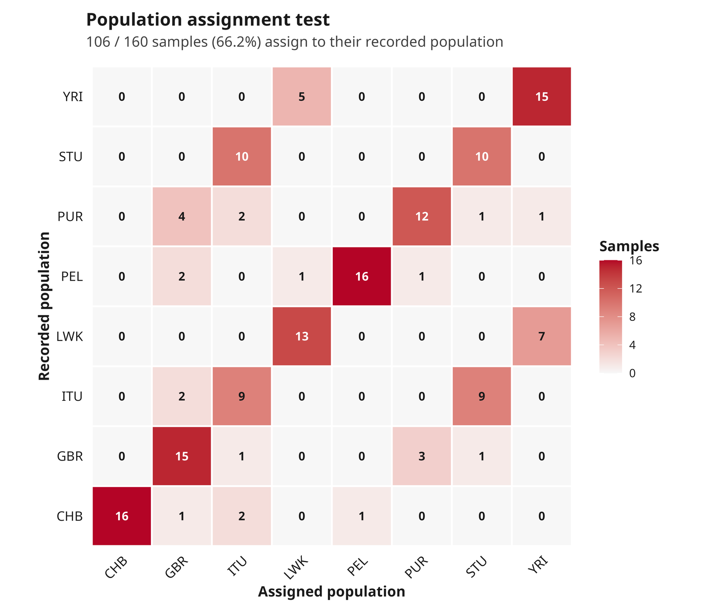
```

On the quickstart example, 106 of 160 samples (66%) correctly self-assign. The 54 mismatches are heavily concentrated in the two most genetically similar population pairs already identified above by FST/Nm: 31 of 54 (57%) are ITU/STU or LWK/YRI cross-assignments -- an independent cross-validation of the FST/Nm and Nei's-distance results, using a per-sample genotype-likelihood approach rather than aggregate allele-frequency distance, not a defect in the method.

## Genome scans

Windowed FST and diversity (`39_genome_scan_fst.tsv`, `40_genome_scan_diversity.tsv`) track the same statistics above along physical position rather than only as a single genome-wide number -- useful for spotting localized differentiation or diversity outliers. Windows are non-overlapping by default (`analyses.genome_scan_step_bp` equals `analyses.genome_scan_window_bp`); a smaller step gives a real overlapping/sliding scan.

`41_genome_scan_FST_outliers.tsv` is a descriptive ranking (highest-FST windows), **not** a significance test -- no permutation or null distribution is computed, so a high-FST window is a candidate worth further investigation, not a statistically confirmed selection signal. Always check a window's `n_snps` before treating its estimate as meaningful: windows below `analyses.genome_scan_min_snps` (default 5) are reported as `NA` rather than a misleadingly precise value from too few markers, and even windows just above that threshold can be noisy.

```{r genome-scan-fst-figure, echo=FALSE, out.width="90%"}
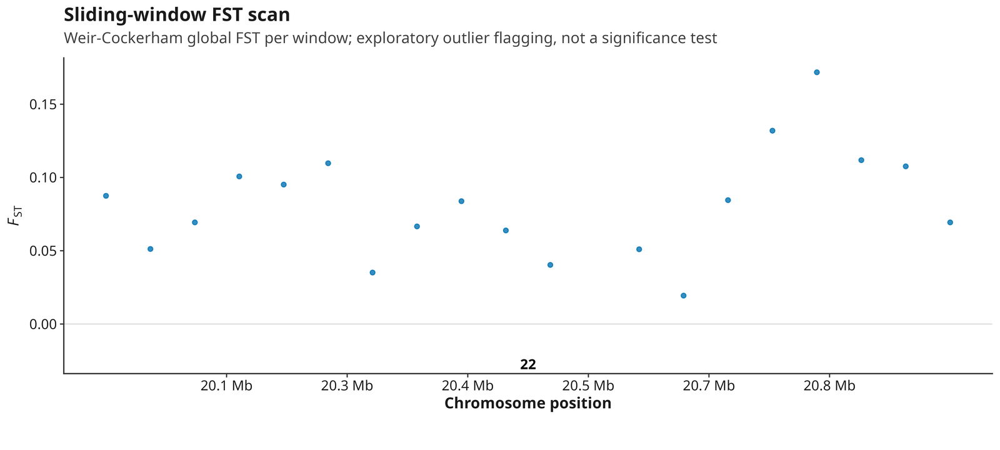
```

The 20 windows range from FST 0.051 to 0.172. The single highest, 20.80-20.85 Mb (FST=0.172, 104 SNPs), is a candidate worth further investigation under the caveats above, not a confirmed selection signal -- especially since it is only moderately above the region's known global FST of 0.0915.

```{r genome-scan-diversity-figure, echo=FALSE, out.width="90%"}
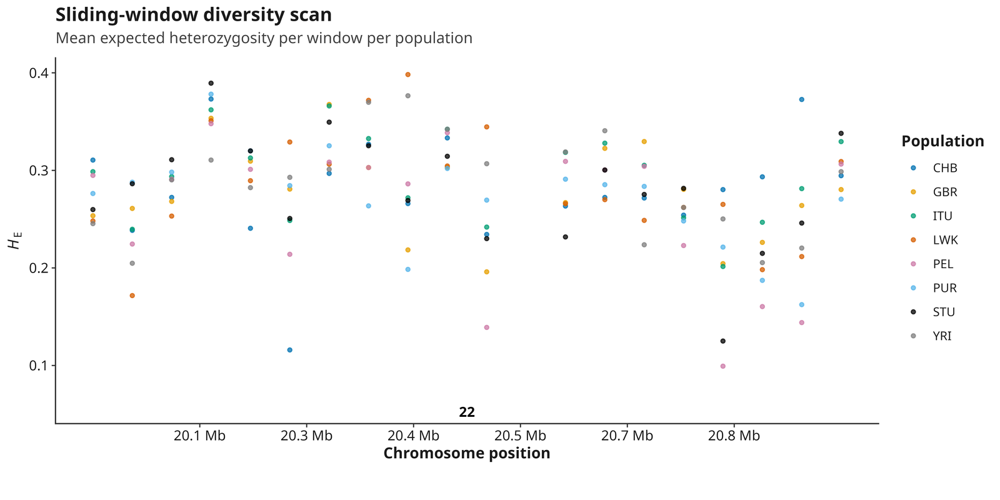
```

Mean expected heterozygosity per window per population ranges from 0.099 to 0.398 across the 8 populations -- the same kind of real, biologically plausible spread reported for the genome-wide diversity summary above, now resolved by position.

`segregating_sites`/`tajima_d` (Tajima 1989) are also computed per window per population, reusing the same window grid and locus data -- windowed Watterson's theta vs. pairwise nucleotide diversity, a classical neutrality-test statistic (positive: excess of intermediate-frequency variants relative to neutral expectation; negative: excess of rare variants, e.g. after a selective sweep or population expansion). Like the FST outliers above, a single window's Tajima's D is descriptive, not itself a significance test.

```{r genome-scan-tajima-d-figure, echo=FALSE, out.width="90%"}
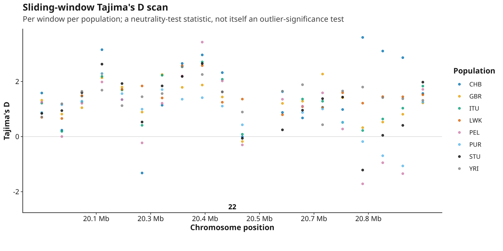
```

Real values are almost entirely positive (median 1.34, range -1.71 to 3.60 across the 152 windows with a defined estimate). This is an expected artifact of this pipeline's own QC, not necessarily a real signal of balancing selection or population contraction: the default minor-allele-frequency filter (`qc.maf`, default 0.05) removes rare variants *before* this scan runs, and removing rare variants is well known to bias Tajima's D upward (it reduces the segregating-sites count much more than it reduces pairwise diversity). Interpreting Tajima's D values from any MAF-filtered marker set -- the norm for SNP-array/exome-chip data, including this one -- needs this caveat kept in mind.

## Linkage disequilibrium decay

`43_LD_decay.tsv` bins pairwise genotypic correlation (r-squared) between SNPs by physical distance, computed on the QC-passing, **unpruned** marker set -- the LD-pruned set used elsewhere (PCA, kinship, DAPC, ancestry) is specifically selected to have *low* pairwise LD, so decay computed on it would systematically understate how far real LD extends. A real limitation: pairs beyond the SNP-index window `analyses.ld_decay_slide` are never computed even if within `analyses.ld_decay_max_distance_bp`, so the curve's usable range depends on marker density, not only on the configured distance cutoff.

```{r ld-decay-figure, echo=FALSE, out.width="90%"}
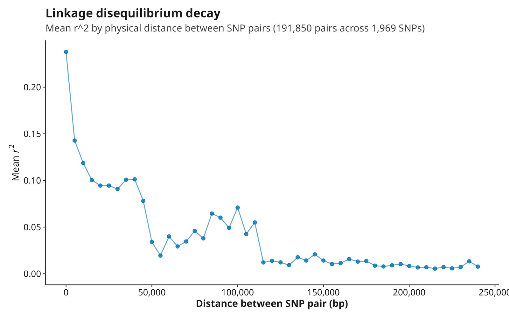
```

Mean r-squared falls from 0.238 at the shortest distance bin (0-5kb) to under 0.04 by roughly 50kb -- a real, biologically sensible decay curve (not flat or noisy), consistent with typical human LD extent at this marker density.

## LD-based effective population size

`45_Ne_LD.tsv` estimates contemporary effective population size (Ne) per population from linkage disequilibrium between **cross-chromosome** (effectively unlinked) SNP pairs -- the opposite pair selection from LD decay above, which specifically wants physically close pairs (Waples 2006; Waples & Do 2008, the "LDNe" method also implemented by the NeEstimator software). A single realization's LD-based Ne estimate has real, substantial sampling variance -- treat a point estimate as an order-of-magnitude indication, not a precise count, especially without a confidence interval (not yet implemented). `ne = Inf` means no drift signal was detectable above sampling noise (a real, informative result, not a failure); `NA` with `ne_status = "below_formula_domain"` means the implied Ne is outside the estimator's valid range.

This method fundamentally needs markers on **at least two chromosomes** to work at all. The quickstart dataset's retained autosomal marker set is chr22-only by design (the same reason chromosome X/Y are reserved for the sex-check module rather than pooled into other analyses), so every population in the real reference run correctly reports `ne_status = "fewer_than_two_chromosomes"` -- an honest, expected skip for this particular demo dataset, not a bug or a broken feature. A real multi-chromosome VCF will produce real per-population estimates.

## DAPC

This package's DAPC module discriminates unsupervised `find.clusters()` partitions computed at each configured K, not user-supplied population labels; the metadata `population` column is used only for plot colour and as ground truth for the reported assignment-accuracy diagnostic. Apparent separation is therefore not independent confirmation that either the clusters or any real population labels are biologically meaningful.

Document how many principal components and discriminant axes were retained, how those choices were validated, and whether sample sizes support the model. Avoid presenting discrimination between data-driven clusters as an unbiased discovery result about the sampled populations.

`22d_DAPC_K_selection.tsv`/`22e_DAPC_K_selection.tsv` and this figure report the automatic cluster-number consensus across BIC, mean cross-validation success, Calinski-Harabasz, Davies-Bouldin, and replicate-membership RMSE. It is a starting point, not a substitute for domain judgment about how many groups the data can support.

```{r dapc-k-selection-figure, echo=FALSE, out.width="90%"}
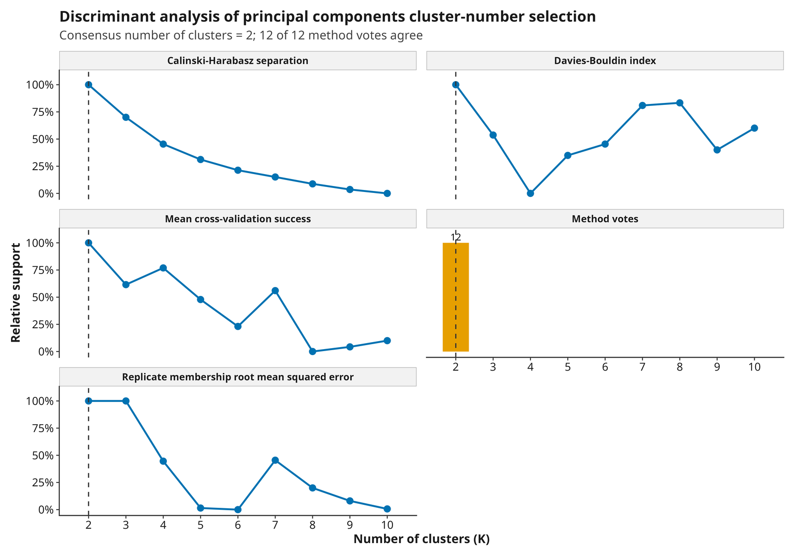
```

The full report (`22_DAPC_coordinates_K<k>.tsv`, `22f_DAPC_loadings_K<k>.tsv`, and figures) contains one complete set of DAPC results for **every** requested K (2 through 10 by default), not only the consensus K shown here. Before trusting any given K's clustering, check its `replicate_max_rmse` in `21_DAPC_diagnostics.tsv` against `analyses.structure.reproducibility_rmse` (default 0.05): a K at or below that threshold has reproducible replicate membership across independent `find.clusters()`/`dapc()` runs; a K above it does not, and its clusters and loadings should not be interpreted, only the consensus itself and the diagnostics that led to it. In the quickstart example, the consensus K=3 has `replicate_max_rmse` effectively 0 (fully reproducible); several other K values in the same run exceed the threshold and are not shown here for that reason.

`22f_DAPC_loadings_K<k>.tsv`, plus a genomic Manhattan-style figure and a rank-ordered figure, report each SNP's contribution to every discriminant function at each K. A large contribution identifies a marker that helped separate that K's clusters; it does not by itself establish biological cause.

```{r dapc-figure, echo=FALSE, out.width="90%"}
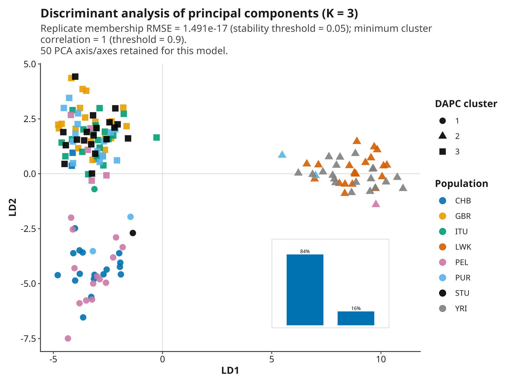
```

```{r dapc-loadings-manhattan-figure, echo=FALSE, out.width="90%"}
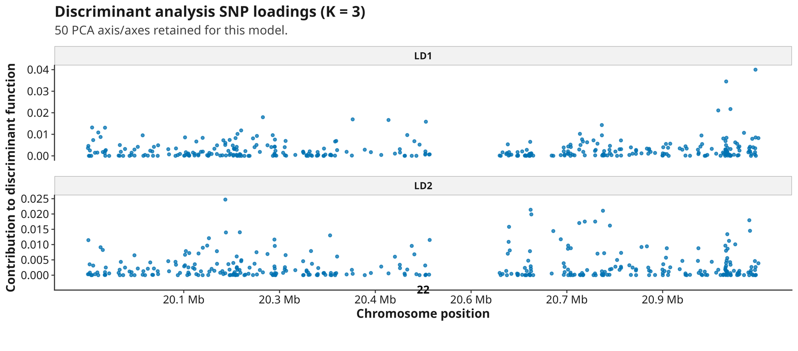
```

```{r dapc-loadings-ranked-figure, echo=FALSE, out.width="90%"}
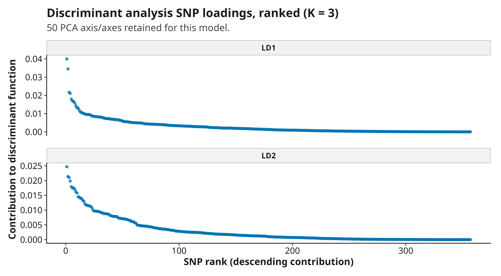
```

## AMOVA

Analysis of molecular variance (Excoffier et al. 1992, via `poppr::poppr.amova()`) partitions total genetic variance hierarchically -- between populations, between samples within populations, and within samples -- and tests each component's significance by permutation (`ade4::randtest()`, 999 permutations, not currently configurable). Its meaning depends entirely on the hierarchy tested, the distance definition, and the permutation design -- state all three. Interpret a negative variance component transparently (a real, expected outcome of the estimator under weak or absent true structure, not an error) rather than silently truncating it to zero.

`24_AMOVA_phi_statistics.tsv`'s `Phi-population-total` is the same quantity as FST in this hierarchical framework -- the fraction of total variance attributable to among-population differences, computed by an entirely different route (variance partitioning on a distance matrix, rather than FST's allele-frequency-based estimator). On the quickstart example, `23_AMOVA_components.tsv` partitions total variance into 9.04% between-population, 4.27% between-samples-within-population, and 86.69% within-samples; `Phi-population-total` = 0.0904, and all three components are significant at p = 0.001 (999/999 permutations, the permutation floor). This 9.04% is an independent, method-agnostic confirmation of the same ~9% among-population signal already reported by Weir and Cockerham's (1984) global FST (0.0915) and Weir and Goudet's (2017) population-specific FST (`global_beta_fst` = 0.0915) above -- three different estimators converging on the same real value from the same real population structure, not three unrelated numbers that happen to look similar.

## Multilocus genotype (MLG) and clonal diversity

`poppr::poppr()`/`poppr::mlg.id()`/`poppr::genotype_curve()` (Kamvar, Tabima, and Grunwald 2014) ask a question distinct from kinship above: not "how related are these two samples," but "do these two samples have *exactly* the same genotype at every analyzed locus" -- the standard signal for clonal replicates, accidental resampling, or duplicate sample submissions. `56_MLG_diversity_summary.tsv` reports per-population genotypic diversity (MLG count, eMLG, Shannon's H, Stoddart-Taylor's G, Simpson's lambda, evenness, and the index of association Ia/rbarD); `57_MLG_groups.tsv` lists any samples sharing an identical genotype, flagging groups that span more than one recorded population.

```{r clonality-curve-figure, echo=FALSE, out.width="90%"}
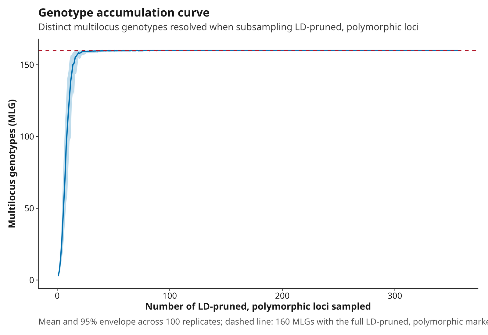
```

On the quickstart example, all 160 samples have a unique multilocus genotype across the 1,969 QC-passing loci this module reuses from the diversity module (not the 357-SNP LD-pruned set kinship/PCA/tree use). Notably, this includes the one pair kinship classifies as `duplicate/MZ twin` (`NA19331`/`NA19334`, kinship = 0.4459): on this larger marker panel their genotypes are not bit-identical -- the expected difference between a continuous relatedness estimator and exact genotype matching, not a contradiction. The accumulation curve saturates almost immediately: a mean of 150 of the 160 possible MLGs are already resolved with only 14 of the ~1,969 available loci, deterministically saturating at 174. Ia/rbarD are positive throughout (Total Ia = 35.40, rbarD = 0.0185); read this cautiously, not as clonality evidence in this outbreeding species -- the module reuses diversity's unpruned locus set for consistency with AMOVA, so a positive value here largely reflects ordinary physical linkage among nearby SNPs.

## Ancestry models

**ADMIXTURE, fastStructure, and sNMF are not run by default** (`analyses.admixture`, `analyses.faststructure`, and `analyses.snmf` all default to `enabled: false`). Each is an external, optional dependency -- ADMIXTURE and fastStructure are separate command-line programs, not R packages -- and none is required for the rest of popgenVCF to work. See the [ancestry backend guide](https://github.com/duceppemo/popgenVCF/blob/main/docs/user/ancestry-backends.md) to enable one.

ADMIXTURE, fastStructure, and sNMF estimate model-dependent ancestry proportions. Cluster labels are exchangeable, and the selected K is not a literal count of ancestral populations.

For each K, compare the population-organized membership figure with the
`_data_driven_` figure. Both display the same fitted coefficients. The latter
ignores the metadata population labels, groups samples by their dominant
inferred cluster, and orders them by membership strength. This makes structure
that conflicts with the prior population definitions easier to see without
mistaking a different sample order for a second model fit. Vertical separator
lines mark boundaries between dominant inferred-cluster groups.

The consensus cluster number combines the raw optimum, elbow, and parsimonious
plateau or one-standard-error choices from diagnostics that the fitted models
already produced. Review the method-level votes, normalized diagnostic panels,
agreement fraction, and documented tie-break rather than reporting only the
final number. Consensus among related diagnostics is not independent evidence
that the selected number represents biological truth.
Interpret replicate alignment, convergence, fit metrics, cross-validation or entropy criteria, cluster stability, sample uncertainty, and agreement across backends. Prefer stable patterns supported across replicates and neighboring K values. Do not equate a colour component with a named historical population without independent evidence.

The figures below are from real ADMIXTURE, fastStructure, and sNMF runs against the quickstart example (K=2..9 each, ADMIXTURE with 5-fold cross-validation and sNMF with 5 repetitions per K) -- deliberately enabled just for this documentation, not part of the bundled dataset's default analysis. All three are run independently here, not cross-validated against each other (a separate, heavier release-gate evidence process); their three different consensus K values below (7, 3, 6) are a real, expected illustration of why this section says to distinguish computational agreement from biological truth rather than average or otherwise reconcile them by default.

In every population-organized membership figure below, populations are ordered by similarity of their mean ancestry composition (average-linkage clustering on each population's per-cluster mean proportions), not alphabetically, so similar populations sit next to each other rather than being scattered apart by name.

### ADMIXTURE

```{r admixture-k-selection-figure, echo=FALSE, out.width="90%"}
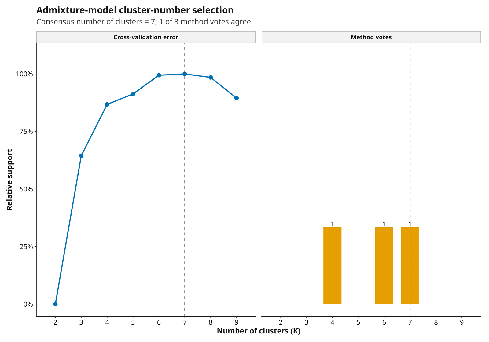
```

Cross-validation error is lowest and flattens from K=6 through K=9; the automatic consensus selects **K=7**. The full report (`27_ADMIXTURE_CV.tsv`, `28_ADMIXTURE_Q_K<k>.tsv`, and figures) contains a complete Q matrix and pair of figures for **every** requested K, not only the one shown here.

```{r admixture-q-population-figure, echo=FALSE, out.width="90%"}
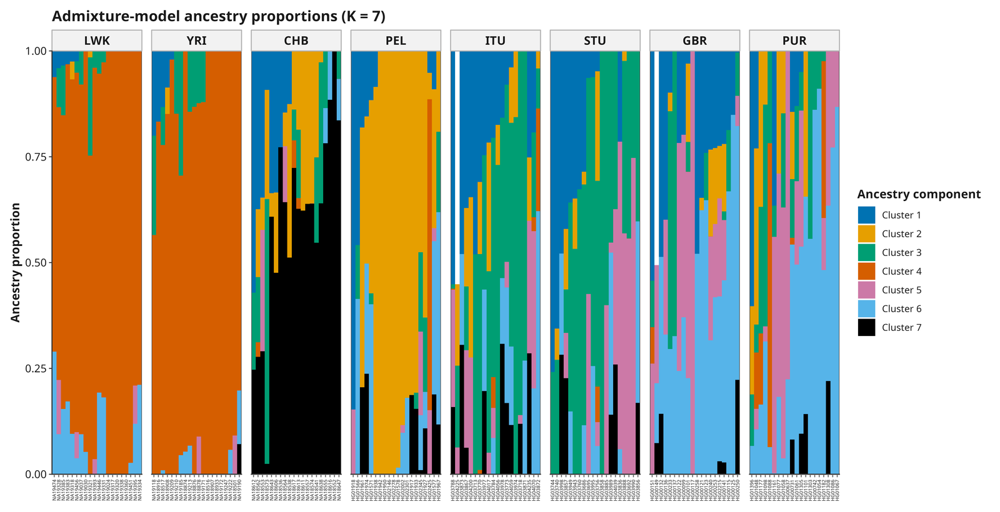
```

```{r admixture-q-data-driven-figure, echo=FALSE, out.width="90%"}
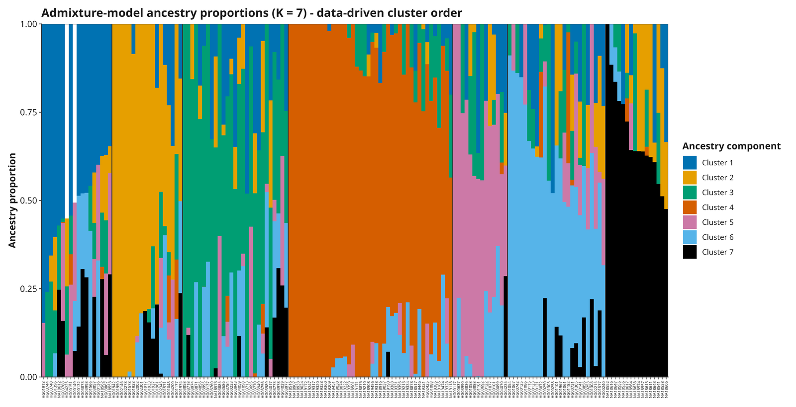
```

### fastStructure

```{r faststructure-k-selection-figure, echo=FALSE, out.width="90%"}
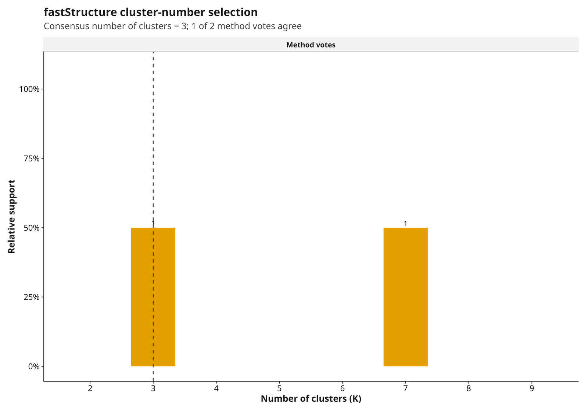
```

Marginal likelihood peaks at K=3 (-0.849, versus -0.854 to -0.872 elsewhere in the K=2..9 range); the automatic consensus selects **K=3**. The full report (`29_fastStructure_runs.tsv`, `29_fastStructure_Q_K<k>.tsv`, and figures) contains a complete Q matrix and pair of figures for **every** requested K, not only the one shown here.

```{r faststructure-q-population-figure, echo=FALSE, out.width="90%"}
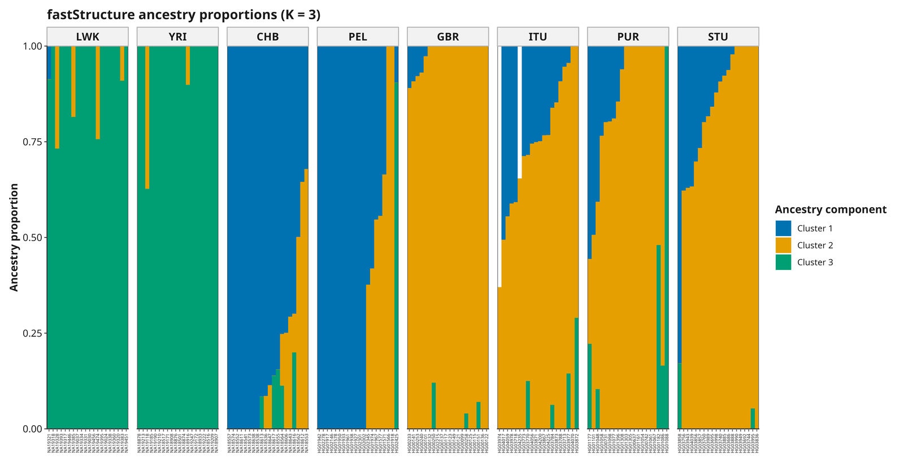
```

```{r faststructure-q-data-driven-figure, echo=FALSE, out.width="90%"}
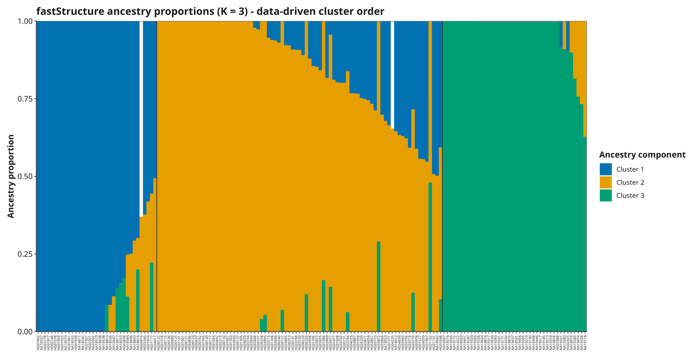
```

### sNMF

```{r snmf-k-selection-figure, echo=FALSE, out.width="90%"}
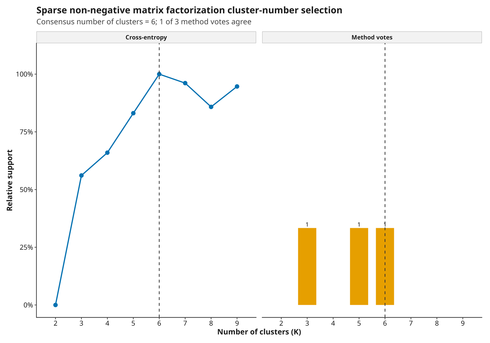
```

Mean cross-entropy across replicates is lowest at K=6 (0.627, versus 0.628 to 0.650 elsewhere in the K=2..9 range); the automatic consensus selects **K=6**. The full report (`30_sNMF_cross_entropy.tsv`, `30_sNMF_Q_K<k>.tsv`, and figures) contains a complete Q matrix and pair of figures for **every** requested K, not only the one shown here.

```{r snmf-q-population-figure, echo=FALSE, out.width="90%"}
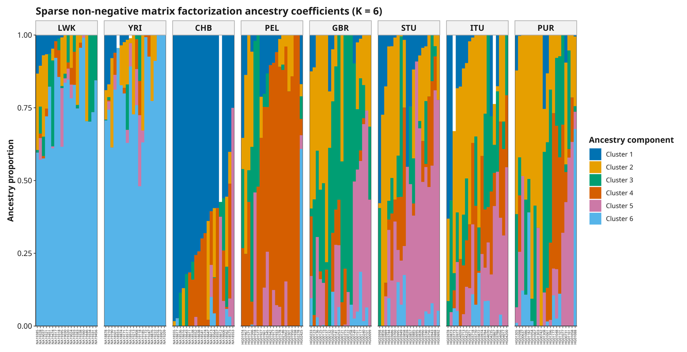
```

```{r snmf-q-data-driven-figure, echo=FALSE, out.width="90%"}
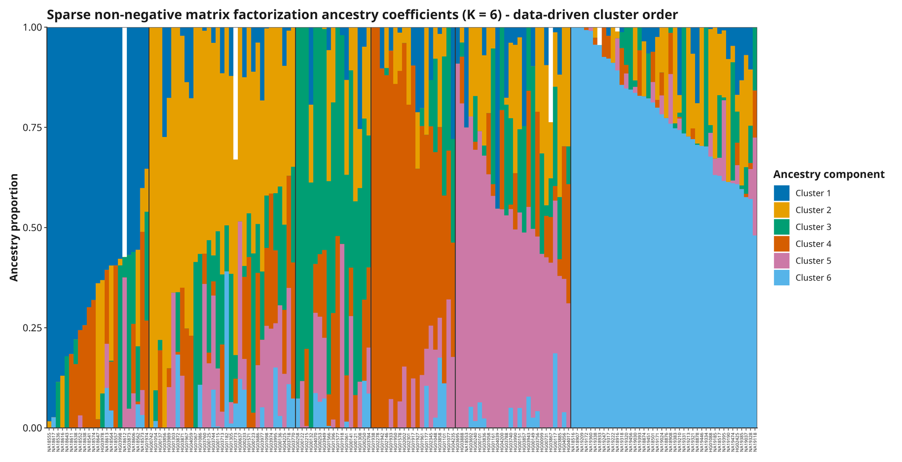
```

Comparing the population-organized and data-driven figures within each backend above is the standard check described earlier in this section: structure that persists regardless of sample ordering is more trustworthy than structure only visible when samples are pre-sorted by their metadata population label.

## Isolation by distance and Mantel analyses

A relationship between genetic and geographic distance can reflect dispersal limitation, barriers, hierarchical structure, sampling geometry, or environmental covariation.

Inspect the distance definitions, complete coordinate pairs, spatial extent, outliers, permutation design, and residual pattern. A Mantel result does not establish a causal spatial process and can be misleading under complex spatial or hierarchical sampling.

The quickstart metadata includes real, documented population-level collection
coordinates (see the dataset's `README.md` for the exact source and the
GBR/ITU/STU shared-point caveat), so this module actually runs for the
quickstart example rather than being skipped for lack of coordinates.

```{r ibd-figure, echo=FALSE, out.width="90%"}
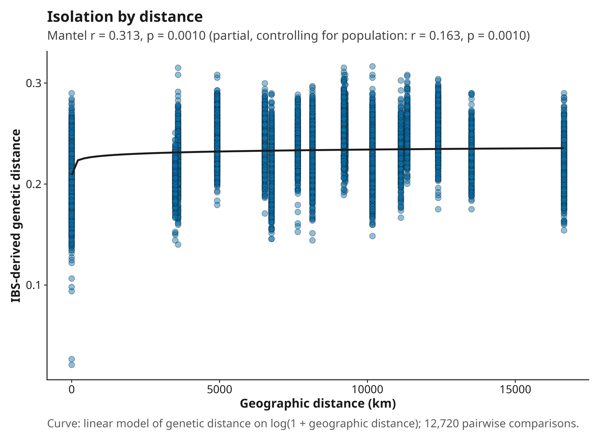
```

The Mantel test (Pearson, 999 permutations) on the quickstart example gives
r = 0.3129, p = 0.001 (the 999-permutation floor), with a positive slope
(0.00275, R² = 0.137) across all 12,720 complete sample pairs. The same 8
populations are also the units compared by FST and PCA elsewhere in this
report, so this is not independent confirmation from an unrelated experiment.

When population metadata is present with at least two populations, a
**partial Mantel test** (`vegan::mantel.partial()`, Smouse, Long, and Sokal
1986) also runs automatically, controlling the genetic-vs-geographic distance
correlation for a same/different population indicator -- does the
isolation-by-distance signal survive once population membership is accounted
for, or is it purely an artifact of population clustering? On the quickstart
example the partial Mantel r drops to 0.1627 (p = 0.001): weaker than the
plain Mantel r, but still real and statistically significant, indicating
geographic distance carries genuine explanatory power beyond simple
population clustering. Both results are reported together in the figure's
subtitle above.

## Spatial autocorrelation

`50_spatial_autocorrelation.tsv` bins sample pairs into geographic-distance classes and reports a spatial-autocorrelation coefficient r per class (Smouse and Peakall 1999), with a permutation-based 95% null envelope and p-value -- a distance-resolved complement to the single overall Mantel r above.

```{r spatial-autocorrelation-figure, echo=FALSE, out.width="90%"}
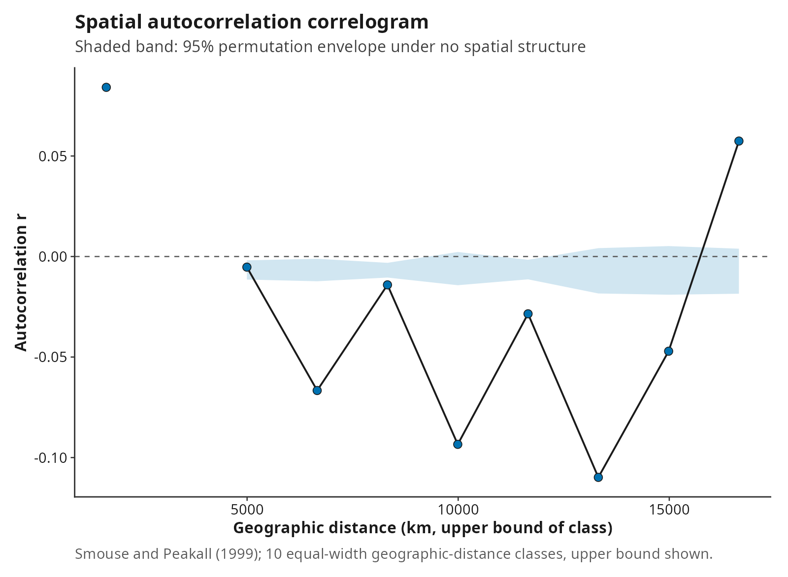
```

Read this one with real caution: the quickstart metadata uses population-level representative coordinates, not per-individual GPS, so 21% of sample pairs sit at exactly zero geographic distance and the smallest nonzero distance jumps to 3,503 km, leaving the shortest distance classes empty. The correlogram mostly resolves population-site-to-site differences here, not fine-grained within-population spatial structure -- treat the quickstart values as a demonstration that the analysis runs correctly, not as a spatial-structure finding.

## Integrating analyses

Concordant analyses can strengthen a description, but shared inputs also create shared biases. PCA separation, high pairwise FST, ancestry components, and geographic clustering are not four independent experiments when they use the same samples and variants.

When analyses disagree, investigate sample size, missingness, LD, relatives, population labels, spatial scale, model assumptions, and uncertainty before choosing the preferred narrative.

## Reporting checklist

A defensible results section should identify:

- input datasets and checksums;
- sample and variant exclusions;
- filtering and LD-pruning parameters;
- estimator and software versions;
- random seeds, threads, and replicate counts;
- validation state and failed or skipped modules;
- uncertainty intervals or resampling where available;
- limitations and plausible alternative explanations;
- the exact source tables behind each figure.

Scientific conclusions remain the responsibility of the analyst. popgenVCF provides deterministic calculations, evidence records, and transparent failure states; it does not replace study-design review or domain expertise.
