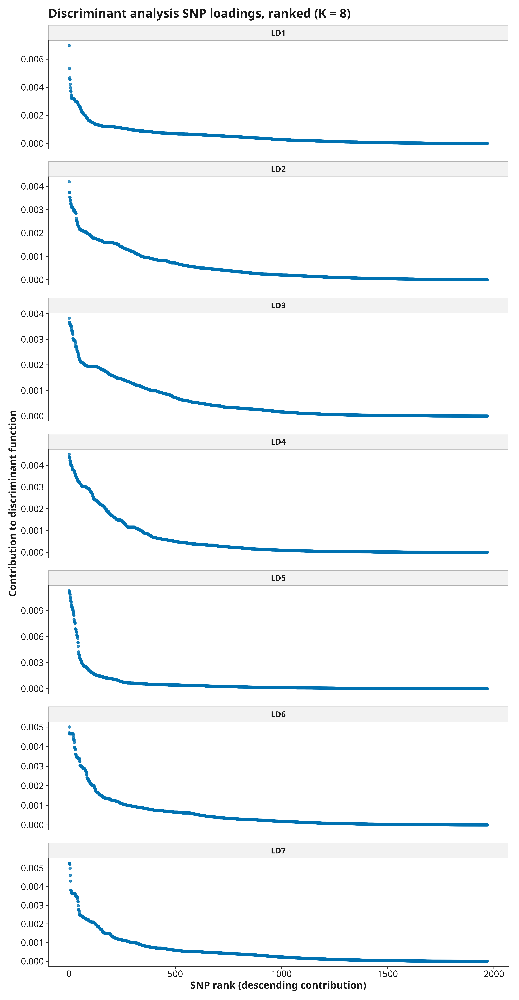

```{r, include = FALSE}
knitr::opts_chunk$set(collapse = TRUE, comment = "#>")
```

Population-genomic outputs are summaries of a particular sample, marker set, filtering policy, population definition, and model. They are not direct measurements of demographic history or causation. Interpretation should begin with execution and validation evidence, not with the most visually striking figure.

## Read results in this order

1. Confirm exact sample identity and metadata alignment.
2. Review sample and variant QC, missingness, allele-frequency filters, and LD pruning.
3. Confirm module capability, execution state, and validation state.
4. Inspect numerical source tables before figures.
5. Compare related analyses and investigate disagreement.
6. State assumptions, uncertainty, exclusions, and alternative explanations.

## Execution and evidence states

| State | Meaning | Interpretation rule |
|---|---|---|
| `success` | The module completed | Interpret only after its validation record passes |
| `skipped` or unavailable | Required metadata, software, or inputs were absent | Report the reason; do not infer a negative biological result |
| `blocked` | A prerequisite failed or did not complete | Interpret neither the blocked module nor missing downstream artifacts |
| `failed` | The module encountered an error or invalid output | Resolve the cause and rerun before scientific use |
| `timed_out` | The configured elapsed-time budget was exceeded | Treat as incomplete, not as evidence for absence |
| diagnostic-only | A comparison is informative but not release-gating | Do not describe it as certified equivalence |
| insufficient evidence | Required datasets, repetitions, approvals, or comparisons are missing | Do not convert the state into pass or fail |

## Quality control and filtering

Sample and variant QC determine the data on which every downstream result depends.

Review missingness, heterozygosity, minor-allele frequency, retained sample counts, retained variant counts, chromosome representation, and the exact LD-pruned SNP list. Large changes after one threshold deserve explanation. A sample with unusual heterozygosity may reflect biology, contamination, ploidy mismatch, mapping error, or sample mixture; the statistic alone does not identify the cause.

Filtering can change ordinations, distances, diversity, and differentiation. Report thresholds and sensitivity analyses when conclusions depend on a narrow filtering choice.

```{r maf-figure, echo=FALSE, out.width="90%"}
knitr::include_graphics("figures/01_MAF.png")
```

The quickstart example (see `vignette("quickstart")`) reduces 21,418 biallelic SNPs to 1,969 after MAF filtering and 357 after LD pruning -- real numbers from a real 160-sample, 8-population run, not a toy fixture.

## PCA

Principal components summarize directions of variance in the analyzed genotype matrix. Separation can reflect population structure, family relationships, batch effects, uneven missingness, marker ascertainment, inversions, or geographic clines.

Interpret the eigenvalues and source coordinates together. Do not assign discrete populations solely from visual clusters. Examine whether patterns persist after removing close relatives, high-LD regions, or problematic samples. Axis signs are arbitrary; only relative geometry is meaningful.

`31_PCA_loadings.tsv`, plus a genomic Manhattan-style figure and a rank-ordered figure, report each SNP's signed correlation with every retained component. Ranking is by magnitude, not raw value, since a large negative loading is just as informative as a large positive one. A high-magnitude loading marks a marker associated with an axis; it is not evidence that the marker is causal without independent, functional follow-up.

```{r pca-figure, echo=FALSE, out.width="90%"}
knitr::include_graphics("figures/07_PCA_PC1_PC2.png")
```

```{r pca-loadings-manhattan-figure, echo=FALSE, out.width="90%"}
knitr::include_graphics("figures/17_PCA_loadings_manhattan.png")
```

```{r pca-loadings-ranked-figure, echo=FALSE, out.width="90%"}
knitr::include_graphics("figures/18_PCA_loadings_ranked.png")
```

The 8 populations in the quickstart example separate largely by continental origin along PC1/PC2, as expected for real, geographically diverse human samples.

## IBS and MDS

Identity-by-state measures allele sharing in the retained marker set. MDS represents those distances in a lower-dimensional space.

The pairwise-distance heatmap labels both axes with public sample names and uses
an average-linkage row dendrogram aligned to the clustered heatmap order. High
similarity may indicate relatedness or shared population history, but IBS is
not an identity-by-descent estimate and does not establish pedigree relationships. Check pairwise source tables, sample labels, and the amount of distortion introduced by the displayed dimensions.

```{r ibs-figure, echo=FALSE, out.width="90%"}
knitr::include_graphics("figures/09_IBS_heatmap.png")
```

## Kinship

Kinship (`SNPRelate::snpgdsIBDKING()`, KING-robust, Manichaikul et al. 2010) answers a different question than IBS/MDS above: not "how similar are these samples overall" but "are these two individuals related, and how closely." KING-robust is specifically chosen for robustness to population stratification, unlike naive relatedness estimators that assume a single homogeneous population -- a real requirement here, since this package explicitly supports analyzing structured populations.

The estimator needs realistic marker density to behave sensibly; a handful of SNPs produces values with no biological meaning, confirmed concretely during this feature's implementation against both an undersized fixture and real chromosome-scale data. `relationship_degree` uses the standard KING thresholds and is a screening classification, not a pedigree diagnosis -- a flagged pair warrants follow-up (sample duplication, family structure in the study design, or a labeling error), not an automatic conclusion. Kinship is bounded above at 0.5 (a self/duplicate pair) but is *not* bounded below at -0.5 for arbitrarily divergent pairs; very negative values are expected, not an error, when comparing highly differentiated populations. Detected close relatives can bias the FST, diversity, and structure analyses computed from the same sample set -- consider whether to exclude or account for them before interpreting those results.

```{r kinship-figures, echo=FALSE, out.width="90%"}
knitr::include_graphics("figures/21_kinship_heatmap.png")
knitr::include_graphics("figures/22_kinship_IBS0_vs_kinship.png")
```

The quickstart example deliberately includes two known real duplicate/MZ-twin pairs: `HG03873`/`HG03998` (kinship 0.4525, labelled as two *different* populations, ITU and STU -- exactly the kind of labeling issue this analysis is meant to surface) and `NA19331`/`NA19334` (kinship 0.4459, both LWK). Both are correctly classified `duplicate/MZ twin`.

## Runs of homozygosity

Runs of homozygosity (`bcftools roh`, an HMM-based method, Narasimhan et al. 2016) identify long stretches where a sample's genotype calls are consistently homozygous -- a standard per-sample autozygosity/inbreeding signal, distinct from both diversity's population-level FIS below and kinship's pairwise relatedness above.

Allele frequencies are self-estimated from the analyzed samples (there is no mechanism to attach an external reference-panel frequency), so informative site count -- and therefore sensitivity -- drops with smaller cohorts, confirmed concretely during this feature's implementation. `FROH` (total run length divided by the analyzed genomic footprint) is scaled to the footprint actually covered by the analyzed variants, **not the whole genome** -- a single-region VCF and a whole-genome VCF give very different `FROH` for the same underlying biology, so never compare `FROH` values across analyses that covered different genomic spans. No short/medium/long run-length classification is imposed; that convention is species- and study-specific and is left for the analyst to apply if relevant, unlike kinship's KING thresholds, which are a defined property of the estimator itself.

```{r roh-figure, echo=FALSE, out.width="90%"}
knitr::include_graphics("figures/24_ROH_FROH_by_sample.png")
```

## Diversity

Allelic richness, heterozygosity, nucleotide diversity, and related summaries are sensitive to sample size, missing data, marker ascertainment, and the genomic regions retained after filtering.

Compare populations only when estimators and sampling effort are appropriate. A lower estimate is not automatically evidence of a bottleneck, inbreeding, or reduced fitness. Those explanations require additional analyses and study-design support.

`hwe_pvalue` (per-population Wigginton et al. 2005 exact test) and `private_allele` are reporting-only and never filter a SNP. A significant HWE deviation has many non-error causes -- null alleles, genotyping artifacts, selection, non-random mating, or substructure within the labeled group -- and small samples have limited power to detect real deviations, so treat both the raw and FDR-adjusted significant-loci counts as descriptive. A private allele is evidence only that it was observed in one retained population and nowhere else in the sampled set; it is not, by itself, evidence of adaptive significance.

```{r diversity-figure, echo=FALSE, out.width="90%"}
knitr::include_graphics("figures/05_sample_heterozygosity.png")
```

## FST

FST summarizes relative allele-frequency differentiation under a specified estimator. It is not a direct measure of migration rate, divergence time, or reproductive isolation.

Report the estimator, marker set, population definitions, sample sizes, confidence intervals or resampling procedure, and whether pairwise estimates are stable. Negative estimates can arise from sampling variation and should be handled according to the documented estimator policy rather than silently transformed.

```{r fst-figure, echo=FALSE, out.width="90%"}
knitr::include_graphics("figures/10_pairwise_FST.png")
```

The global FST estimate for the quickstart example is 0.0915, consistent with real, moderate differentiation across 8 geographically diverse populations at this marker density.

## Genome scans

Windowed FST and diversity (`39_genome_scan_fst.tsv`, `40_genome_scan_diversity.tsv`) track the same statistics above along physical position rather than only as a single genome-wide number -- useful for spotting localized differentiation or diversity outliers. Windows are non-overlapping by default (`analyses.genome_scan_step_bp` equals `analyses.genome_scan_window_bp`); a smaller step gives a real overlapping/sliding scan.

`41_genome_scan_FST_outliers.tsv` is a descriptive ranking (highest-FST windows), **not** a significance test -- no permutation or null distribution is computed, so a high-FST window is a candidate worth further investigation, not a statistically confirmed selection signal. Always check a window's `n_snps` before treating its estimate as meaningful: windows below `analyses.genome_scan_min_snps` (default 5) are reported as `NA` rather than a misleadingly precise value from too few markers, and even windows just above that threshold can be noisy.

## DAPC

This package's DAPC module discriminates unsupervised `find.clusters()` partitions computed at each configured K, not user-supplied population labels; the metadata `population` column is used only for plot colour and as ground truth for the reported assignment-accuracy diagnostic. Apparent separation is therefore not independent confirmation that either the clusters or any real population labels are biologically meaningful.

Document how many principal components and discriminant axes were retained, how those choices were validated, and whether sample sizes support the model. Avoid presenting discrimination between data-driven clusters as an unbiased discovery result about the sampled populations.

`22f_DAPC_loadings_K<k>.tsv`, plus a genomic Manhattan-style figure and a rank-ordered figure, report each SNP's contribution to every discriminant function at each K. A large contribution identifies a marker that helped separate that K's clusters; it does not by itself establish biological cause.

```{r dapc-figure, echo=FALSE, out.width="90%"}
knitr::include_graphics("figures/11_DAPC_K8.png")
```

```{r dapc-loadings-manhattan-figure, echo=FALSE, out.width="90%"}
knitr::include_graphics("figures/15_DAPC_loadings_manhattan_K8.png")
```

```{r dapc-loadings-ranked-figure, echo=FALSE, out.width="90%"}

```

## AMOVA

AMOVA partitions molecular variance according to a predefined hierarchy. Its meaning depends entirely on that hierarchy, distance definition, and permutation design.

State the levels tested, the units permuted, the number of permutations, and whether the design contains enough independent groups. A statistically detectable component may still be small or confounded by sampling design.

## Ancestry models

ADMIXTURE, fastStructure, and sNMF estimate model-dependent ancestry proportions. Cluster labels are exchangeable, and the selected K is not a literal count of ancestral populations.

For each K, compare the population-organized membership figure with the
`_data_driven_` figure. Both display the same fitted coefficients. The latter
ignores the metadata population labels, groups samples by their dominant
inferred cluster, and orders them by membership strength. This makes structure
that conflicts with the prior population definitions easier to see without
mistaking a different sample order for a second model fit. Vertical separator
lines mark boundaries between dominant inferred-cluster groups.

The consensus cluster number combines the raw optimum, elbow, and parsimonious
plateau or one-standard-error choices from diagnostics that the fitted models
already produced. Review the method-level votes, normalized diagnostic panels,
agreement fraction, and documented tie-break rather than reporting only the
final number. Consensus among related diagnostics is not independent evidence
that the selected number represents biological truth.
Interpret replicate alignment, convergence, fit metrics, cross-validation or entropy criteria, cluster stability, sample uncertainty, and agreement across backends. Prefer stable patterns supported across replicates and neighboring K values. Do not equate a colour component with a named historical population without independent evidence.

## Isolation by distance and Mantel analyses

A relationship between genetic and geographic distance can reflect dispersal limitation, barriers, hierarchical structure, sampling geometry, or environmental covariation.

Inspect the distance definitions, complete coordinate pairs, spatial extent, outliers, permutation design, and residual pattern. A Mantel result does not establish a causal spatial process and can be misleading under complex spatial or hierarchical sampling.

The quickstart metadata includes real, documented population-level collection
coordinates (see the dataset's `README.md` for the exact source and the
GBR/ITU/STU shared-point caveat), so this module actually runs for the
quickstart example rather than being skipped for lack of coordinates.

```{r ibd-figure, echo=FALSE, out.width="90%"}
knitr::include_graphics("figures/12_isolation_by_distance.png")
```

The Mantel test (Pearson, 999 permutations) on the quickstart example gives
r = 0.3129, p = 0.001 (the 999-permutation floor), with a positive slope
(0.00275, R² = 0.137) across all 12,720 complete sample pairs. The same 8
populations are also the units compared by FST and PCA elsewhere in this
report, so this is not independent confirmation from an unrelated experiment.

## Integrating analyses

Concordant analyses can strengthen a description, but shared inputs also create shared biases. PCA separation, high pairwise FST, ancestry components, and geographic clustering are not four independent experiments when they use the same samples and variants.

When analyses disagree, investigate sample size, missingness, LD, relatives, population labels, spatial scale, model assumptions, and uncertainty before choosing the preferred narrative.

## Reporting checklist

A defensible results section should identify:

- input datasets and checksums;
- sample and variant exclusions;
- filtering and LD-pruning parameters;
- estimator and software versions;
- random seeds, threads, and replicate counts;
- validation state and failed or skipped modules;
- uncertainty intervals or resampling where available;
- limitations and plausible alternative explanations;
- the exact source tables behind each figure.

Scientific conclusions remain the responsibility of the analyst. popgenVCF provides deterministic calculations, evidence records, and transparent failure states; it does not replace study-design review or domain expertise.
