# Results and interpretation

Every figure below is real output from the bundled quickstart dataset (160
real 1000 Genomes chromosome 22 samples across 8 populations -- see
[Getting Started](Getting-Started) to run it yourself in a few minutes) so
you can see exactly what popgenVCF produces before deciding whether it fits
your data. The complete PDF report from this same run is available at
[`docs/examples/chr22-quickstart-report.pdf`](https://github.com/duceppemo/popgenVCF/blob/main/docs/examples/chr22-quickstart-report.pdf).

Interpret execution state before biology. Begin with
`analysis_execution_ledger.tsv` and `analysis_validation.tsv`. A module that is
failed, blocked, cancelled, timed out, or unavailable has no interpretable
biological result.

## Quality control

Report the input and retained sample/variant counts, missingness thresholds,
MAF threshold, LD-pruning rule, sample exclusions, and marker exclusions.
Inspect sequential and independent QC tables because a final count alone cannot
show which rule removed a sample or marker.

Filtering defines the analyzed dataset. Avoid choosing thresholds after seeing
the preferred population pattern.

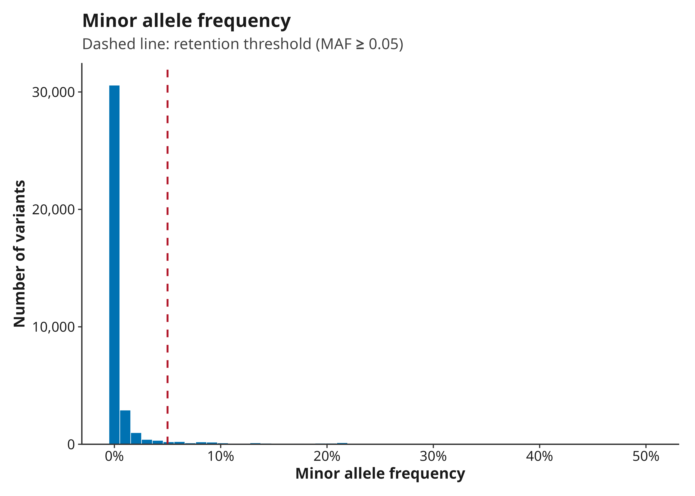

The quickstart example's input is 98,922 biallelic SNPs: 21,418 on
chromosome 22, 16,999 on chromosome X, and 60,505 on chromosome Y (real,
male-only 1000 Genomes data; the 83 female samples correctly show no calls
there at all, not a data-quality problem -- see below). MAF filtering
(`maf = 0.05`) retains 63,585 of these combined. By default
(`qc.autosome_only`, on unless turned off) only the 1,969 that are on
chromosome 22 continue into LD pruning, which further reduces that to 357
SNPs used for PCA, IBS, kinship, DAPC, the ancestry backends, ROH, FST,
genome scans, diversity, and AMOVA -- every module that assumes uniform
diploid genotypes at every marker, which a hemizygous or entirely-absent
sex chromosome violates. Mixing sex-chromosome markers into these modules
is not just imprecise: on this exact dataset it collapsed a known real
duplicate pair's kinship from 0.4525 to essentially zero, and separately
silently dropped every female sample out of the entire pipeline (chromosome
Y's near-total absence in females inflated their overall missingness past
the sample-QC threshold), both confirmed before these exclusions were
added. The remaining 1,148 QC-passing chromosome X SNPs and 60,468
QC-passing chromosome Y SNPs are reserved for the sex-check module below,
the one place this package deliberately needs them.

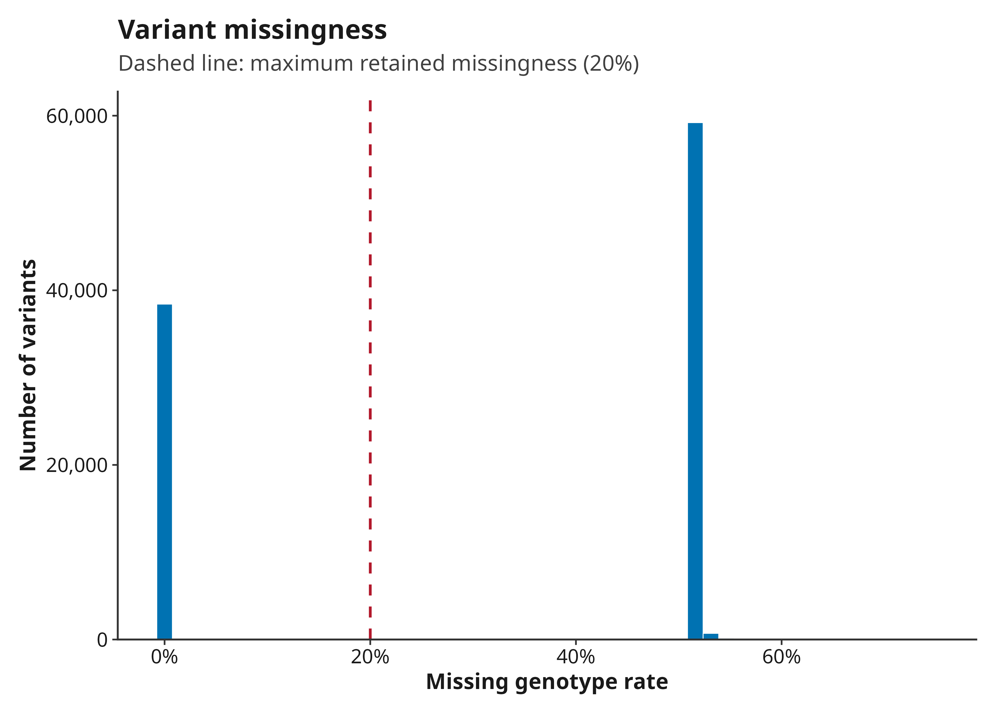

The bimodal shape above is that same sex-chromosome story rendered
directly: the left peak is well-covered autosomal markers near 0%
missingness, and the right peak just past 50% is chromosome X/Y markers
missing across roughly half the cohort (hemizygous or absent in one sex) --
not a data-quality failure, the exact mechanism described above.

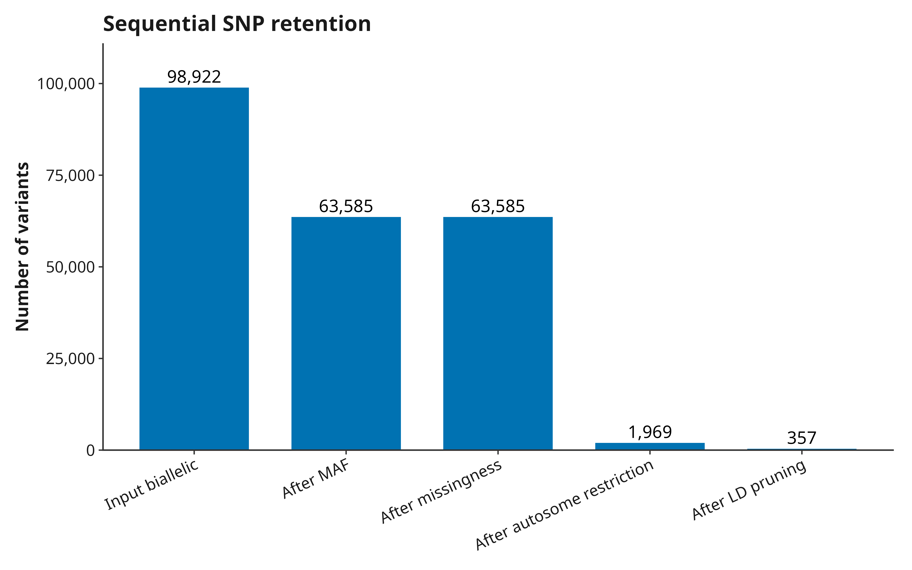

The funnel above is the same sequence of numbers just quoted, in order:
input, after MAF, after missingness (identical to after MAF here -- this
cohort's variants are either well-covered or not called at all, nothing in
between to filter further), and after LD pruning to the 357-SNP final
marker set.

## PCA

Check the variance table, scores, sample identities, missingness, and outliers.
PCA axes may change sign without changing the solution. Repeated or nearly
equal eigenvalues can rotate a subspace, so validation should use subspace or
residual comparisons rather than raw signed vectors.

Separation can reflect population history, relatedness, batch effects,
geography, uneven sampling, or technical artifacts. A principal component is
not itself a population.

`31_PCA_loadings.tsv` and the Manhattan/ranked loading figures report which
SNPs correlate most strongly with each retained component. Loadings are
signed (direction is preserved); "top contributing" ranks by magnitude, not
raw value. A large loading identifies a marker associated with an axis, not
a causal or functionally validated variant -- treat it as a lead for further
investigation, not a conclusion.

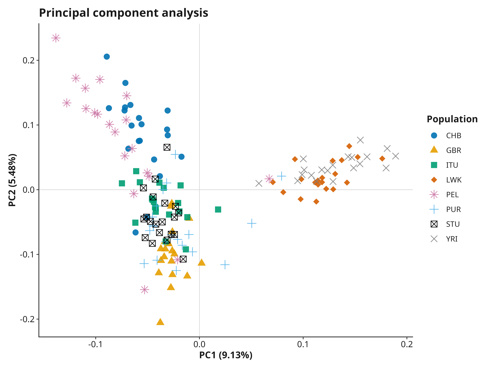

The 8 sampled populations separate along the first two components largely by
continental origin, as expected for real, geographically diverse human data.

The report also draws one additional PC1/PC2 panel per other metadata column
that qualifies for colouring: enough samples per distinct value
(`analyses.pca_metadata_color_min_group`, default 3) and not too many
distinct values (`analyses.pca_metadata_color_max_levels`, default 12).
`population` itself, continuous coordinates (`latitude`/`longitude`), and
identifier-like columns are excluded automatically. In the quickstart
metadata, `sex` qualifies:

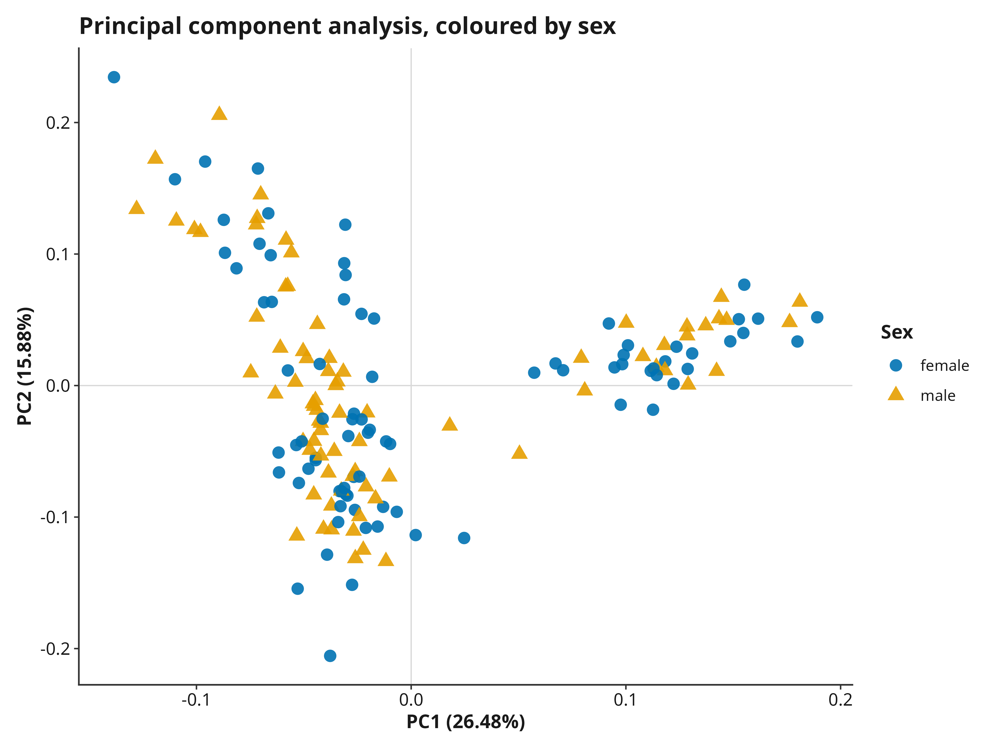

Sex shows no separation here (ANOVA on this exact PCA fit: p = 0.24 on PC1,
p = 0.62 on PC2) -- itself the expected, useful result for an autosomal
analysis: population structure, not sex, drives this PCA. A
per-metadata-column panel that *does* show separation on your own data would
be a genuine signal worth investigating (a batch effect, a confound, or real
biology), not something to assume is noise.

## IBS and MDS

Identity-by-state (IBS, `SNPRelate::snpgdsIBS()`) is a simpler, symmetric
similarity measure than kinship below: the fraction of alleles shared
between every pair of samples, with no explicit relatedness model behind
it. Multidimensional scaling (classical `stats::cmdscale()` on the 1 - IBS
distance matrix, Zheng et al. 2012) projects that pairwise matrix into
low-dimensional coordinates for visualization -- the same purpose as PCA
above, but built from a similarity matrix rather than the raw genotype
matrix directly, so treat it as a complementary view, not a substitute.
Confirm sample order and matrix symmetry before trusting either the heatmap
or the MDS coordinates. Interpret low-dimensional MDS only after checking
how much variance each axis actually explains: `cmdscale()` can produce
negative eigenvalues for a non-Euclidean distance like IBS (goodness-of-fit
is computed from the positive eigenvalues only), and a low percentage means
the 2D plot is compressing away real structure, not that little structure
exists. Close pairs in either view may reflect relatives or duplicates
rather than population-level structure -- the Kinship section below is the
right tool to tell those apart, not IBS/MDS alone.

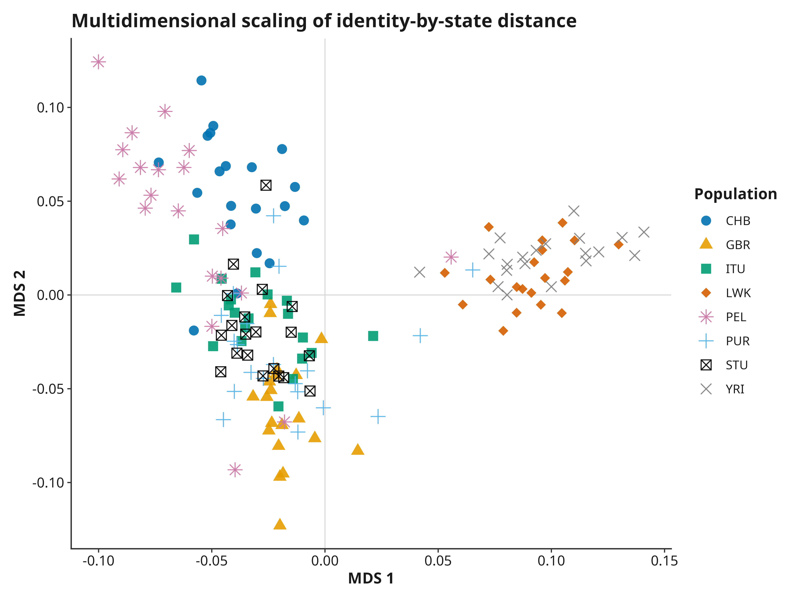

On the quickstart example, MDS1 and MDS2 explain 11.97% and 6.99% of the
positive-eigenvalue variation respectively (65 of the 160 eigenvalues are
negative -- an expected property of IBS-based distances, not an error).
Modest but real: MDS1 alone already separates the two African populations
(LWK, YRI) from the rest (ANOVA on MDS1 by population, p = 5.5e-64), the
same continental pattern PCA recovers above, now from a completely
different starting matrix (pairwise allele-sharing rather than PCA's
genotype covariance structure) -- an independent confirmation, not a
re-derivation of the same PCA result. The single highest pairwise IBS
similarity in the whole dataset (0.979) is `HG03873`/`HG03998` -- the same
pair the next section flags as a kinship "duplicate/MZ twin" call that
turns out, on corroborating sex-check evidence, not actually to be one;
worth keeping in mind while reading that section.

The same IBS distance matrix also builds a neighbour-joining tree (Saitou
and Nei 1987), a third view of the same pairwise relationships alongside
the heatmap and MDS above -- useful for reading off which *specific*
samples group together, not just how much variance separates them.
Bootstrap support (Felsenstein 1985; `analyses.tree_bootstrap`, on by
default, 100 replicates) is shown at each internal node: loci are resampled
with replacement, the tree rebuilt from each resampled set, and the
percentage of replicates agreeing with each split in the original tree
reported -- interpret it exactly like PCA's percent-variance-explained: a
measure of how much confidence *this specific dataset* supports *this
specific split*, not a universal truth about the populations involved.

On the quickstart example (357 LD-pruned SNPs), most internal nodes show
low bootstrap support (median 13%; 44% of nodes below 10%) -- an honest,
expected consequence of resolving fine-scale, individual-level
relationships from a modest, LD-pruned marker panel, not a defect in the
tree or the bootstrap procedure. The one split that matters most, though,
is rock solid: the deepest split in the tree -- separating the African
(LWK, YRI) samples from everyone else, the same continental signal MDS and
PCA both already found -- has 100% bootstrap support. Read this tree for
its well-supported deep structure, not for fine-scale terminal groupings,
which this marker panel genuinely cannot resolve with confidence; a
whole-genome VCF would show substantially higher support throughout.

### Maximum-likelihood tree (optional)

`analyses.ml_tree` (off by default; needs the optional `phangorn` package)
builds a genuine maximum-likelihood alternative to the NJ tree above: GTR
substitution rates, gamma-distributed among-site rate variation, and Lewis
(2001) ascertainment-bias correction, jointly optimized together with the
topology. The correction matters specifically because this is SNP-only data
-- a VCF records no invariant sites at all, and an uncorrected substitution
model implicitly (and wrongly) assumes some were observed and simply happened
not to vary. Applies only to this individual-level tree: ML substitution
models describe per-sample sequence evolution, and there is no standard,
defensible way to apply them to the population-level tree below, which is
built from allele-*frequency* distances, not per-sample sequences.
Genotypes are encoded as IUPAC nucleotide codes (homozygous calls become the
plain reference/alternate base, heterozygous calls become the standard
ambiguity code) so the existing biallelic ref/alt alleles double as a
sequence alignment; bootstrap support (100 replicates by default, same
Felsenstein 1985 procedure and interpretation as the NJ tree above) is shown
at each node the same way.

On the quickstart example, ML bootstrap support is even sparser than the NJ
tree's own (median 1%; 68% of nodes below 10%) -- expected, not a
regression: a proper likelihood-based method with an explicit substitution
model is honestly more conservative than a simple distance method about
what a modest, 357-SNP marker panel can actually resolve. Reassuringly, the
one split both methods recover with full confidence is the *same* split:
the tree's root, separating the African (LWK, YRI) samples from everyone
else, at 100% bootstrap support in both the NJ and ML trees -- the same
continental signal already found by PCA, MDS, and FST, now independently
confirmed a fourth way, by a genuinely different statistical framework
(explicit likelihood under a substitution model, not a distance
transformation). As with the NJ tree, read this for its well-supported deep
structure; a whole-genome VCF's much larger marker panel would resolve
substantially more of the tree with confidence.

## Kinship

Kinship (`SNPRelate::snpgdsIBDKING()`, KING-robust, Manichaikul et al. 2010)
answers a different question than IBS/MDS above: not "how similar are these
samples overall" but "are these two individuals related, and how closely."
KING-robust is specifically chosen for robustness to population
stratification, unlike naive relatedness estimators that assume a single
homogeneous population -- a real requirement here, since this package
explicitly supports analyzing structured populations. The estimator needs
realistic marker density to behave sensibly: a handful of SNPs produces
values with no biological meaning. `relationship_degree` uses the standard
KING thresholds and is a screening classification, not a pedigree diagnosis --
a flagged pair warrants follow-up (checking for sample duplication, family
structure in the design, or a labeling error), not an automatic conclusion.
Kinship is bounded above at 0.5 (a self/duplicate pair) but is *not* bounded
below at -0.5 for arbitrarily divergent pairs; very negative values are
expected, not an error, when comparing highly differentiated populations.
Detected close relatives can bias FST, diversity, and structure analyses
computed from the same sample set -- consider whether to exclude or account
for them before interpreting those results.

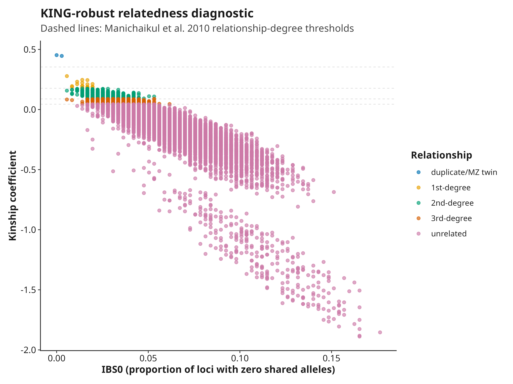

The quickstart dataset deliberately includes a known real duplicate/MZ-twin
pair, `NA19331`/`NA19334` (kinship 0.4459, both LWK, correctly classified
`duplicate/MZ twin`), confirmed consistent on chromosome X too: both are
genuinely male (real hemizygous chromosome X genotypes, not just a metadata
label), matching each other, with no contradicting evidence.

`HG03873`/`HG03998` (kinship 0.4525, also classified `duplicate/MZ twin`)
is a more interesting cautionary example, not a second confirmed duplicate:
their real chromosome X genotypes show `HG03873` is genuinely female and
`HG03998` is genuinely male (not just a metadata discrepancy between two
population labels, ITU and STU) -- and MZ twins share genetic sex by
definition, so despite the high chr22-only kinship, this pair cannot
actually be the same individual or identical twins. The autosomal kinship
signal is real (it is not a computation error), but a single small
autosomal window is not sufficient evidence for "duplicate" on its own; the
sex-check module below is exactly the kind of corroborating, independent
evidence needed before accepting a kinship-based duplicate call as
biological fact. Treat a single flagged pair as a lead to investigate, not
a conclusion -- this is a real example of why.

## Sex check

Genetic sex inference from two complementary, independent signals -- X-chromosome
heterozygosity and Y-chromosome genotype call rate -- flags samples whose
metadata-reported `sex` disagrees with what their genotypes imply, PLINK's
`--check-sex` convention extended the way real sex-check pipelines actually
use it. X-chromosome heterozygosity (Visscher et al. 2010's F-statistic, via
`SNPRelate::snpgdsIndInb(method = "mom.visscher")`, already used elsewhere in
this package) separates hemizygous males (excess homozygosity, F close to 1)
from diploid females (F close to 0); default thresholds (male F > 0.8, female
F < 0.2) are PLINK's own documented defaults, verified on a hand-built
synthetic fixture before shipping: simulated males gave F in [0.84, 1.13],
simulated females in [-0.06, 0.10]. Y-chromosome call rate
(`SNPRelate::snpgdsSampMissRate()`, already an SNPRelate dependency) is a
second, much cleaner signal: males have a Y chromosome to call genotypes
from, females do not. Verified against real 1000 Genomes data before
shipping: females showed exactly 0.0 call rate, males 0.995-1.0 -- an almost
perfectly binary separation, well clear of the default thresholds (male >
0.5, female < 0.1).

When both signals are available and agree, that is a high-confidence call.
When they are both available but confidently disagree, the combined call is
`discordant` -- real, informative evidence of a data problem, not averaged
away. Either signal alone is used when only one chromosome is present.
Pseudoautosomal (PAR) regions on X are not excluded by default, since their
boundaries are genome-build-specific and this package accepts VCFs from any
build or organism; PAR SNPs dilute, not reverse, the X-based separation.

This module needs only genotypes (no metadata required, though a `sex`
column enables the mismatch comparison) and is on by default
(`analyses.sex_check`). It skips transparently -- no table, no figure --
only when *both* chromosomes have too few QC-passing SNPs; either signal
alone is used when only one chromosome is present, exactly like
Mantel/isolation-by-distance skipping without coordinates.

The quickstart example gives 1,148 QC-passing chromosome X SNPs and 60,468
QC-passing chromosome Y SNPs (both deliberately excluded from every other
module above, per the Quality control section). Of 160 samples, 155 classify
as a confident `match` and 5 as `discordant` -- zero `ambiguous`, zero
`mismatch`. Combining the two signals resolved every one of the 40 samples
that were `ambiguous` on chromosome X alone (X's F-statistic, from a single
bounded 1Mb region, is a noisier signal than Y's near-binary call rate) into
a confident call. The 5 `discordant` samples are genuinely informative: all
5 have real chromosome Y call rate of exactly 0 (confidently female) while
chromosome X gives a spurious `male` reading (F just above the 0.8
threshold) -- a real example of chromosome X's small-region noise producing
a wrong call that chromosome Y's cleaner signal catches, exactly the value
of using both signals together rather than trusting either alone. All 5
samples' metadata-reported sex is `female`, agreeing with the chromosome Y
evidence. A follow-up check against genome-wide (not just this bounded
region) chromosome X data for these same 160 samples independently confirmed
this: zero genuine mismatches remained at that scale, and these same 5
samples resolved to `female`.

## Runs of homozygosity

Runs of homozygosity (`bcftools roh`, an HMM-based method, Narasimhan et al.
2016) identify long stretches where a sample's genotype calls are
consistently homozygous -- a standard per-sample autozygosity/inbreeding
signal, distinct from both diversity's population-level FIS and kinship's
pairwise relatedness above. Allele frequencies are self-estimated from the
analyzed samples (there is no mechanism to attach an external reference-panel
frequency), which means informative site count -- and therefore sensitivity
-- drops with smaller cohorts; treat results from small sample sets
cautiously, the same caution as HWE and kinship above. `FROH` (total run
length divided by the analyzed genomic footprint) is scaled to the footprint
actually covered by the analyzed variants, **not the whole genome** -- a
single-region VCF and a whole-genome VCF give very different `FROH` for the
same underlying biology, so never compare `FROH` values across analyses that
covered different genomic spans.

Each run is also classified into a length class (Ceballos et al. 2018): short
(background LD), intermediate (distant common ancestors via genetic drift),
and long (recent close inbreeding, e.g. parental relatedness), with the two
boundaries between classes configurable
(`analyses.roh_length_class_short_max_bp`/`roh_length_class_long_min_bp`,
defaulting to 500 kb and 2 Mb -- this package's own convention chosen within
Ceballos et al.'s published ranges, not a universal standard). `FROH` is
reported per class as well as in total, on `38_ROH_sample_summary.tsv` and the
figure below. **Watch the analyzed genomic footprint against the long-class
threshold**: in the quickstart example, all 8 populations show zero "long"
runs -- not because recent close inbreeding is genuinely absent, but because
the quickstart's analyzed chr22 region spans under 1 Mb end to end, smaller
than the 2 Mb long-class threshold, so no single run can ever be classified
"long" there regardless of true biology. This is a property of the demo's
narrow genomic scope, not a general limitation -- a whole-genome VCF is not
subject to this ceiling.

## Diversity and FIS

Report the estimator, locus filters, missing-data handling, sample sizes, and
uncertainty. Negative or positive FIS does not identify a cause by itself;
technical artifacts, substructure, inbreeding, selection, and sample design can
produce similar summaries.

`hwe_pvalue` is a per-population exact test (Wigginton et al. 2005); it is
reporting-only and does not filter any SNP. A significant deviation has many
non-error causes (null alleles, genotyping artifacts, selection, non-random
mating, population substructure within the labeled group) and small sample
sizes have limited power to detect real deviations -- treat the p-value
distribution and the FDR-adjusted count as descriptive, not as an automatic
exclusion criterion. `private_allele` identifies alleles found in only one
retained population; it is not itself evidence of adaptive significance or
of any particular demographic history.

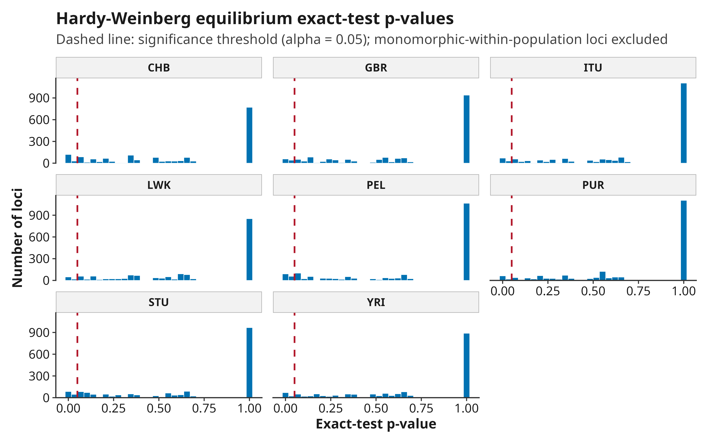

The distribution above is what "descriptive, not exclusionary" looks like
in practice: every population shows a large spike at p = 1 (genotype
counts matching Hardy-Weinberg expectations exactly, common at biallelic
SNP scale) plus a roughly uniform scatter of smaller p-values below the
dashed significance threshold -- the expected shape under the null, not a
red flag by itself. A population with an unusually heavy concentration of
loci just below the threshold, rather than this uniform scatter, is the
pattern worth investigating further.

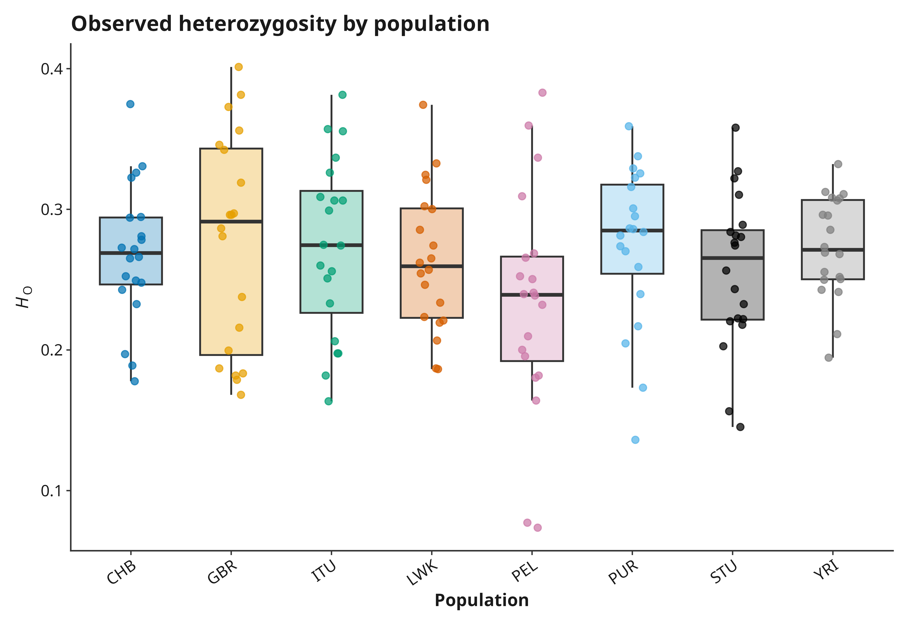

The sample-level view above complements a population-level one: observed
heterozygosity averaged per population against its Hardy-Weinberg
expectation.

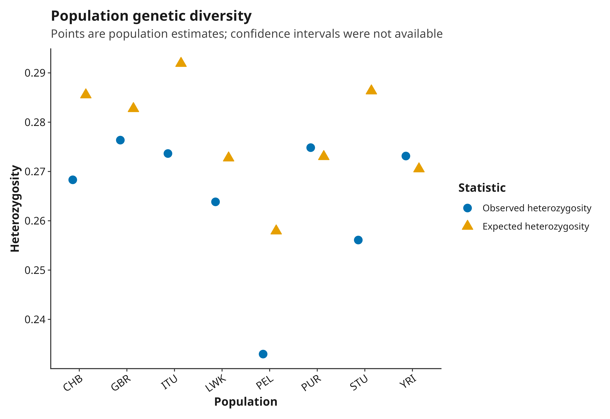

A population whose observed heterozygosity sits well below its expected
value (PEL here, a real 1000 Genomes admixed American population) is worth
a second look with FIS/inbreeding-aware analyses -- this comparison alone
does not distinguish inbreeding, a Wahlund effect (pooling genetically
distinct sub-groups under one population label), or a complex admixed
demographic history from each other.

`allelic_richness` (rarefied via `hierfstat::allelic.richness()`, an optional
dependency that skips transparently with a logged warning if not installed)
is a per-population, sample-size-corrected count of alleles per locus --
unlike raw heterozygosity, it is comparable across populations with unequal
sample sizes, since it rarefies every population down to the same allele
count before counting. For biallelic SNPs it ranges from 1 (monomorphic
within the population) to 2 (both alleles present).

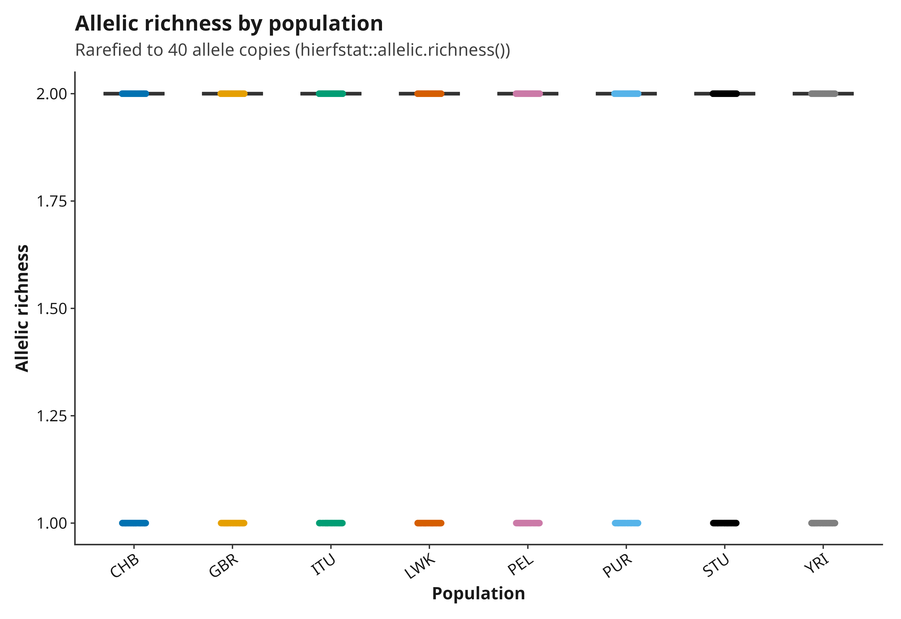

The quickstart example's 8 populations are all exactly 20 samples, so
richness is rarefied to 40 allele copies and unsurprisingly narrow (1.82 to
1.94 across populations) -- this metric earns its keep on real datasets with
unbalanced population sizes, where it can diverge from raw heterozygosity in
ways worth investigating.

`effective_alleles` (Kimura and Crow 1964, Ae = 1 / (1 - unbiased expected
heterozygosity)) is a per-locus, per-population summary complementing
allelic richness; `mean_effective_alleles` is its population-level average
(averaged per locus, not computed from the mean heterozygosity -- these are
not the same value). Unlike rarefied allelic richness, Ae is not bounded
above at 2 for biallelic markers: it is a bias-corrected continuous
estimator, and small per-population samples can legitimately push a
locus's Ae above 2 or, in the extreme, to infinity -- reported as `Inf`,
not a fabricated finite number, the same convention used for Nm and
Ne(LD). On the quickstart example, `mean_effective_alleles` ranges from
1.44 to 1.51 across the 8 populations.

## Site frequency spectrum and bottleneck screen

`48_site_frequency_spectrum.tsv` bins each population's segregating loci
by folded minor allele frequency (10 classes spanning 0-0.5 by default).
`49_bottleneck_mode_shift.tsv` applies the mode-shift test (Luikart and
Cornuet 1998): under mutation-drift equilibrium the lowest frequency class
is expected to hold the most loci; a mode shifted to a higher class is a
possible recent-bottleneck signature. This is the qualitative screening
version of the test -- a signal worth investigating further, not a p-value
or a confirmed bottleneck. Unlike the classic heterozygosity-excess
bottleneck test, it makes no assumption about the locus mutation model, so
it is a clean fit for biallelic SNP data.

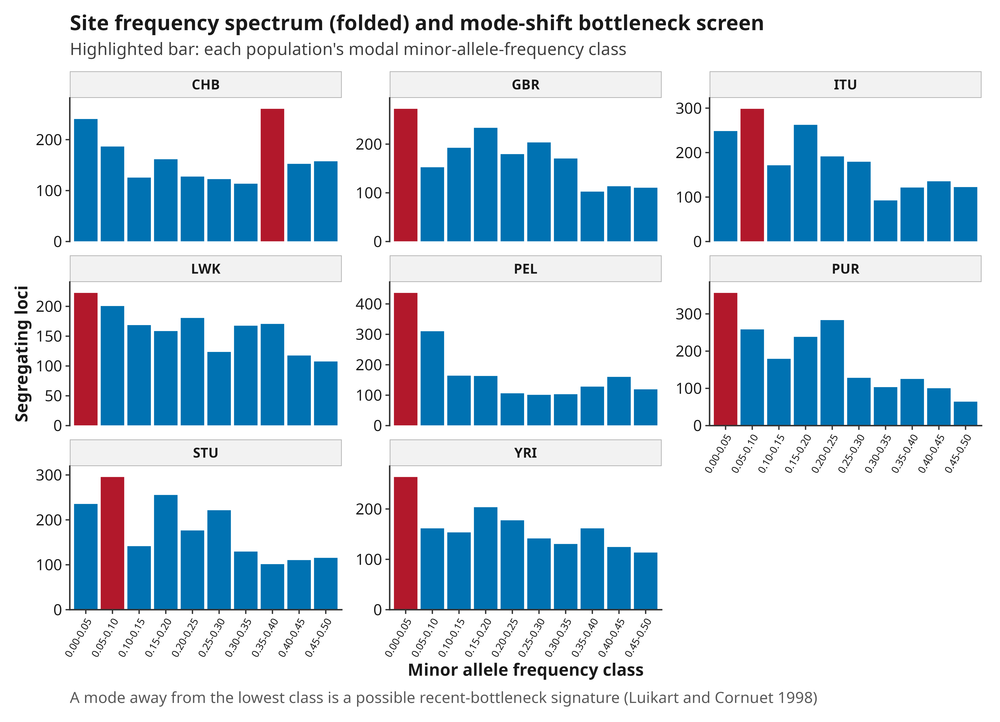

**Read this result with the same caution as any MAF-filtered analysis.**
With this package's default `qc.maf = 0.05` filter, all 8 quickstart
populations show `mode_shifted = TRUE`. Before reporting this, it was
checked against an unfiltered re-analysis (`qc.maf = 0` on the same data):
only 3 of 8 populations (ITU, STU, YRI) are genuinely mode-shifted: the
other 5 (CHB, GBR, LWK, PEL, PUR) correctly show the expected unshifted,
lowest-class mode once the MAF filter is removed. The default filter
systematically removes population-rare variants before this test ever
sees the data, and that alone can produce a spurious mode-shift signal --
the same general caveat already documented for Tajima's D's own
MAF-filtering bias. This is not evidence that all 8 quickstart populations
experienced a recent bottleneck; a real investigation would rerun with a
low or zero `qc.maf`.

## FST

State the estimator explicitly. Global and pairwise values depend on population
definitions, sample size, marker ascertainment, missingness, and the genomic
region. A small numerical value can be statistically precise, while a larger
one can be uncertain.

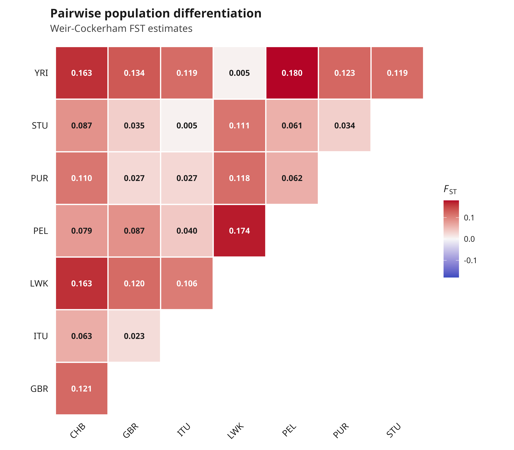

The global FST estimate for the quickstart example is 0.0915, consistent
with real, moderate differentiation across 8 geographically diverse
populations at this marker density.

Every FST estimate is accompanied by Wright's (1931) island-model gene-flow
estimate, Nm = (1 - FST) / (4 * FST), on `17_global_FST.tsv` (`global_nm`)
and `18_pairwise_FST.tsv` (`nm`) -- a direct, monotonic transform of the
same FST value, not a new independent measurement, so it is not shown as a
separate figure. On the quickstart example, global Nm = 2.48; the pairwise
minimum (ITU-STU, FST = 0.0052) gives Nm = 48.3 and the pairwise maximum
(PEL-YRI, FST = 0.180) gives Nm = 1.14 -- consistent with FST = 0 giving
infinite (unrestricted) gene flow and FST = 1 giving zero gene flow.

The same tables also carry Jost's (2008) D (`global_jost_d`, `jost_d` on
`18_pairwise_FST.tsv`, and a `19b_pairwise_jost_d_matrix.tsv`) -- a
different differentiation measure, not a transform of FST. FST's
denominator is bounded by within-population heterozygosity, so a highly
polymorphic marker set can never show a high FST even under strong true
differentiation; Jost's D was designed specifically to avoid that
constraint. On the quickstart example, global Jost's D = 0.0387 versus
global FST = 0.0915 -- Jost's D being numerically smaller than FST here is
expected, not a discrepancy. Pairwise D correlates strongly with pairwise
FST (r = 0.998) but is not a strict re-ranking of it: FST's closest pair is
ITU-STU with LWK-YRI a close second, while Jost's D reverses that order --
both pairs are near-ties on both measures, illustrating that the two
statistics agree overall without being interchangeable in fine detail.

The same tables also carry Nei's (1987) Dxy, absolute nucleotide divergence
(`global_dxy`, `dxy` on `18_pairwise_FST.tsv`, and a
`19c_pairwise_dxy_matrix.tsv`) -- a third differentiation measure, and the
one genuinely unnormalized member of the group. FST, Nm, and Jost's D are
all scaled by within-population diversity, so identical low values can mask
two different demographic histories: recent divergence with ongoing gene
flow (low Dxy) versus an older split that still shares a lot of ancestral
polymorphism (high Dxy) -- a distinction FST alone cannot make (Cruickshank
and Hahn 2014). On the quickstart example, global Dxy = 0.3056; pairwise Dxy
correlates positively with FST (r = 0.90) but noticeably less tightly than
Jost's D does (r = 0.998) -- expected, since Dxy is the one measure here not
scaled by within-population heterozygosity, so it is genuinely picking up
different information. Read honestly rather than forced into a dramatic
storyline: in this dataset the two lowest-FST pairs (ITU-STU and LWK-YRI)
are also the two lowest-Dxy pairs, i.e. no FST/Dxy decoupling shows up here
-- consistent with these 8 populations sharing a broadly similar,
relatively recent divergence history (real human demographic history at
this timescale) rather than the highly variable species-level divergence
times where FST/Dxy decoupling is most often reported in the literature.

Global and pairwise FST both describe the whole dataset or a pair of
populations; neither directly answers "how distinct is this one population
from the panel as a whole." Population-specific FST / beta (Weir and Goudet
2017), via `hierfstat::betas()` (the reference implementation), fills that
gap: a per-population value using a common ("global") kinship reference
rather than a pairwise one, on `51_population_specific_fst.tsv`. On the
quickstart example, the overall weighted mean (`global_beta_fst`) is
0.0915 -- agreeing with `global_fst` to 9 significant figures, an expected
internal-consistency check rather than a coincidence. Per-population beta
ranges from ITU (0.0446, least distinct from the rest of the panel) to PEL
(0.1558, most distinct); PEL standing out as the most differentiated
population matches this package's own Nei's-distance and population-
assignment results elsewhere in this report, an independent third
confirmation of the same real population-structure pattern.

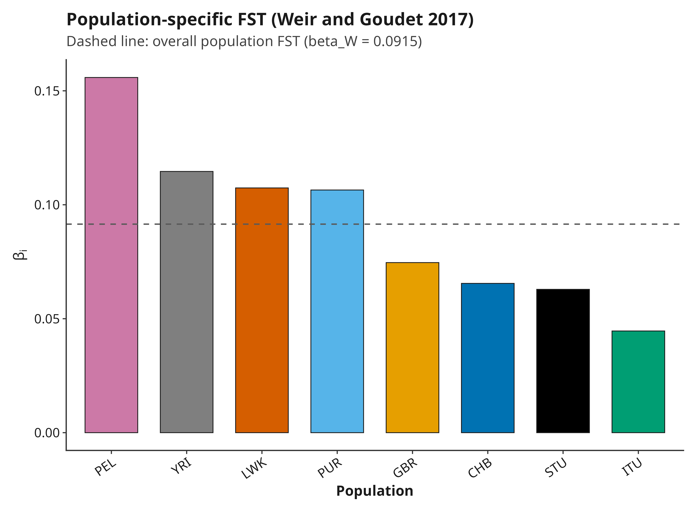

## Population genetic distance and tree

`46_population_genetic_distance.tsv` is Nei's (1972) standard genetic
distance between populations, computed from allele frequencies -- a
different deliverable from the "Runs of homozygosity"/kinship/individual
tree sections above: those describe relationships among **samples**, this
describes relationships among **populations**. A neighbour-joining tree
built from this distance matrix is written to
`trees/population_Nei_neighbor_joining.nwk` and rendered as a figure
whenever at least three populations are present, with the same
locus-resampling bootstrap support (Felsenstein 1985; see the individual
IBS tree above for the full explanation of what the percentages mean)
shown at each internal node.

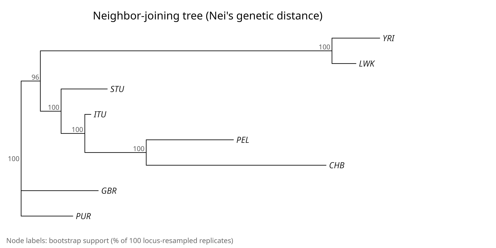

On the quickstart example, LWK-YRI (Luhya, Kenya and Yoruba, Nigeria, both
African) is the single closest pair (D=0.0112), while the largest
distances are all African-vs-non-African population pairs (up to
D=0.091) -- the expected continental-population-structure pattern, a real
result from real chr22 data, not a fabricated demonstration. Unlike the
individual-level tree above, support here is uniformly high (96-100% at
every internal node): population-level allele-frequency distances average
over many individuals per population, making the resulting topology far
more robust to which specific loci were sampled than any single
individual-level split can be.

## Population assignment test

`47_population_assignment.tsv` is a frequency-based self-assignment test
(Paetkau et al. 1995, 2004): for each sample, the leave-one-out likelihood
(Rannala and Mountain 1997 -- a sample's own genotype is excluded from its
own recorded population's allele frequencies before scoring against it) of
its genotype is computed under every population's allele frequencies, and
the sample is assigned to whichever population maximizes that likelihood.
A sample whose assigned population differs from its recorded metadata
label (`mismatch = TRUE`) is a candidate migrant or a metadata error, the
same kind of "does the data match the metadata" question kinship and sex
check already ask, applied here to population identity. Uses the same
LD-pruned marker set as kinship/PCA/IBS, not the full QC-passing set: the
per-locus likelihoods are multiplied together assuming independence, which
linked markers would violate.

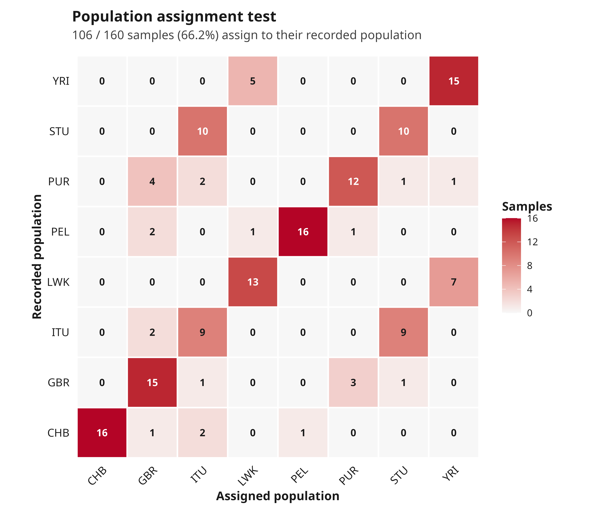

On the quickstart example, 106 of 160 samples (66%) correctly self-assign.
The 54 mismatches are heavily concentrated in exactly the two most
genetically similar population pairs already identified above by FST/Nm:
31 of 54 (57%) are ITU/STU or LWK/YRI cross-assignments. This is not a
defect in the method -- a 357-SNP marker panel genuinely cannot cleanly
separate population pairs this closely related -- and it is a real,
independent cross-validation of the FST/Nm and Nei's-distance results
above, using a completely different statistical approach (per-sample
genotype likelihood rather than aggregate allele-frequency distance).

## Genome scans

Windowed FST and diversity (`39_genome_scan_fst.tsv`,
`40_genome_scan_diversity.tsv`) track the same statistics above along
physical position, rather than only as a single genome-wide number --
useful for spotting localized differentiation or diversity outliers.
Windows are non-overlapping by default (`analyses.genome_scan_step_bp`
equals `analyses.genome_scan_window_bp`); a smaller step gives a real
overlapping/sliding scan. `41_genome_scan_FST_outliers.tsv` is a
descriptive ranking (highest-FST windows), **not** a significance test --
no permutation or null distribution is computed, so a high-FST window is a
candidate worth further investigation, not a statistically confirmed
selection signal. Always check a window's `n_snps` before treating its
estimate as meaningful: windows below `analyses.genome_scan_min_snps`
(default 5) are reported as `NA` rather than a misleadingly precise value
from too few markers, and even windows just above that threshold can be
noisy.

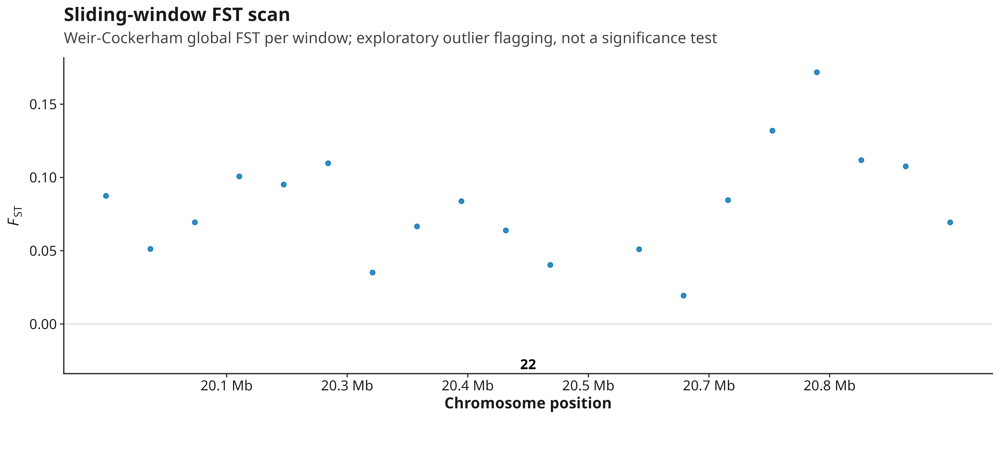

The 20 windows range from FST 0.051 to 0.172. The single highest, 20.80-20.85 Mb (FST=0.172, 104 SNPs), is a candidate worth further investigation under the caveats above, not a confirmed selection signal -- especially since it is only moderately above the region's known global FST of 0.0915.

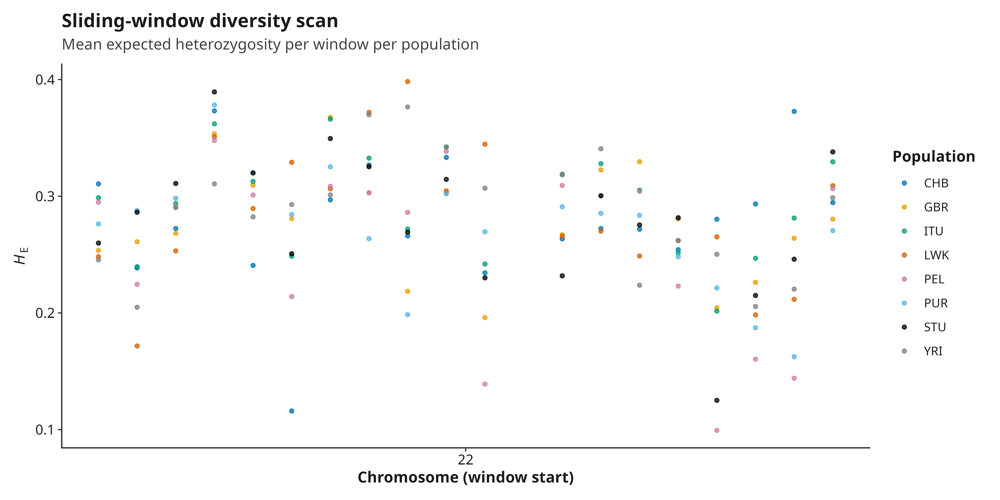

Mean expected heterozygosity per window per population ranges from 0.099 to 0.398 across the 8 populations -- the same kind of real, biologically plausible spread reported for the genome-wide diversity summary above, now resolved by position.

`segregating_sites`/`tajima_d` (Tajima 1989) are also computed per window per population, reusing the same window grid and locus data -- windowed Watterson's theta vs. pairwise nucleotide diversity, a classical neutrality-test statistic (positive: excess of intermediate-frequency variants relative to neutral expectation; negative: excess of rare variants, e.g. after a selective sweep or population expansion). Like the FST outliers above, a single window's Tajima's D is descriptive, not itself a significance test.

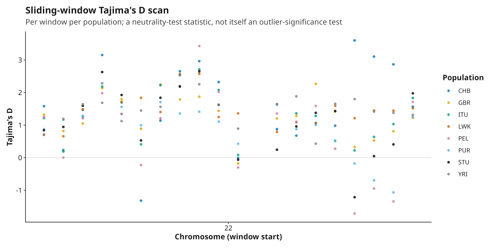

Real values are almost entirely positive (median 1.34, range -1.71 to 3.60 across the 152 windows with a defined estimate). This is an expected artifact of this pipeline's own QC, not necessarily a real signal of balancing selection or population contraction: the default minor-allele-frequency filter (`qc.maf`, default 0.05) removes rare variants *before* this scan runs, and removing rare variants is well known to bias Tajima's D upward (it reduces the segregating-sites count much more than it reduces pairwise diversity). Interpreting Tajima's D values from any MAF-filtered marker set -- the norm for SNP-array/exome-chip data, including this one -- needs this caveat kept in mind.

## pcadapt outlier scan

`59_pcadapt_outliers.tsv` is a genuine per-locus statistical outlier test
for local adaptation/selection (Luu et al. 2016; Privé et al. 2020), via
the `pcadapt` package -- distinct from the genome-scan FST-outlier table
above, which the previous section already flags as descriptive, not a
significance test. PCA is fit on the retained genotype matrix; each
locus's genotypes are regressed on the K retained PC scores to get a
vector of z-scores, and a robust, genomic-control-corrected Mahalanobis
distance of that vector is tested against a chi-squared distribution with
K degrees of freedom, giving a real p-value per locus. Benjamini-Hochberg
FDR correction (`stats::p.adjust`, the base-R equivalent of Storey's
q-value) controls the false-discovery rate across all tested loci;
`59b_pcadapt_significant_outliers.tsv` lists loci significant at
`analyses.pcadapt_fdr_alpha` (default q < 0.05). Unlike almost every other
module in this report, **pcadapt does not require population metadata at
all** -- it is unsupervised. K defaults to (number of populations - 1)
when population metadata is available, matching the standard heuristic
that the number of structure-describing PCs tracks group count minus one;
without population metadata it falls back to pcadapt's own default of 2.
Computed on the full QC-passing, **unpruned** marker set (like the genome
scans above), not the LD-pruned set PCA/kinship/DAPC use -- LD-pruning
could remove the very loci a selection scan is looking for.

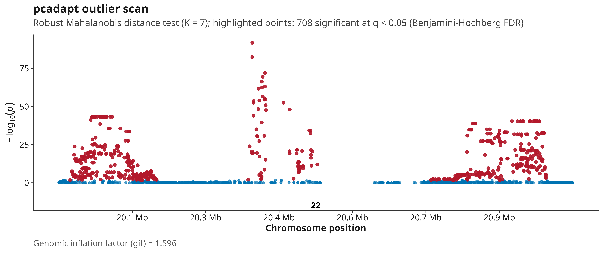

On the quickstart example (K=7, one less than the 8 populations), 708 of
1,969 tested loci (36%) are significant at q < 0.05 -- a genuine
Benjamini-Hochberg-adjusted result, not a screening threshold, but read
this fraction honestly rather than as "708 independent selection targets."
Two things explain it. First, the genomic inflation factor is 1.60,
meaningfully above the no-inflation value of 1 -- with 8 continental-scale
populations this divergent (the same real population structure PCA, FST,
and the population tree already establish throughout this report) spread
across a comparatively modest, un-genome-wide marker panel, a large
fraction of loci can show real elevated differentiation from ordinary
genome-wide drift alone, not necessarily localized selection; this is a
known, general limitation of PCA-based outlier scans applied to strongly
structured samples, not specific to this dataset. Second, the significant
loci are not spread uniformly but cluster into a handful of genomic
windows -- consistent with local linkage disequilibrium in this
deliberately unpruned marker set producing one effective signal repeated
across several physically adjacent, highly correlated SNPs, not many
independent discoveries. Reassuringly, several of the strongest clusters
land in exactly the same genomic windows the cruder, purely descriptive
genome-scan FST-outlier table above already flagged -- most notably
20.86-20.95 Mb, overlapping the single highest-FST window in the entire
scan (20.80-20.85 Mb, FST=0.172) -- an independent corroboration from two
different statistical approaches, though still not proof of a specific
selection target given the strong overall population-structure inflation
already noted.

## Linkage disequilibrium decay

`43_LD_decay.tsv` bins pairwise genotypic correlation (r-squared) between
SNPs by physical distance, computed on the QC-passing, **unpruned** marker
set -- the LD-pruned set used elsewhere (PCA, kinship, DAPC, ancestry) is
specifically selected to have *low* pairwise LD, so decay computed on it
would systematically understate how far real LD extends. A real limitation:
pairs beyond the SNP-index window `analyses.ld_decay_slide` are never
computed even if within `analyses.ld_decay_max_distance_bp`, so the curve's
usable range depends on marker density, not only on the configured distance
cutoff.

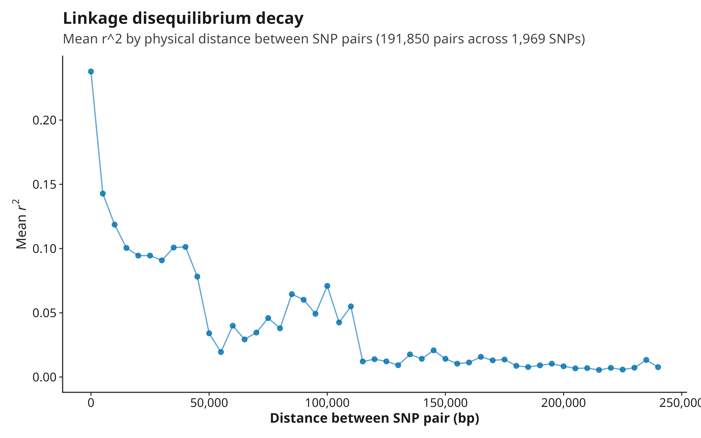

Mean r-squared falls from 0.238 at the shortest distance bin (0-5kb) to
under 0.04 by roughly 50kb -- a real, biologically sensible decay curve
(not flat or noisy), consistent with typical human LD extent at this
marker density.

## LD-based effective population size

`45_Ne_LD.tsv` estimates contemporary effective population size (Ne) per
population from linkage disequilibrium between **cross-chromosome**
(effectively unlinked) SNP pairs -- the opposite pair selection from LD
decay above, which specifically wants physically close pairs
(Waples 2006; Waples & Do 2008, the "LDNe" method also implemented by the
NeEstimator software). A single realization's LD-based Ne estimate has
real, substantial sampling variance -- treat a point estimate as an
order-of-magnitude indication, not a precise count, especially without a
confidence interval (not yet implemented; see the module's own
documentation for why). `ne = Inf` means no drift signal was detectable
above sampling noise (a real, informative result, not a failure); `NA`
with `ne_status = "below_formula_domain"` means the implied Ne is outside
the estimator's valid range.

This method fundamentally needs markers on **at least two chromosomes** to
work at all. The quickstart dataset's retained autosomal marker set is
chr22-only by design (the same reason chromosome X/Y are reserved for the
sex-check module rather than pooled into other analyses), so every
population in the real reference run correctly reports
`ne_status = "fewer_than_two_chromosomes"` -- an honest, expected skip for
this particular demo dataset, not a bug or a broken feature. A real
multi-chromosome VCF will produce real per-population estimates.

## DAPC

DAPC is conditional on groups and retained PCs. Inspect cross-validation and
avoid retaining enough PCs to memorize individuals. Strong separation is not
independent evidence for groups when those groups defined the discriminant
analysis.

`22d_DAPC_K_selection.tsv` (a top-level convenience copy) and the four
`22e_DAPC_K_selection_*.tsv` tables (`_methods`, `_scores`, `_votes`,
`_consensus`) and this figure report the automatic cluster-number
consensus across BIC, mean cross-validation success, Calinski-Harabasz,
Davies-Bouldin, and replicate-membership RMSE.
It is a starting point, not a substitute for domain judgment about how many
groups the data can support.

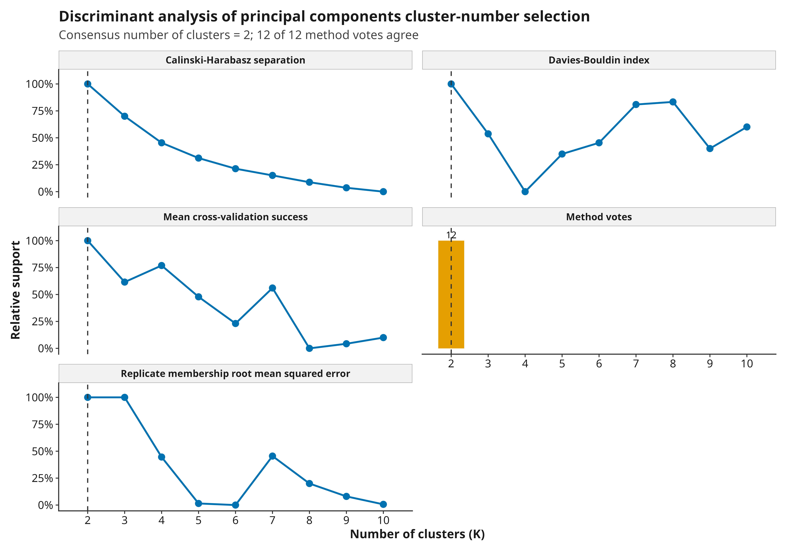

The full report (`22_DAPC_coordinates_K<k>.tsv`, `22f_DAPC_loadings_K<k>.tsv`,
and figures) contains one complete set of DAPC results for **every**
requested K (2 through 10 by default), not only the consensus K shown here.
Before trusting any given K's clustering, check its
`replicate_max_rmse` in `21_DAPC_diagnostics.tsv` against
`analyses.structure.reproducibility_rmse` (default 0.05): a K at or below
that threshold has reproducible replicate membership across independent
`find.clusters()`/`dapc()` runs; a K above it does not, and its clusters and
loadings should not be interpreted, only the consensus itself and the
diagnostics that led to it. In the quickstart example, the consensus K=3 has
`replicate_max_rmse` effectively 0 (fully reproducible); several other K
values in the same run exceed the threshold and are not shown here for that
reason.

Retaining too many or too few PCs before the discriminant step is a separate
risk from picking the wrong K: too few PCs discards real signal, too many
starts to memorize individual samples rather than group structure (in the
extreme, retaining so many PCs that samples nearly perfectly separate can
make every K look artificially clean). By default
(`analyses.dapc_cross_validation: true`) each K's number of retained PCs is
chosen automatically by `adegenet::xvalDapc()` cross-validated assignment
success, not left at a fixed default -- the number reported as `n_pca` in
`21_DAPC_diagnostics.tsv` for that K. This figure shows the full diagnostic
behind that choice, not just the summary: every individual bootstrap
replicate's outcome (the semi-transparent points -- the same real
per-replicate variability `adegenet::xvalDapc()` itself computes but
normally discards after averaging), the mean curve connecting them, the full
random-chance reference band (2.5/50/97.5%, not just its median), and the
selected PC count marked directly on the curve. A tight cluster of replicate
points at each candidate count is reassuring; a wide spread means the "best"
count is closer to a coin flip among several similarly-plausible values than
a clean, confident peak -- exactly the case where the automatic selection
deserves a second look before trusting the resulting K=3 clustering below.

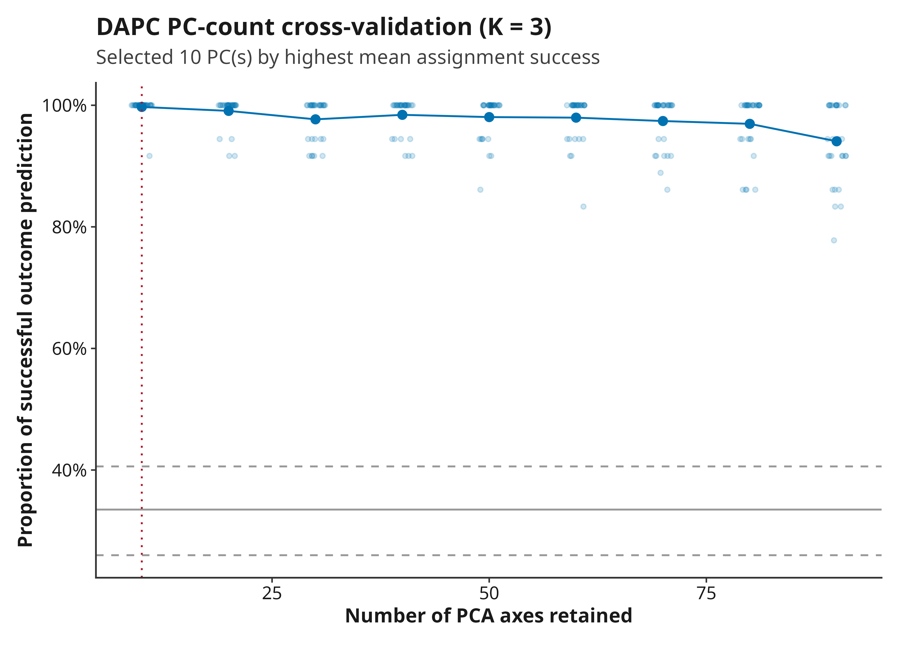

A second, independent check on the same question comes from the
discriminant analysis itself rather than the PC-retention step that feeds
it: `dapc$eig`, the between-group variance each retained discriminant axis
explains. A steep drop after the first axis or two means later axes carry
comparatively little real separating power; a flat, undifferentiated bar
chart across many axes is a sign the discriminant step is not cleanly
separating the data either.

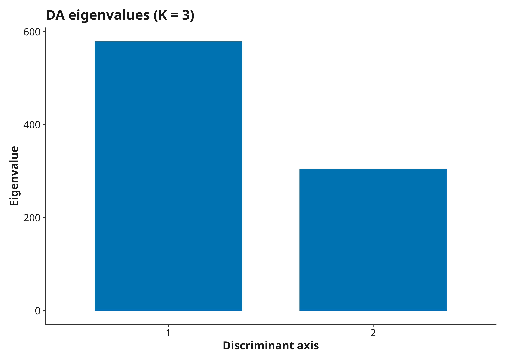

`22f_DAPC_loadings_K<k>.tsv` and the per-K Manhattan/ranked loading figures
report each SNP's contribution to every discriminant function (this
repository's DAPC groups are the unsupervised `find.clusters()` partition at
that K, not the raw metadata `population` column). A SNP with a large
contribution helped separate that K's clusters; it is not, by itself,
evidence that the SNP is biologically causal for whatever the clusters
represent.

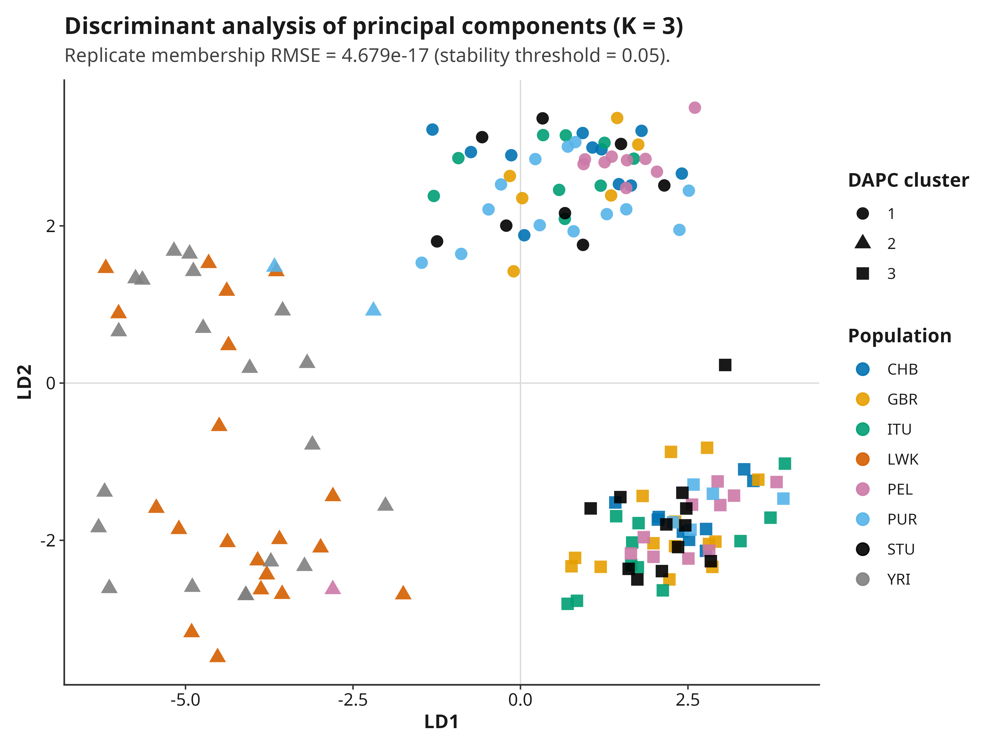

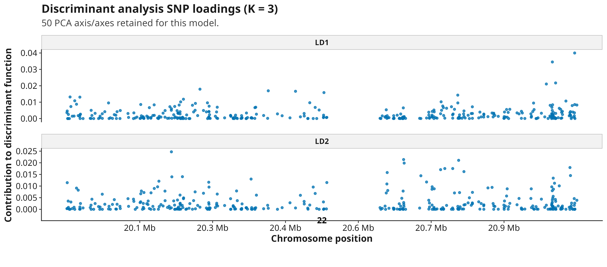

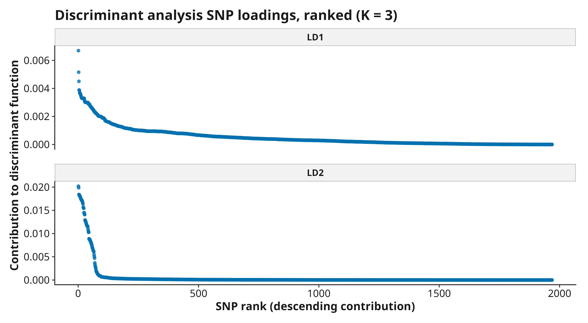

## Ancestry backends

**ADMIXTURE, fastStructure, and sNMF are not run by default** (`analyses.admixture`, `analyses.faststructure`, and `analyses.snmf` all default to `enabled: false`). Unlike every other module on this page, each is an external, optional dependency -- ADMIXTURE and fastStructure are separate command-line programs, not R packages, and none is required for the rest of popgenVCF to work. See [Installing and configuring ancestry backends](https://github.com/duceppemo/popgenVCF/blob/main/docs/user/ancestry-backends.md) to enable one.

For ADMIXTURE, fastStructure, and sNMF:

- verify the sample-order file against every Q matrix;
- retain all replicates and fit statistics;
- align exchangeable cluster labels before comparison;
- report K-selection criteria and uncertainty;
- distinguish computational agreement from biological truth.

K is a model index, and colored components are not literal ancestral
populations without external evidence.

The figures below are from real ADMIXTURE, fastStructure, and sNMF runs
against the quickstart example (K=2..9 each, ADMIXTURE with 5-fold
cross-validation and sNMF with 5 repetitions per K) -- deliberately enabled
just for this documentation, not part of the bundled dataset's default
analysis. All three are run independently here, not cross-validated
against each other (a separate, heavier release-gate evidence process
covered in `docs/SCIENTIFIC_CONCORDANCE.md`); their three different
consensus K values below (7, 3, 6) are a real, expected illustration of why
this section says to distinguish computational agreement from biological
truth rather than average or otherwise reconcile them by default.

In every population-organized membership figure below, populations are
ordered by similarity of their mean ancestry composition (average-linkage
clustering on each population's per-cluster mean proportions), not
alphabetically -- so populations with a similar ancestry profile sit next
to each other in the panel instead of being scattered apart by their name.

### ADMIXTURE

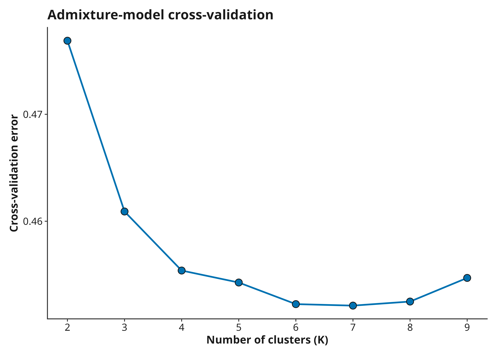

ADMIXTURE's own native cross-validation error curve above is one of the
raw diagnostics the consensus figure below combines with others (BIC,
elbow, parsimony); showing it directly lets a reader judge how sharp or
flat the minimum really is before trusting a single derived number.

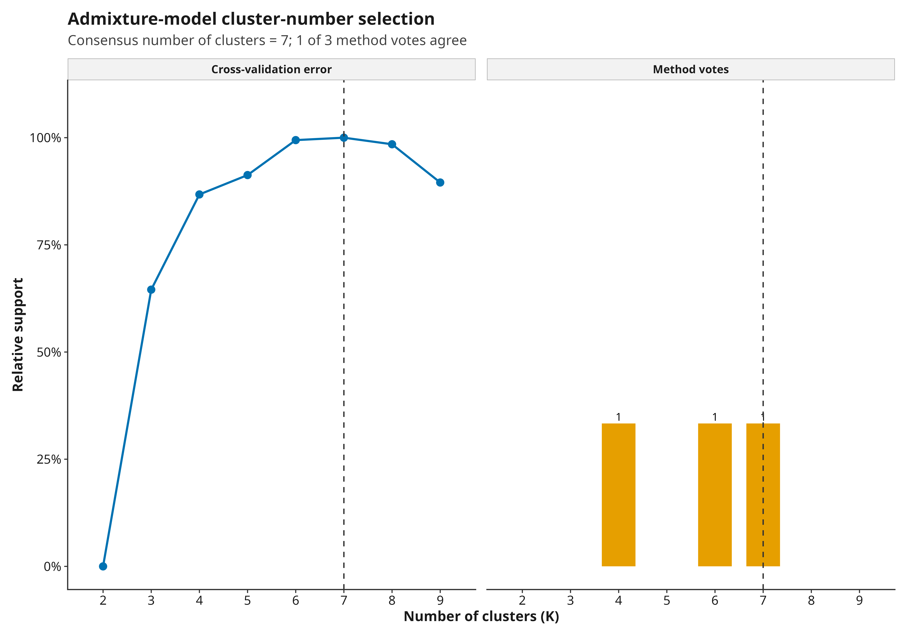

Cross-validation error is lowest and flattens from K=6 through K=9; the
automatic consensus selects **K=7**. The full report
(`27_ADMIXTURE_CV.tsv`, `28_ADMIXTURE_Q_K<k>.tsv`, and figures) contains a
complete Q matrix and pair of figures for **every** requested K, not only
the one shown here.

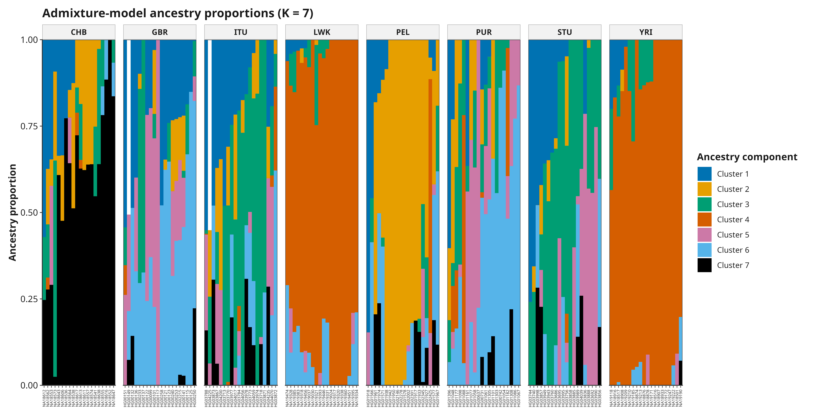

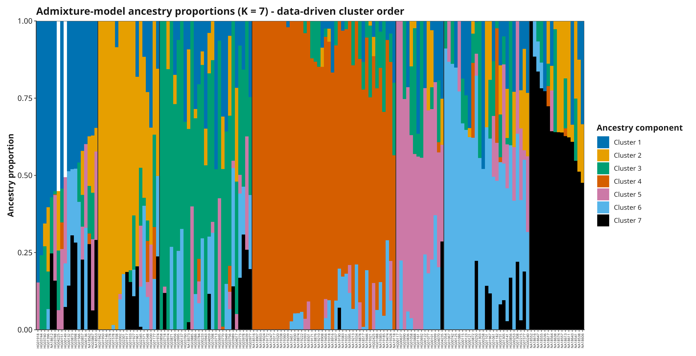

### fastStructure

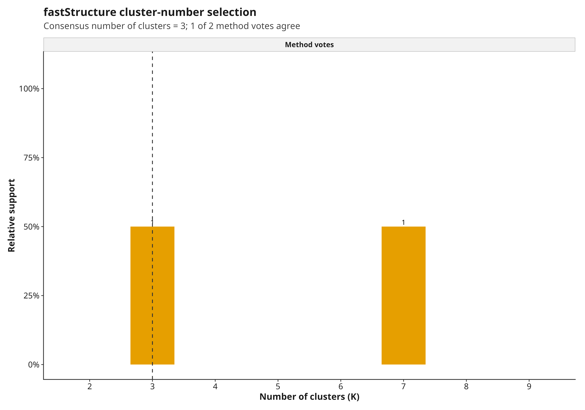

Marginal likelihood peaks at K=3 (-0.849, versus -0.854 to -0.872 elsewhere
in the K=2..9 range); the automatic consensus selects **K=3**. The full
report (`29_fastStructure_runs.tsv`, `29_fastStructure_Q_K<k>.tsv`, and
figures) contains a complete Q matrix and pair of figures for **every**
requested K, not only the one shown here.

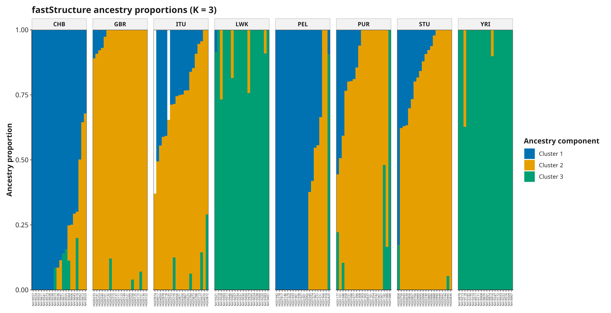

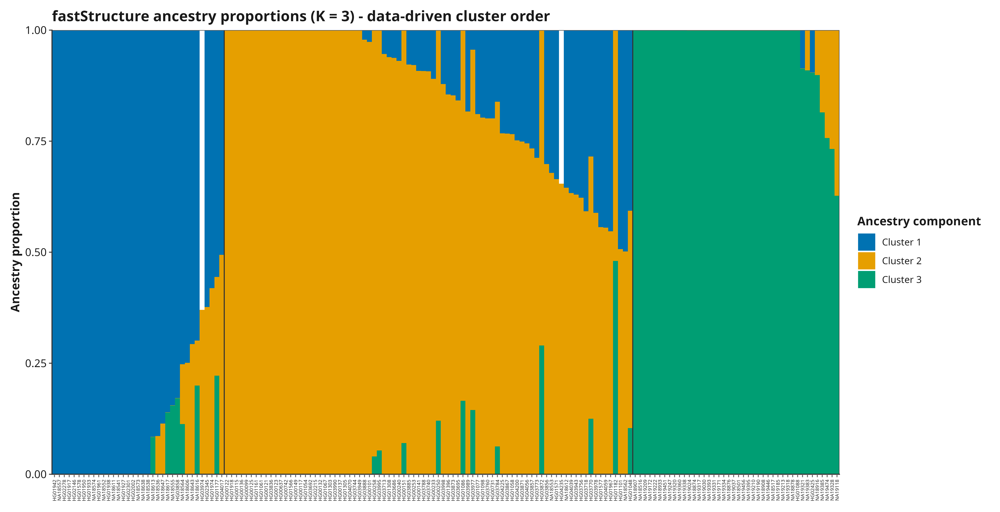

### sNMF

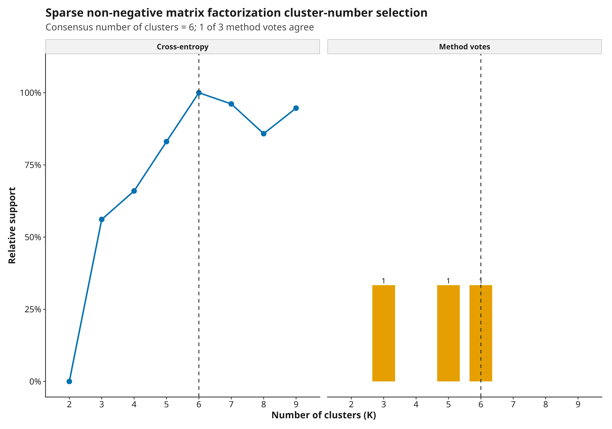

Mean cross-entropy across replicates is lowest at K=6 (0.627, versus 0.628
to 0.650 elsewhere in the K=2..9 range); the automatic consensus selects
**K=6**. The full report (`30_sNMF_cross_entropy.tsv`,
`30_sNMF_Q_K<k>.tsv`, and figures) contains a complete Q matrix and pair of
figures for **every** requested K, not only the one shown here.

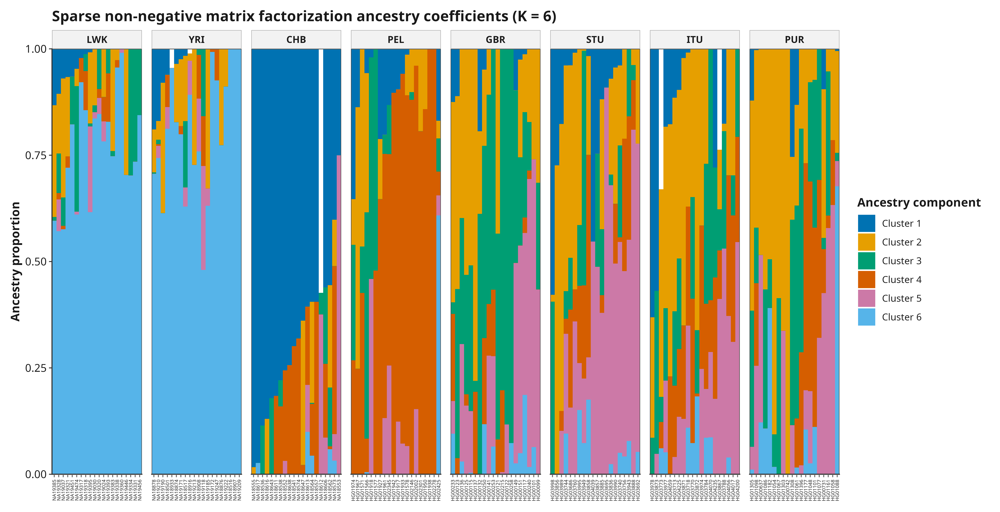

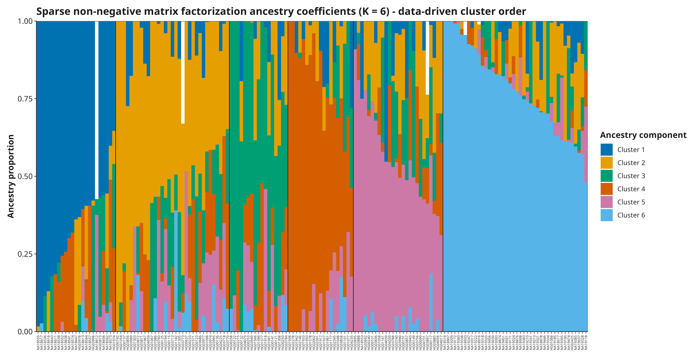

Comparing the population-organized and data-driven figures within each
backend above is the standard check described earlier in this section:
structure that persists regardless of sample ordering is more trustworthy
than structure only visible when samples are pre-sorted by their metadata
population label.

## AMOVA

Analysis of molecular variance (Excoffier et al. 1992, via
`poppr::poppr.amova()`) partitions total genetic variance hierarchically --
between populations, between samples within populations, and within
samples -- and tests each component's significance by permutation
(`ade4::randtest()`, 999 permutations, not currently configurable). Report
the hierarchy, distance definition, permutations, missing-data handling,
and variance components. Interpret a negative variance component transparently
(a real, expected outcome of the estimator under weak or absent true
structure, not an error) rather than silently truncating it to zero.

`24_AMOVA_phi_statistics.tsv`'s `Phi-population-total` is the same quantity
as FST in this hierarchical framework -- the fraction of total variance
attributable to among-population differences, computed by an entirely
different route (variance partitioning on a distance matrix, rather than
FST's allele-frequency-based estimator). On the quickstart example,
`23_AMOVA_components.tsv` partitions total variance into 9.04%
between-population, 4.27% between-samples-within-population, and 86.69%
within-samples; `Phi-population-total` = 0.0904, and all three components
are significant at p = 0.001 (999/999 permutations, the permutation floor).
This 9.04% is an independent, method-agnostic confirmation of the same ~9%
among-population signal already reported by Weir and Cockerham's (1984)
global FST (0.0915) and Weir and Goudet's (2017) population-specific FST
(`global_beta_fst` = 0.0915) above -- three different estimators converging
on the same real value from the same real population structure, not three
unrelated numbers that happen to look similar.

## Multilocus genotype (MLG) and clonal diversity

`poppr::poppr()`/`poppr::mlg.id()`/`poppr::genotype_curve()` (Kamvar, Tabima,
and Grunwald 2014) ask a question distinct from kinship above: not "how
related are these two samples," but "do these two samples have *exactly*
the same genotype at every analyzed locus." That's the standard signal for
clonal replicates, accidental resampling, or duplicate sample submissions --
relevant for any population-genetic dataset, not only strictly outbreeding
ones.

Two genuinely different marker sets feed this module, deliberately.
`57_MLG_groups.tsv` (exact duplicate-genotype detection, via `mlg.id()`)
uses the full, unpruned QC-passing locus set -- fewer markers would make it
*more* likely that two genuinely different individuals coincidentally match
at every retained locus, so exact identity needs maximum discriminating
power. `56_MLG_diversity_summary.tsv` (MLG/eMLG/Shannon's H/Stoddart-
Taylor's G/Simpson's lambda/evenness/Ia/rbarD, via `poppr()`) and the
genotype accumulation curve below instead use the LD-pruned locus set. Both
originally reused the full unpruned set "for consistency with AMOVA," but a
real production run found that choice was wrong on two counts at once: a
50-sample, 561,767-locus unpruned cohort took 29+ hours in `poppr()`'s
Ia/rbarD computation alone (confirmed superlinear in locus count by direct
scaling measurement, not merely slow); and Ia/rbarD's own null-model
interpretation assumes approximately independent input loci, so feeding it
hundreds of thousands of physically linked SNPs mechanically inflates the
appearance of non-random multilocus association through ordinary linkage,
not real clonal signal. Running it on the LD-pruned set instead -- the same
set already used for kinship/PCA/DAPC elsewhere in this pipeline -- fixes
both problems together; see `R/clonality.R`'s top-of-file comment for the
full measurement and reasoning.

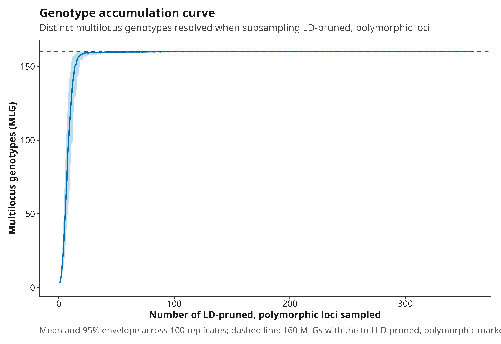

On the quickstart example, all 160 samples have a unique multilocus genotype
-- `57_MLG_groups.tsv` is empty. This is computed on the full 1,969
QC-passing loci this module reuses from the diversity module (not the
357-SNP LD-pruned set kinship/PCA/tree use above), and includes the one pair
kinship above confidently classifies as `duplicate/MZ twin`
(`NA19331`/`NA19334`, kinship = 0.4459): on this larger marker panel their
genotypes are *not* bit-identical. That is not a contradiction, it is the
expected difference between the two signals. Kinship's continuous estimator
assigns a relatedness class from partial genetic similarity (even a genuine
duplicate can show some genotyping noise or missing-data differences); exact
multilocus-genotype matching requires literal identity, and with almost
2,000 markers even a very close pair is unlikely to match at every one.

The genotype accumulation curve and Ia/rbarD summary run on the 357-SNP
LD-pruned set instead, and show just how little data the MLG distinction
needs in practice: a mean of 150 of the 160 possible MLGs are already
resolved with only 14 of the 357 available LD-pruned loci, and every
resampled replicate deterministically resolves all 160 by 71 loci. Ia and
rbarD are still positive overall (Total Ia = 2.28, rbarD = 0.0066) but far
smaller than the full-unpruned-set values this module reported before this
change (Ia = 35.40, rbarD = 0.0185) -- concrete confirmation that most of
that earlier signal was ordinary physical linkage among nearby SNPs, not
clonal structure, in this genuinely outbreeding human dataset. Read any
remaining positive value cautiously either way, not as direct evidence of
clonal reproduction.

A locus that is monomorphic (identical genotype at every retained sample)
carries zero information for either question this module asks: it can never
distinguish two multilocus genotypes for `mlg.id()`, and it contributes
nothing to Ia/rbarD's pairwise distances. This pipeline drops monomorphic
loci once, up front, from both marker sets, rather than leaving `poppr()`
to compute over them uselessly -- reported directly by a user whose real
50-sample, 7-population cohort (561,767 unpruned / 54,052 LD-pruned loci)
still took 8.3 hours in this module even after the LD-pruning fix above,
much of it wasted on loci that could not possibly affect the result.
Dropping a monomorphic locus is correctness-neutral for both marker sets --
unlike the LD-pruning tradeoff above, which does trade some discriminating
power for speed on the Ia/rbarD side only. On a real marker panel this can
be many loci, so rather than naming each one on the console (`poppr`'s own
default behavior for the ones it discovers internally, which floods the
pipeline log at scale), this pipeline logs only the count and writes the
full list, one locus name per line, to `57b_monomorphic_loci_dropped.csv`
(dropped from the full unpruned set, before `57_MLG_groups.tsv`/duplicate
detection) and `58c_monomorphic_loci_dropped.csv` (dropped from the
LD-pruned set, before the Ia/rbarD summary, the accumulation curve below,
and the MSN) -- each present only when at least one locus was dropped from
that set. On the quickstart example neither file is written: none of its
1,969 QC-passing or 357 LD-pruned loci are monomorphic.

A minimum spanning network (MSN; Kamvar, Tabima, and Grunwald 2014,
`poppr::poppr.msn()`, over the same LD-pruned marker set as the accumulation
curve above) draws a complementary picture: a genetic-distance network
connecting each clone-corrected multilocus genotype -- one node per distinct
genotype, larger when more than one sample shares it -- to its nearest
neighbors, rather than either a bifurcating tree (the NJ trees above) or a
fixed low-dimensional projection (PCA/DAPC). Every edge's endpoints and
genetic distance are in `58b_MSN_edges.tsv`. Unlike [the poppr MSN
tutorial](https://grunwaldlab.github.io/Population_Genetics_in_R/Minimum_Spanning_Networks.html)'s
own `bruvo.msn()`, which assumes a stepwise mutation model appropriate for
microsatellite repeat lengths, this pipeline uses `poppr::diss.dist()` -- a
discrete/Hamming-style distance poppr itself documents as usable for any
marker system, and, at `percent = TRUE`, numerically identical to
`provesti.dist()` but built to scale better for large sample counts.

On the quickstart example, every one of the 160 samples remains its own node
even on the LD-pruned set (no edges collapse into a multi-sample node),
consistent with the accumulation curve's own near-immediate saturation
above. Reading the network from `58b_MSN_edges.tsv` rather than by eye: the
overall same-population/cross-population edge-distance split is modest
(mean 0.154 within a recorded population vs. 0.162 across two, out of 162
total edges) -- individual pairwise distance on a 357-SNP panel does not
cleanly separate these populations the way aggregate multi-locus methods
(PCA, FST) do, consistent with the same ~9% FST/AMOVA-among-population
signal reported above rather than a sharper one. Some specific structure is
real and verifiable, though: CHB (East Asian) forms a largely self-contained
subcluster (18 of its 21 incident edges connect two CHB samples to each
other) with only single, separate bridging edges out to six other
populations, no one of them dominant; LWK and YRI (African) likewise mostly
connect to each other (28 of 36 edges touching either population). Both
observations echo, from a genuinely different node-and-edge method, the same
population-structure signal PCA/DAPC/FST report elsewhere on this page --
not a new finding on its own. A sample whose shortest edge crosses into a
different population's genotypes is worth checking against its PCA/DAPC
placement and kinship results before trusting its recorded population
label.

## Sex-biased dispersal test

`hierfstat::sexbias.test()` (Goudet, Perrin, and Waser 2002) asks a
population-level question distinct from the individual-level tests above:
does one recorded sex disperse more than the other? The signal comes from
each individual's assignment index (AIc, Favre et al. 1997) -- how strongly
their genotype matches their own recorded population's allele frequencies,
corrected for sample size. The more-dispersing sex (recent immigrants, or
their offspring genotyped before local allele frequencies "catch up") shows
a systematically lower mean AIc than the more philopatric sex. The default
`mAIc` test is a two-sample t-test (or, with a configured number of
permutations, a within-population permutation test) comparing mean AIc
between the two recorded sexes; `60_sexbias_AIc_by_sample.tsv` reports the
per-sample assignment index, and `60b_sexbias_test_summary.tsv` the test
statistic and p-value. This is a genuinely different question from
sex-check above: sex-check asks whether one sample's own genotype is
consistent with its recorded sex; this asks whether the two recorded sexes
differ, as groups, in how strongly their genotypes match their recorded
population -- so it deliberately uses the metadata `sex` column, not
sex-check's genetically inferred sex.

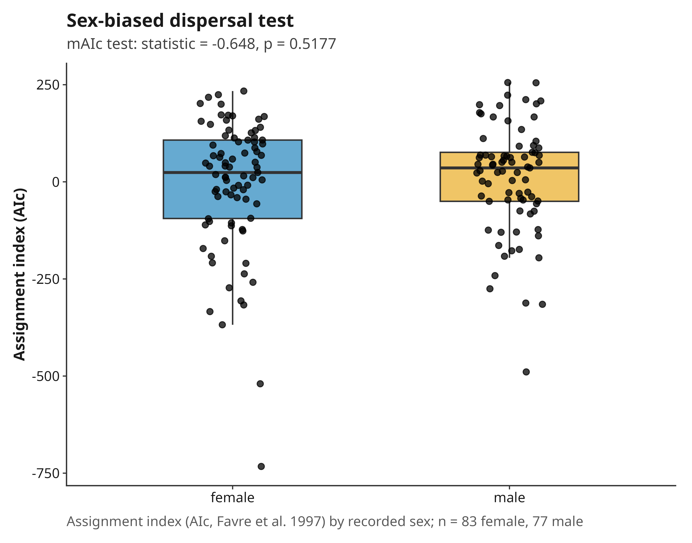

On the quickstart example, mean AIc does not differ detectably by recorded
sex (mAIc t-test statistic = -0.648, p = 0.5177, n = 83 female, 77 male).
That null result is expected, not a modeling failure: the quickstart
dataset pools eight geographically and ethnically distinct 1000 Genomes
populations sampled cross-sectionally for genomic diversity, not a single
species/site dispersal study with reproductive-age individuals genotyped at
their natal versus breeding location -- the setting this test was designed
for. A real, biologically meaningful sex-bias signal requires exactly that
kind of dispersal-focused sampling design; report it as such rather than
over-interpreting a null result from data this test was never designed to
detect a signal in.

## Mantel and isolation by distance

Report geographic and genetic distance definitions, transformations,
permutations, complete sample pairs, and sampling design. A Mantel association
does not establish a causal spatial process and can be sensitive to
autocorrelation and clustered sampling.

The quickstart metadata includes real, documented population-level collection
coordinates (`inst/extdata/quickstart/README.md` has the exact source and the
GBR/ITU/STU shared-point caveat), so this analysis actually runs rather than
being skipped for lack of coordinates.

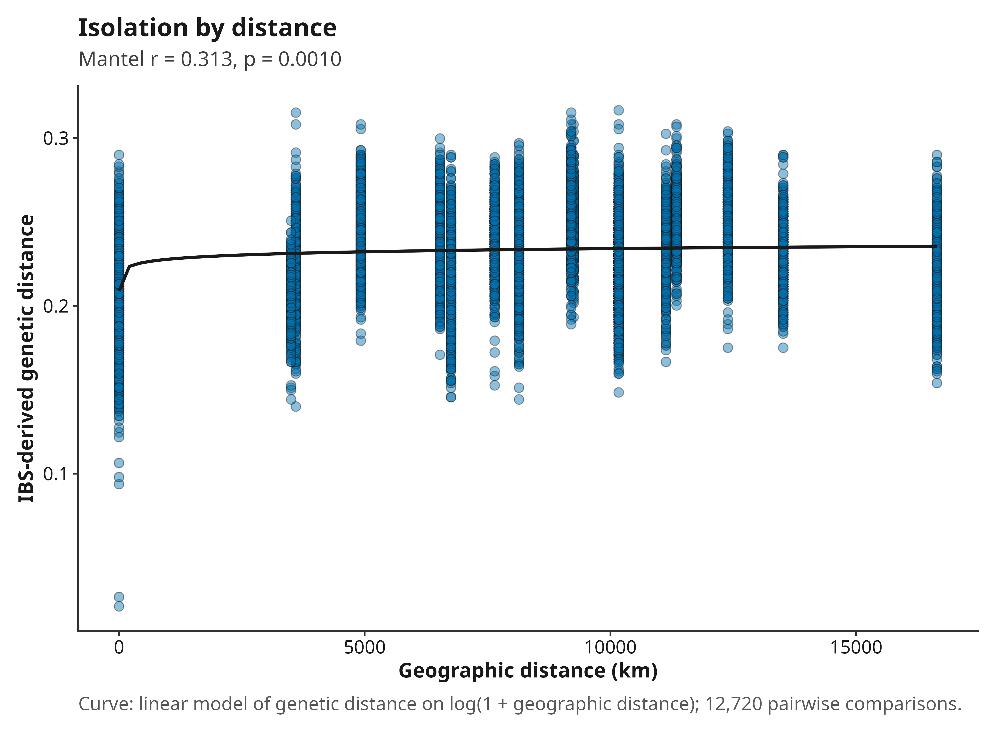

On the quickstart example, the Mantel test (Pearson, 999 permutations) gives
r = 0.3129, p = 0.001 (999-permutation floor), with a positive slope (0.00275,
R² = 0.137) across all 12,720 complete sample pairs -- genetic distance really
does increase with geographic distance across these 8 continentally diverse
populations, a real, biologically sensible isolation-by-distance signal. This
does not, by itself, establish a causal spatial process: the same 8
populations are also the units compared by FST and PCA above, so this is not
independent evidence from a fourth, unrelated experiment.

When population metadata is present and at least two populations are
represented, a **partial Mantel test** (`vegan::mantel.partial()`, Smouse,
Long, and Sokal 1986) also runs automatically, controlling the genetic-vs-
geographic distance correlation for a same/different population indicator --
does the isolation-by-distance signal survive once population membership is
accounted for, or is it purely an artifact of population clustering? On the
quickstart example, the partial Mantel r drops to 0.1627 (p = 0.001): the
signal weakens considerably but remains real and statistically significant
once population identity is controlled for, indicating that geographic
distance carries genuine explanatory power beyond simple population
clustering. Both results are shown together in the figure's subtitle above.

## Spatial autocorrelation

`50_spatial_autocorrelation.tsv` bins sample pairs into geographic-distance
classes and reports a spatial-autocorrelation coefficient r per class
(Smouse and Peakall 1999), with a permutation-based 95% null envelope and
p-value -- a distance-resolved complement to the single overall Mantel r
above, showing whether the isolation-by-distance signal is concentrated at
particular spatial scales rather than smooth across the whole range.

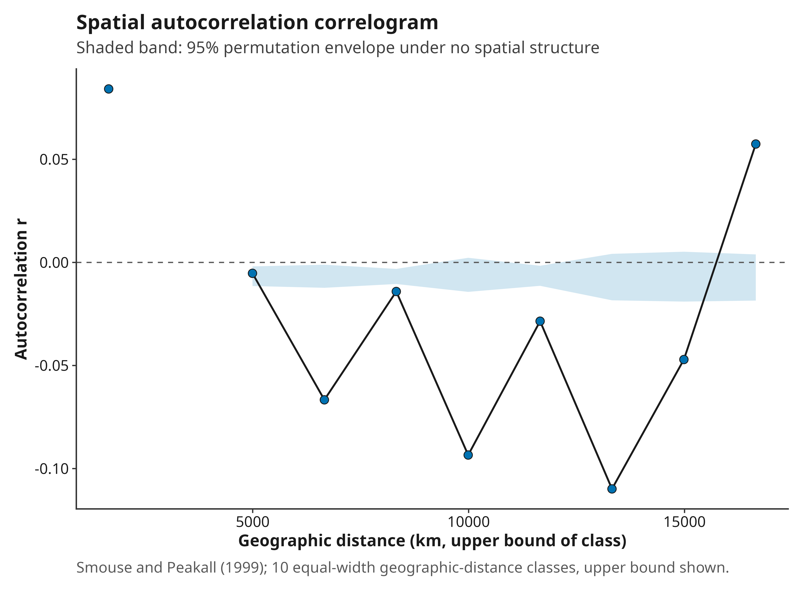

**Read this one with real caution.** The quickstart metadata uses real,
documented *population-level* representative coordinates (individual
sample locations are never published for de-identified 1000 Genomes data),
so 21% of sample pairs (same population, or populations sharing one
representative point) sit at exactly zero geographic distance, and the
smallest *nonzero* distance jumps straight to 3,503 km -- leaving the two
shortest distance classes completely empty. The correlogram therefore
mostly resolves differences between population collection sites, not the
fine-grained, continuous within-population spatial structure this method
was designed to detect. Treat the quickstart values as a demonstration of
the analysis running correctly, not as a finding about within-population
spatial genetic structure.

## Figures and reports

Captions should identify the dataset, filters, estimator, sample size, software
version, and uncertainty or validation evidence. Publication-ready styling is
not scientific approval.

## Further reading

- [Interpreting results vignette](https://duceppemo.github.io/popgenVCF/articles/interpreting-results.html)
- [Publication gallery](https://duceppemo.github.io/popgenVCF/articles/publication-gallery.html)
- [Scientific validation](https://github.com/duceppemo/popgenVCF/blob/main/docs/SCIENTIFIC_VALIDATION.md)
