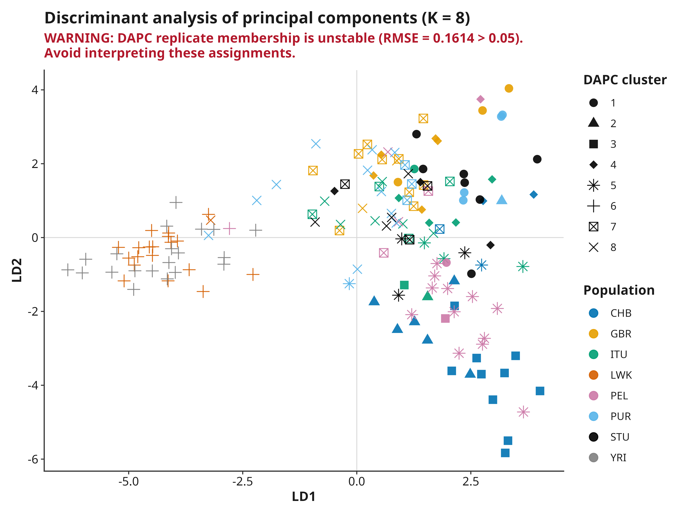

# Results and interpretation

Every figure below is real output from the bundled quickstart dataset (160
real 1000 Genomes chromosome 22 samples across 8 populations -- see
[Getting Started](Getting-Started) to run it yourself in a few minutes) so
you can see exactly what popgenVCF produces before deciding whether it fits
your data. The complete PDF report from this same run is available at
[`docs/examples/chr22-quickstart-report.pdf`](https://github.com/duceppemo/popgenVCF/blob/main/docs/examples/chr22-quickstart-report.pdf).

Interpret execution state before biology. Begin with
`analysis_execution_ledger.tsv` and `analysis_validation.tsv`. A module that is
failed, blocked, cancelled, timed out, or unavailable has no interpretable
biological result.

## Quality control

Report the input and retained sample/variant counts, missingness thresholds,
MAF threshold, LD-pruning rule, sample exclusions, and marker exclusions.
Inspect sequential and independent QC tables because a final count alone cannot
show which rule removed a sample or marker.

Filtering defines the analyzed dataset. Avoid choosing thresholds after seeing
the preferred population pattern.

On the quickstart example, MAF filtering (`maf = 0.05`) reduced 21,418
biallelic SNPs to 1,969, and LD pruning further reduced that to 357 SNPs
used for PCA/IBS/kinship.

## PCA

Check the variance table, scores, sample identities, missingness, and outliers.
PCA axes may change sign without changing the solution. Repeated or nearly
equal eigenvalues can rotate a subspace, so validation should use subspace or
residual comparisons rather than raw signed vectors.

Separation can reflect population history, relatedness, batch effects,
geography, uneven sampling, or technical artifacts. A principal component is
not itself a population.

`31_PCA_loadings.tsv` and the Manhattan/ranked loading figures report which
SNPs correlate most strongly with each retained component. Loadings are
signed (direction is preserved); "top contributing" ranks by magnitude, not
raw value. A large loading identifies a marker associated with an axis, not
a causal or functionally validated variant -- treat it as a lead for further
investigation, not a conclusion.

The 8 sampled populations separate along the first two components largely by
continental origin, as expected for real, geographically diverse human data.

## IBS and MDS

Confirm sample order and matrix symmetry. Interpret low-dimensional MDS only
after inspecting the distance definition and retained eigenvalues. Close pairs
may reflect relatives or duplicates rather than population-level structure.

## Kinship

Kinship (`SNPRelate::snpgdsIBDKING()`, KING-robust, Manichaikul et al. 2010)
answers a different question than IBS/MDS above: not "how similar are these
samples overall" but "are these two individuals related, and how closely."
KING-robust is specifically chosen for robustness to population
stratification, unlike naive relatedness estimators that assume a single
homogeneous population -- a real requirement here, since this package
explicitly supports analyzing structured populations. The estimator needs
realistic marker density to behave sensibly: a handful of SNPs produces
values with no biological meaning. `relationship_degree` uses the standard
KING thresholds and is a screening classification, not a pedigree diagnosis --
a flagged pair warrants follow-up (checking for sample duplication, family
structure in the design, or a labeling error), not an automatic conclusion.
Kinship is bounded above at 0.5 (a self/duplicate pair) but is *not* bounded
below at -0.5 for arbitrarily divergent pairs; very negative values are
expected, not an error, when comparing highly differentiated populations.
Detected close relatives can bias FST, diversity, and structure analyses
computed from the same sample set -- consider whether to exclude or account
for them before interpreting those results.

The quickstart dataset deliberately includes two known real duplicate pairs
as a worked example: `HG03873`/`HG03998` (kinship 0.4525) -- individuals
labelled as two *different* populations, ITU and STU, that are nonetheless
the same/an identical-twin pair, exactly the kind of labeling issue this
analysis is meant to surface -- and `NA19331`/`NA19334` (kinship 0.4459,
both LWK). Both are correctly classified `duplicate/MZ twin`.

## Runs of homozygosity

Runs of homozygosity (`bcftools roh`, an HMM-based method, Narasimhan et al.
2016) identify long stretches where a sample's genotype calls are
consistently homozygous -- a standard per-sample autozygosity/inbreeding
signal, distinct from both diversity's population-level FIS and kinship's
pairwise relatedness above. Allele frequencies are self-estimated from the
analyzed samples (there is no mechanism to attach an external reference-panel
frequency), which means informative site count -- and therefore sensitivity
-- drops with smaller cohorts; treat results from small sample sets
cautiously, the same caution as HWE and kinship above. `FROH` (total run
length divided by the analyzed genomic footprint) is scaled to the footprint
actually covered by the analyzed variants, **not the whole genome** -- a
single-region VCF and a whole-genome VCF give very different `FROH` for the
same underlying biology, so never compare `FROH` values across analyses that
covered different genomic spans. No short/medium/long run-length
classification is imposed; that convention is species- and study-specific
and is left for the analyst to apply if relevant.

## Diversity and FIS

Report the estimator, locus filters, missing-data handling, sample sizes, and
uncertainty. Negative or positive FIS does not identify a cause by itself;
technical artifacts, substructure, inbreeding, selection, and sample design can
produce similar summaries.

`hwe_pvalue` is a per-population exact test (Wigginton et al. 2005); it is
reporting-only and does not filter any SNP. A significant deviation has many
non-error causes (null alleles, genotyping artifacts, selection, non-random
mating, population substructure within the labeled group) and small sample
sizes have limited power to detect real deviations -- treat the p-value
distribution and the FDR-adjusted count as descriptive, not as an automatic
exclusion criterion. `private_allele` identifies alleles found in only one
retained population; it is not itself evidence of adaptive significance or
of any particular demographic history.

## FST

State the estimator explicitly. Global and pairwise values depend on population
definitions, sample size, marker ascertainment, missingness, and the genomic
region. A small numerical value can be statistically precise, while a larger
one can be uncertain.

The global FST estimate for the quickstart example is 0.0915, consistent
with real, moderate differentiation across 8 geographically diverse
populations at this marker density.

## Genome scans

Windowed FST and diversity (`39_genome_scan_fst.tsv`,
`40_genome_scan_diversity.tsv`) track the same statistics above along
physical position, rather than only as a single genome-wide number --
useful for spotting localized differentiation or diversity outliers.
Windows are non-overlapping by default (`analyses.genome_scan_step_bp`
equals `analyses.genome_scan_window_bp`); a smaller step gives a real
overlapping/sliding scan. `41_genome_scan_FST_outliers.tsv` is a
descriptive ranking (highest-FST windows), **not** a significance test --
no permutation or null distribution is computed, so a high-FST window is a
candidate worth further investigation, not a statistically confirmed
selection signal. Always check a window's `n_snps` before treating its
estimate as meaningful: windows below `analyses.genome_scan_min_snps`
(default 5) are reported as `NA` rather than a misleadingly precise value
from too few markers, and even windows just above that threshold can be
noisy.

## DAPC

DAPC is conditional on groups and retained PCs. Inspect cross-validation and
avoid retaining enough PCs to memorize individuals. Strong separation is not
independent evidence for groups when those groups defined the discriminant
analysis.

`22f_DAPC_loadings_K<k>.tsv` and the per-K Manhattan/ranked loading figures
report each SNP's contribution to every discriminant function (this
repository's DAPC groups are the unsupervised `find.clusters()` partition at
that K, not the raw metadata `population` column). A SNP with a large
contribution helped separate that K's clusters; it is not, by itself,
evidence that the SNP is biologically causal for whatever the clusters
represent.

## Ancestry backends

For ADMIXTURE, fastStructure, and sNMF:

- verify the sample-order file against every Q matrix;
- retain all replicates and fit statistics;
- align exchangeable cluster labels before comparison;
- report K-selection criteria and uncertainty;
- distinguish computational agreement from biological truth.

K is a model index, and colored components are not literal ancestral
populations without external evidence.

## AMOVA

Report the hierarchy, distance definition, permutations, missing-data handling,
and variance components. Interpret negative components transparently rather
than silently truncating them.

## Mantel and isolation by distance

Report geographic and genetic distance definitions, transformations,
permutations, complete sample pairs, and sampling design. A Mantel association
does not establish a causal spatial process and can be sensitive to
autocorrelation and clustered sampling.

The quickstart metadata includes real, documented population-level collection
coordinates (`inst/extdata/quickstart/README.md` has the exact source and the
GBR/ITU/STU shared-point caveat), so this analysis actually runs rather than
being skipped for lack of coordinates.

On the quickstart example, the Mantel test (Pearson, 999 permutations) gives
r = 0.3129, p = 0.001 (999-permutation floor), with a positive slope (0.00275,
R² = 0.137) across all 12,720 complete sample pairs -- genetic distance really
does increase with geographic distance across these 8 continentally diverse
populations, a real, biologically sensible isolation-by-distance signal. This
does not, by itself, establish a causal spatial process: the same 8
populations are also the units compared by FST and PCA above, so this is not
independent evidence from a fourth, unrelated experiment.

## Figures and reports

Captions should identify the dataset, filters, estimator, sample size, software
version, and uncertainty or validation evidence. Publication-ready styling is
not scientific approval.

## Further reading

- [Interpreting results vignette](https://duceppemo.github.io/popgenVCF/articles/interpreting-results.html)
- [Publication gallery](https://duceppemo.github.io/popgenVCF/articles/publication-gallery.html)
- [Scientific validation](https://github.com/duceppemo/popgenVCF/blob/main/docs/SCIENTIFIC_VALIDATION.md)
